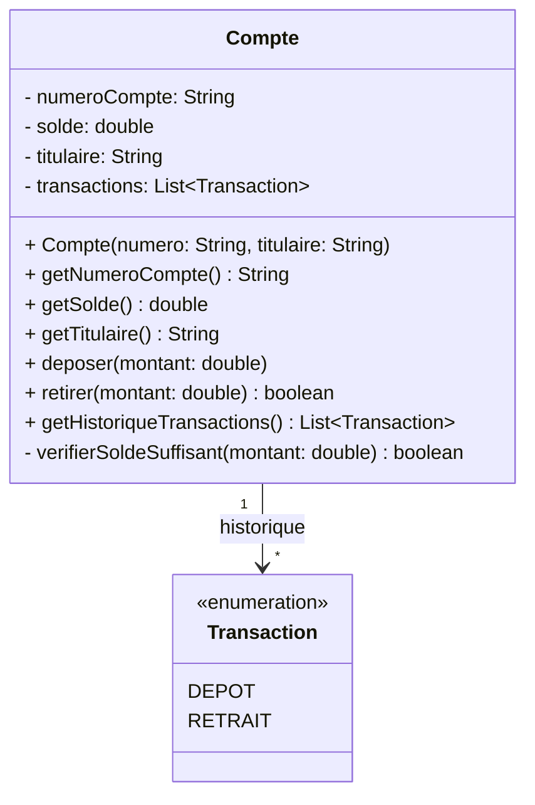
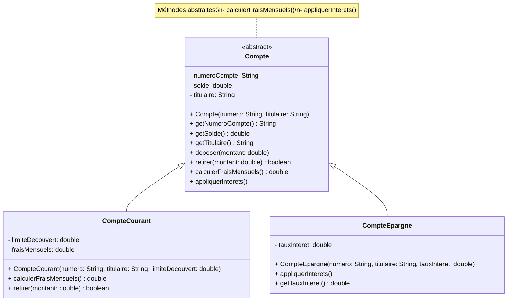
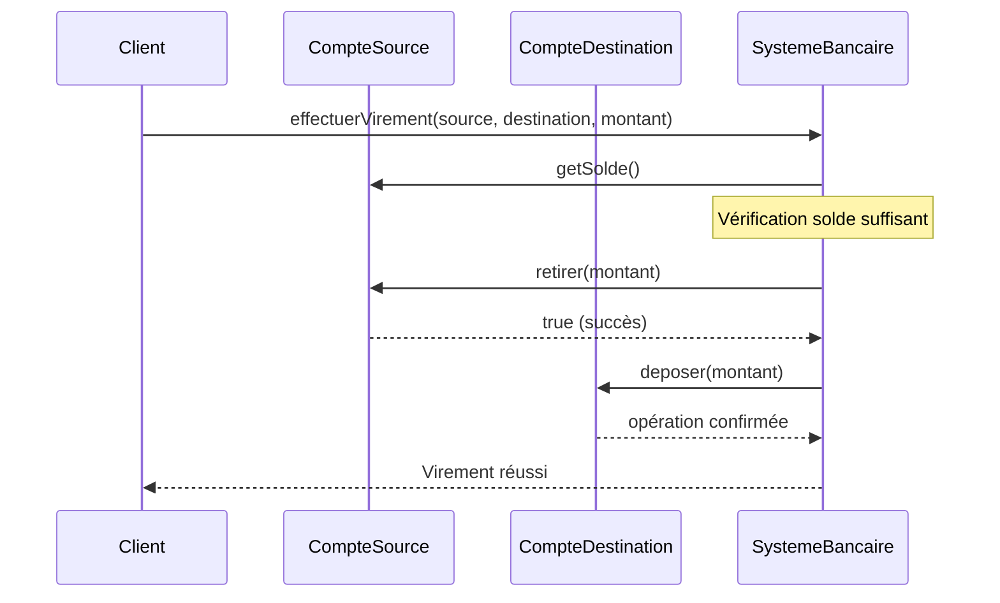
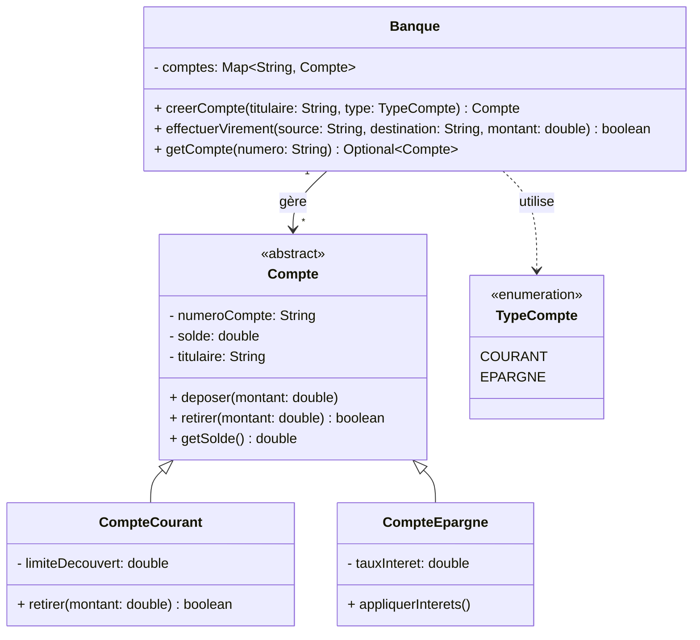

# Étude de Cas Bancaire — Niveau Basique

## Guide de Préparation aux Examens : UML, POO et Design Patterns Fondamentaux

---

Ce premier document constitue le socle de votre préparation aux examens de génie logiciel. Nous aborderons les concepts fondamentaux de la programmation orientée objet et de la modélisation UML à travers un système bancaire simplifié. L'objectif n'est pas seulement de comprendre la syntaxe, mais de saisir pourquoi ces concepts existent et comment ils résolvent des problèmes concrets de développement logiciel.

Les exercices proposés dans ce document correspondent typiquement aux questions d'examen de première session. Ils évaluent votre capacité à concevoir des diagrammes de classes corrects, à identifier les relations entre objets et à implémenter des solutions simples mais structurées. Un étudiant maîtrise ce niveau lorsqu'il peut dessiner de mémoire un diagramme de classes pour un système de gestion de comptes et expliquer chaque choix de conception.

---

## Probleme 1 : La Classe Compte — Maîtrise de l'Encapsulation

### Énoncé du Problème

On vous demande de concevoir la classe fondamentale d'un système bancaire : la classe `Compte`. Un compte bancaire possède un numéro unique, un solde et un titulaire. Le système doit garantir que le solde ne peut jamais devenir négatif et que toutes les modifications du solde sont tracées. Le titulaire du compte doit pouvoir consulter le solde actuel et effectuer des opérations de dépôt et de retrait.

Ce problème teste votre compréhension de l'encapsulation, principe fondamental de la programmation orientée objet. L'encapsulation consiste à regrouper les données (attributs) et les opérations sur ces données (méthodes) dans une même entité, tout en protégeant l'intégrité des données par des contrôles d'accès appropriés. Dans le contexte bancaire, où la moindre erreur de manipulation peut avoir des conséquences financières graves, l'encapsulation n'est pas seulement une bonne pratique — c'est une nécessité métier.

### Concepts Abordés

Ce problème mobilise plusieurs concepts essentiels de la programmation orientée objet. L'encapsulation constitue le cœur de la problématique : elle permet de cacher les détails d'implémentation internes d'un objet et d'exposer uniquement une interface publique bien définie. EnJava, cela se traduit par l'utilisation des modificateurs d'accès `private`, `protected` et `public`. EnPython, les conventions de nommage avec le préfixe underscore ( `_attribut`) signalent aux développeurs qu'un attribut est destiné à un usage interne, bien que le langage n'impose pas de restriction stricte commeJava.

Les accesseurs (getters) et mutateurs (setters) permettent de contrôler l'accès aux attributs privés. Un getter retourne la valeur d'un attribut tandis qu'un mutateur permet de la modifier, généralement avec des validations. Cette approche offre plusieurs avantages : centralisation de la logique de validation, possibilité de modifier l'implémentation interne sans affecter les utilisateurs de la classe, et traçabilité des modifications. Dans notre cas bancaire, le mutateur du solde vérifie que la nouvelle valeur n'est pas négative avant d'accepter la modification.

La construction d'objets via des constructeurs permet d'initialiser correctement un objet dès sa création. Un constructeur bien conçu garantit que l'objet est dans un état valide dès le départ, évitant ainsi les erreurs difficiles à détecter liées à des objets partiellement initialisés.

### Diagramme UML

Le diagramme de classes suivant modélise notre compte bancaire avec ses attributs privés et ses méthodes publiques :



Ce diagramme révèle plusieurs choix de conception importants. Les attributs sont marqués comme privés (`-`) ce qui signifie qu'ils ne sont accessibles qu'à l'intérieur de la classe elle-même. Les méthodes sont publiques (`+`) car elles constituent l'interface exposée aux utilisateurs de la classe. La relation entre `Compte` et `Transaction` est une association avec multiplicité : un compte peut avoir zéro ou plusieurs transactions, ce qui est représenté par `*`.

### Implémentation en Java

```java
import java.util.ArrayList;
import java.util.List;
import java.util.Objects;

/**
 * Représente un compte bancaire avec encapsulation stricte.
 * Le solde ne peut jamais devenir négatif grâce aux validations.
 */
public class Compte {
    private final String numeroCompte;
    private double solde;
    private final String titulaire;
    private final List<Transaction> historiqueTransactions;
    
    /**
     * Constructeur créant un compte avec un solde initial de zéro.
     * @param numeroCompte Identifiant unique du compte (non null, non vide)
     * @param titulaire Nom du titulaire du compte (non null, non vide)
     * @throws IllegalArgumentException si les paramètres sont invalides
     */
    public Compte(String numeroCompte, String titulaire) {
        if (numeroCompte == null || numeroCompte.trim().isEmpty()) {
            throw new IllegalArgumentException("Le numéro de compte est obligatoire");
        }
        if (titulaire == null || titulaire.trim().isEmpty()) {
            throw new IllegalArgumentException("Le titulaire du compte est obligatoire");
        }
        this.numeroCompte = numeroCompte;
        this.titulaire = titulaire;
        this.solde = 0.0;
        this.historiqueTransactions = new ArrayList<>();
    }
    
    /**
     * Retourne le numéro du compte.
     * @return le numéro de compte
     */
    public String getNumeroCompte() {
        return numeroCompte;
    }
    
    /**
     * Retourne le solde actuel du compte.
     * @return le solde
     */
    public double getSolde() {
        return solde;
    }
    
    /**
     * Retourne le nom du titulaire du compte.
     * @return le titulaire
     */
    public String getTitulaire() {
        return titulaire;
    }
    
    /**
     * Dépose un montant positif sur le compte.
     * @param montant le montant à déposer (doit être positif)
     * @throws IllegalArgumentException si le montant est négatif ou nul
     */
    public void deposer(double montant) {
        if (montant <= 0) {
            throw new IllegalArgumentException("Le montant du dépôt doit être positif");
        }
        this.solde += montant;
        this.historiqueTransactions.add(
            new Transaction(TypeTransaction.DEPOT, montant, "Dépôt en espèces")
        );
    }
    
    /**
     * Retire un montant du compte si le solde est suffisant.
     * @param montant le montant à retirer
     * @return true si le retrait a réussi, false sinon
     * @throws IllegalArgumentException si le montant est négatif ou nul
     */
    public boolean retirer(double montant) {
        if (montant <= 0) {
            throw new IllegalArgumentException("Le montant du retrait doit être positif");
        }
        if (!verifierSoldeSuffisant(montant)) {
            System.out.println("Retrait refusé : solde insuffisant");
            return false;
        }
        this.solde -= montant;
        this.historiqueTransactions.add(
            new Transaction(TypeTransaction.RETRAIT, montant, "Retrait au guichet")
        );
        return true;
    }
    
    /**
     * Vérifie si le solde est suffisant pour un retrait.
     * @param montant le montant demandé
     * @return true si le solde est suffisant
     */
    private boolean verifierSoldeSuffisant(double montant) {
        return this.solde >= montant;
    }
    
    /**
     * Retourne l'historique complet des transactions.
     * @return liste non modifiable des transactions
     */
    public List<Transaction> getHistoriqueTransactions() {
        return List.copyOf(historiqueTransactions);
    }
    
    /**
     * Énumération des types de transactions possibles.
     */
    public enum TypeTransaction {
        DEPOT,
        RETRAIT
    }
}

/**
 * Représente une transaction individuelle sur un compte.
 */
class Transaction {
    private final Compte.TypeTransaction type;
    private final double montant;
    private final String description;
    private final java.time.LocalDateTime date;
    
    public Transaction(Compte.TypeTransaction type, double montant, String description) {
        this.type = type;
        this.montant = montant;
        this.description = description;
        this.date = java.time.LocalDateTime.now();
    }
    
    public Compte.TypeTransaction getType() {
        return type;
    }
    
    public double getMontant() {
        return montant;
    }
    
    public String getDescription() {
        return description;
    }
    
    public java.time.LocalDateTime getDate() {
        return date;
    }
}
```

### Implémentation en Python

```python
from dataclasses import dataclass, field
from datetime import datetime
from typing import List, Optional
from enum import Enum

class TypeTransaction(Enum):
    DEPOT = "dépôt"
    RETRAIT = "retrait"

@dataclass
class Transaction:
    """Représente une transaction sur un compte bancaire."""
    type: TypeTransaction
    montant: float
    description: str
    date: datetime = field(default_factory=datetime.now)

class Compte:
    """
    Représente un compte bancaire avec encapsulation.
    
    En Python, l'encapsulation est une convention plutôt qu'une contrainte.
    Les attributs préfixés par '_' sont considérés comme 'protégés'.
    Les propriétés (@property) permettent de contrôler l'accès.
    """
    
    def __init__(self, numero_compte: str, titulaire: str) -> None:
        if not numero_compte or not numero_compte.strip():
            raise ValueError("Le numéro de compte est obligatoire")
        if not titulaire or not titulaire.strip():
            raise ValueError("Le titulaire du compte est obligatoire")
        
        self._numero_compte = numero_compte
        self._titulaire = titulaire
        self._solde = 0.0
        self._historique_transactions: List[Transaction] = []
    
    @property
    def numero_compte(self) -> str:
        """Retourne le numéro du compte (lecture seule)."""
        return self._numero_compte
    
    @property
    def solde(self) -> float:
        """Retourne le solde actuel du compte."""
        return self._solde
    
    @property
    def titulaire(self) -> str:
        """Retourne le nom du titulaire du compte."""
        return self._titulaire
    
    @property
    def historique_transactions(self) -> List[Transaction]:
        """Retourne l'historique des transactions (copie défensive)."""
        return self._historique_transactions.copy()
    
    def deposer(self, montant: float) -> None:
        """
        Dépose un montant positif sur le compte.
        
        Raises:
            ValueError: Si le montant n'est pas strictement positif.
        """
        if montant <= 0:
            raise ValueError("Le montant du dépôt doit être positif")
        
        self._solde += montant
        self._historique_transactions.append(
            Transaction(TypeTransaction.DEPOT, montant, "Dépôt en espèces")
        )
    
    def retirer(self, montant: float) -> bool:
        """
        Retire un montant du compte si le solde est suffisant.
        
        Args:
            montant: Le montant à retirer (doit être positif).
            
        Returns:
            True si le retrait a réussi, False sinon.
        """
        if montant <= 0:
            raise ValueError("Le montant du retrait doit être positif")
        
        if self._solde < montant:
            print(f"Retrait refusé : solde insuffisant (solde={self._solde}, demandé={montant})")
            return False
        
        self._solde -= montant
        self._historique_transactions.append(
            Transaction(TypeTransaction.RETRAIT, montant, "Retrait au guichet")
        )
        return True
    
    def __str__(self) -> str:
        return f"Compte {self._numero_compte} - Titulaire: {self._titulaire} - Solde: {self._solde:.2f}€"

# Démonstration de l'utilisation
if __name__ == "__main__":
    # Création d'un compte
    compte = Compte("FR7630006000011234567890189", "Jean Dupont")
    print(f"Compte créé : {compte}")
    
    # Opérations sur le compte
    compte.deposer(1000.0)
    print(f"Après dépôt : {compte}")
    
    compte.retirer(250.0)
    print(f"Après retrait : {compte}")
    
    # Affichage de l'historique
    print("\nHistorique des transactions :")
    for tx in compte.historique_transactions:
        print(f"  - {tx.date.strftime('%H:%M:%S')} : {tx.type.value} de {tx.montant}€")
```

### Points Clés — Pourquoi Cette Conception ?

**Pourquoi l'encapsulation est-elle indispensable en contexte bancaire ?** Dans l'exemple du compte bancaire, si l'attribut `solde` était public, un utilisateur malveillant ou maladroit pourrait modifier directement le solde en exécutant `compte.solde = -10000`. Cette manipulation serait possible sans aucun contrôle, ce qui violerait les règles métier de la banque. L'encapsulation garantit l'invariabilité du système : le solde ne peut être modifié que par les méthodes prévues à cet effet (`deposer`, `retrait`), qui appliquent les validations nécessaires.

**Pourquoi retourner une copie défensive de la liste des transactions ?** Dans l'implémentation Java, la méthode `getHistoriqueTransactions()` retourne `List.copyOf(historiqueTransactions)`. Cette technique, appelée copie défensive, empêche un utilisateur externe de modifier directement la liste interne en faisant `list.clear()` ou `list.add()`. Sans cette protection, l'intégrité des données pourrait être compromise par du code externe, même si les intentions ne sont pas malveillantes. EnPython, retourner `self._historique_transactions.copy()` accomplit le même objectif.

**Trade-off entre Java et Python :** Java impose l'encapsulation par le compilateur, ce qui rend les erreurs de conception impossibles à compiler. Python fait confiance au développeur avec le système de propriétés (`@property`), ce qui rend le code plus concis mais potentiellement plus dangereux si les conventions ne sont pas respectées. Dans un contexte bancaire où les erreurs peuvent coûtent cher, la verbosité deJava devient un avantage en termes de robustesse.

---

## Probleme 2 : Hiérarchie de Comptes — Maîtrise de l'Héritage

### Énoncé du Problème

La banque propose désormais deux types de comptes distincts avec des comportements différents. Le `CompteCourant` permet des découverts autorisés jusqu'à un certain seuil et génère des frais mensuels. Le `CompteEpargne` génère des intérêts sur le solde mais ne permet pas de découvert. Ces deux types partagent des caractéristiques communes avec le `Compte` de base (numéro, titulaire, solde) mais ajoutent des comportements spécifiques.

Ce problème illustre l'héritage, mécanisme fondamental de la programmation orientée objet permettant de créer une nouvelle classe à partir d'une classe existante. L'héritage établit une relation "est-un" entre les classes : un `CompteCourant` **est un** `Compte`. Cette relation permet de factoriser le code commun tout en permettant la spécialisation.

### Concepts Abordés

L'héritage permet la réutilisation du code en établissant une relation de généralisation/spécialisation entre les classes. La classe parent (superclasse) contient les attributs et méthodes communs, tandis que les classes enfants (sous-classes) ajoutent ou redéfinissent des comportements spécifiques. EnJava, l'héritage est simple (une seule classe parent) et utilise le mot-clé `extends`. EnPython, l'héritage multiple est possible et utilise les parenthèses dans la définition de classe.

La redéfinition de méthodes (override) permet à une sous-classe de fournir une implémentation spécifique d'une méthode déjà définie dans sa classe parent. La méthode redéfinie doit avoir la même signature (nom et types de paramètres) que la méthode parente. EnJava, l'annotation `@Override` est fortement recommandée car elle permet au compilateur de vérifier que la méthode existe bien dans la classe parent.

Le polymorphisme permet d'utiliser un objet d'une sous-classe là où un objet de la classe parent est attendu. Un `CompteCourant` peut être traité comme un `Compte` générique. Cette capacité est essentielle pour écrire du code générique qui fonctionne avec différentes variantes d'objets, sans avoir à connaître leur type concret au moment de la compilation.

### Diagramme UML

Le diagramme suivant montre la hiérarchie de classes avec les relations d'héritage :



La relation d'héritage est représentée par une flèche creuse (triangle) allant des classes enfants vers la classe parent. La classe `Compte` est abstraite (en italique ou avec le stéréotype `<<abstract>>`) car elle ne doit pas être instanciée directement — elle sert de blueprint pour ses sous-classes.

### Implémentation en Java

```java
import java.util.ArrayList;
import java.util.List;

/**
 * Classe abstraite de base pour tous les comptes bancaires.
 * Définit l'interface commune et le comportement par défaut.
 */
public abstract class Compte {
    protected String numeroCompte;
    protected double solde;
    protected String titulaire;
    protected List<String> historiqueOperations;
    
    public Compte(String numeroCompte, String titulaire) {
        if (numeroCompte == null || numeroCompte.trim().isEmpty()) {
            throw new IllegalArgumentException("Numéro de compte invalide");
        }
        if (titulaire == null || titulaire.trim().isEmpty()) {
            throw new IllegalArgumentException("Titulaire invalide");
        }
        this.numeroCompte = numeroCompte;
        this.titulaire = titulaire;
        this.solde = 0.0;
        this.historiqueOperations = new ArrayList<>();
    }
    
    // Accesseurs
    public String getNumeroCompte() { return numeroCompte; }
    public double getSolde() { return solde; }
    public String getTitulaire() { return titulaire; }
    
    // Opérations de base
    public void deposer(double montant) {
        if (montant <= 0) {
            throw new IllegalArgumentException("Le montant doit être positif");
        }
        this.solde += montant;
        this.historiqueOperations.add(
            String.format("Dépôt: +%.2f€ (solde: %.2f€)", montant, this.solde)
        );
    }
    
    /**
     * Méthode de retrait avec comportement par défaut.
     * Peut être redéfinie par les sous-classes.
     */
    public boolean retirer(double montant) {
        if (montant <= 0) {
            throw new IllegalArgumentException("Le montant doit être positif");
        }
        if (this.solde < montant) {
            System.out.println("Retrait refusé : solde insuffisant");
            return false;
        }
        this.solde -= montant;
        this.historiqueOperations.add(
            String.format("Retrait: -%.2f€ (solde: %.2f€)", montant, this.solde)
        );
        return true;
    }
    
    // Méthodes abstraites que chaque type de compte doit implémenter
    public abstract double calculerFraisMensuels();
    public abstract void appliquerInterets();
}

/**
 * Compte courant avec possibilité de découvert et frais mensuels.
 */
class CompteCourant extends Compte {
    private static final double FRAIS_PAR_DEFAUT = 10.0;
    private double limiteDecouvert;
    private double fraisMensuels;
    
    public CompteCourant(String numeroCompte, String titulaire, double limiteDecouvert) {
        super(numeroCompte, titulaire);
        this.limiteDecouvert = limiteDecouvert;
        this.fraisMensuels = FRAIS_PAR_DEFAUT;
    }
    
    /**
     * Redéfinition du retrait pour autoriser le découvert.
     */
    @Override
    public boolean retirer(double montant) {
        if (montant <= 0) {
            throw new IllegalArgumentException("Le montant doit être positif");
        }
        // Le retrait est autorisé si (solde + limiteDecouvert) >= montant
        double maximumRetirable = this.solde + this.limiteDecouvert;
        if (montant > maximumRetirable) {
            System.out.println("Retrait refusé : dépasse la limite de découvert");
            return false;
        }
        this.solde -= montant;
        this.historiqueOperations.add(
            String.format("Retrait avec découvert: -%.2f€ (solde: %.2f€)", montant, this.solde)
        );
        return true;
    }
    
    @Override
    public double calculerFraisMensuels() {
        return this.fraisMensuels;
    }
    
    @Override
    public void appliquerInterets() {
        // Le compte courant ne génère pas d'intérêts
        System.out.println("Les comptes courants ne génèrent pas d'intérêts");
    }
    
    // Getter et Setter spécifiques
    public double getLimiteDecouvert() { return limiteDecouvert; }
    public void setLimiteDecouvert(double limiteDecouvert) { 
        this.limiteDecouvert = limiteDecouvert; 
    }
}

/**
 * Compte épargne avec intérêts mais sans découvert.
 */
class CompteEpargne extends Compte {
    private double tauxInteret;
    
    public CompteEpargne(String numeroCompte, String titulaire, double tauxInteret) {
        super(numeroCompte, titulaire);
        this.tauxInteret = tauxInteret;
    }
    
    @Override
    public void appliquerInterets() {
        double interets = this.solde * this.tauxInteret / 100;
        this.solde += interets;
        this.historiqueOperations.add(
            String.format("Intérêts: +%.2f€ (taux: %.1f%%)", interets, this.tauxInteret)
        );
        System.out.printf("Intérêts de %.2f€ appliqués au compte %s%n", interets, numeroCompte);
    }
    
    @Override
    public double calculerFraisMensuels() {
        return 0.0; // Pas de frais mensuels pour le compte épargne
    }
    
    @Override
    public boolean retirer(double montant) {
        // Le compte épargne ne permet pas de solde négatif
        if (this.solde < montant) {
            System.out.println("Retrait refusé : le compte épargne ne permet pas de découvert");
            return false;
        }
        return super.retirer(montant); // Déléguer au comportement par défaut
    }
    
    public double getTauxInteret() { return tauxInteret; }
    public void setTauxInteret(double tauxInteret) { this.tauxInteret = tauxInteret; }
}
```

### Implémentation en Python

```python
from abc import ABC, abstractmethod
from dataclasses import dataclass, field
from typing import List

@dataclass
class CompteBancaire(ABC):
    """
    Classe abstraite de base pour tous les comptes bancaires.
    Utilise ABC pour forcer l'implémentation des méthodes abstraites.
    """
    numero_compte: str
    titulaire: str
    _solde: float = field(default=0.0)
    _historique_operations: List[str] = field(default_factory=list)
    
    @property
    def solde(self) -> float:
        return self._solde
    
    def deposer(self, montant: float) -> None:
        """Dépose un montant positif sur le compte."""
        if montant <= 0:
            raise ValueError("Le montant doit être positif")
        self._solde += montant
        self._historique_operations.append(
            f"Dépôt: +{montant:.2f}€ (solde: {self._solde:.2f}€)"
        )
    
    def retirer(self, montant: float) -> bool:
        """Retire un montant si le solde le permet."""
        if montant <= 0:
            raise ValueError("Le montant doit être positif")
        if self._solde < montant:
            print(f"Retrait refusé : solde insuffisant ({self._solde:.2f}€ < {montant:.2f}€)")
            return False
        self._solde -= montant
        self._historique_operations.append(
            f"Retrait: -{montant:.2f}€ (solde: {self._solde:.2f}€)"
        )
        return True
    
    @abstractmethod
    def calculer_frais_mensuels(self) -> float:
        """Calcule les frais mensuels du compte."""
        pass
    
    @abstractmethod
    def appliquer_interets(self) -> None:
        """Applique les intérêts au compte."""
        pass
    
    @property
    def historique_operations(self) -> List[str]:
        """Retourne une copie de l'historique."""
        return self._historique_operations.copy()


class CompteCourant(CompteBancaire):
    """Compte courant avec découvert autorisé et frais mensuels."""
    
    def __init__(self, numero_compte: str, titulaire: str, 
                 limite_decouvert: float = 200.0, frais_mensuels: float = 10.0):
        super().__init__(numero_compte, titulaire)
        self._limite_decouvert = limite_decouvert
        self._frais_mensuels = frais_mensuels
    
    def retirer(self, montant: float) -> bool:
        """Redéfinition pour autoriser le découvert."""
        if montant <= 0:
            raise ValueError("Le montant doit être positif")
        
        maximum_retirable = self._solde + self._limite_decouvert
        if montant > maximum_retirable:
            print(f"Retrait refusé : dépasse la limite de découvert ({self._limite_decouvert}€)")
            return False
        
        self._solde -= montant
        self._historique_operations.append(
            f"Retrait avec découvert: -{montant:.2f}€ (solde: {self._solde:.2f}€)"
        )
        return True
    
    def calculer_frais_mensuels(self) -> float:
        return self._frais_mensuels
    
    def appliquer_interets(self) -> None:
        print("Les comptes courants ne génèrent pas d'intérêts")
    
    @property
    def limite_decouvert(self) -> float:
        return self._limite_decouvert


class CompteEpargne(CompteBancaire):
    """Compte épargne avec intérêts mais sans découvert."""
    
    def __init__(self, numero_compte: str, titulaire: str, taux_interet: float = 2.5):
        super().__init__(numero_compte, titulaire)
        self._taux_interet = taux_interet
    
    def appliquer_interets(self) -> None:
        """Applique les intérêts au solde."""
        interets = self._solde * self._taux_interet / 100
        self._solde += interets
        self._historique_operations.append(
            f"Intérêts: +{interets:.2f}€ (taux: {self._taux_interet:.1f}%)"
        )
        print(f"Intérêts de {interets:.2f}€ appliqués au compte {self.numero_compte}")
    
    def calculer_frais_mensuels(self) -> float:
        return 0.0  # Pas de frais pour le compte épargne
    
    def retirer(self, montant: float) -> bool:
        """Le compte épargne ne permet pas le solde négatif."""
        if self._solde < montant:
            print("Retrait refusé : le compte épargne ne permet pas de découvert")
            return False
        return super().retirer(montant)
    
    @property
    def taux_interet(self) -> float:
        return self._taux_interet


# Démonstration du polymorphisme
def afficher_profil_compte(compte: CompteBancaire) -> None:
    """Fonction polymorphique qui accepte tout type de compte."""
    print(f"\n=== Compte {compte.numero_compte} ===")
    print(f"Titulaire: {compte.titulaire}")
    print(f"Solde actuel: {compte.solde:.2f}€")
    print(f"Frais mensuels: {compte.calculer_frais_mensuels():.2f}€")
    compte.appliquer_interets()


if __name__ == "__main__":
    # Création de différents comptes
    compte_courant = CompteCourant(
        "FR7612345678901234567890123", 
        "Marie Martin", 
        limite_decouvert=500.0
    )
    
    compte_epargne = CompteEpargne(
        "FR7612345678909876543210987",
        "Pierre Durand",
        taux_interet=3.0
    )
    
    # Opérations
    compte_courant.deposer(1000.0)
    compte_courant.retirer(1200.0)  # Autorisé grâce au découvert
    
    compte_epargne.deposer(500.0)
    compte_epargne.appliquer_interets()  # Génère des intérêts
    
    # Démonstration du polymorphisme
    comptes: List[CompteBancaire] = [compte_courant, compte_epargne]
    
    for compte in comptes:
        afficher_profil_compte(compte)
```

### Points Clés — Pourquoi Cette Conception ?

**Pourquoi rendre la classe `Compte` abstraite ?** Une classe abstraite ne peut pas être instanciée directement — elle existe uniquement pour être héritée. Cette contrainte force les développeurs à utiliser les sous-classes concrètes (`CompteCourant`, `CompteEpargne`) plutôt que de créer des comptes génériques sans comportement défini. L'abstraction modélise la réalité : dans une banque, on ouvre un "compte courant" ou un "compte épargne", jamais un simple "compte" sans qualification. Le mot-clé `abstract` enJava et `ABC` enPython matérialisent cette contrainte.

**Pourquoi utiliser l'héritage plutôt que la composition ?** Dans ce cas précis, la relation "est-un" justifie l'héritage : un `CompteCourant` **est un** type de `Compte`. Cependant, si les différences entre types de comptes devenaient trop complexes (par exemple, différents systèmes de frais, différentes règles de validation), la composition serait souvent préférable. On pourrait injecter des comportements (stratégies de découvert, calcul de frais) plutôt que de les coder en dur dans la hiérarchie de classes.

**Le dilemme de l'héritage enPython :** Python supporte l'héritage multiple, ce qui peut sembler flexible mais crée des problèmes de lisibilité et de maintenabilité (le "diamond problem"). Java limite l'héritage à une seule classe parent, ce qui force une hiérarchie plus claire mais peut nécessiter des interfaces pour obtenir des comportements multiples. Dans les deux langages, la tendance moderne est de "préférer la composition à l'héritage" (Design Patterns, Gang of Four), car la composition offre plus de flexibilité.

---

## Probleme 3 : Le Virement entre Comptes — Gestion des Associations

### Énoncé du Problème

On vous demande d'implémenter la fonctionnalité de virement bancaire. Un virement consiste à débiter un compte source et à créditer un compte destination du même montant atomiquement. Le système doit vérifier que le compte source a un solde suffisant avant d'autoriser le virement, et doit tracer l'opération dans les deux comptes.

Ce problème introduit la notion d'association entre objets et la nécessité de transactions atomiques. Un virement n'est pas deux opérations indépendantes (un débit et un crédit) — c'est une seule opération qui doit réussir complètement ou échouer complètement. Si le système crash après le débit mais avant le crédit, on se retrouve dans un état incohérent. Ce problème illustre les défis de la cohérence des données dans les systèmes orientés objet.

### Concepts Abordés

L'association entre classes modélise une relation sémantique entre objets. Dans notre cas, la relation "effectuer un virement" implique deux objets `Compte` qui interagissent. Une association peut avoir une multiplicité (un-à-plusieurs, plusieurs-à-plusieurs) et peut être navigable dans une ou deux directions. Dans le diagramme UML, l'association est représentée par une ligne reliant les classes, potentiellement avec des annotations de multiplicité.

L'atomicité des opérations est cruciale dans les systèmes financiers. Une opération atomique est indivisible : elle s'exécute complètement ou pas du tout. En programmation orientée objet, l'atomicité n'est pas automatique — si une exception survient entre le débit et le crédit, le système peut rester dans un état invalide. Les bases de données résolvent ce problème avec les transactions ACID, mais au niveau objet, nous devons coder cette logique explicitement.

La validation des préconditions garantit que les opérations ne sont exécutées que lorsque les conditions sont réunies. Avant un virement, nous devons vérifier que le compte source existe, qu'il a un solde suffisant, et que le montant est positif. Ces validations protègent contre les erreurs de programmation et les utilisations malveillantes.

### Diagramme UML de Séquence

Le diagramme de séquence suivant montre l'interaction entre les objets lors d'un virement réussi :



### Diagramme UML de Classes Étendu



### Implémentation en Java

```java
import java.util.HashMap;
import java.util.Map;
import java.util.Optional;

/**
 * Représente une banque gérant plusieurs comptes.
 * Centralise les opérations de virement entre comptes.
 */
public class Banque {
    private final Map<String, Compte> comptes;
    private final String nom;
    
    public Banque(String nom) {
        this.nom = nom;
        this.comptes = new HashMap<>();
    }
    
    /**
     * Crée un nouveau compte dans la banque.
     * @param titulaire le nom du titulaire
     * @param type le type de compte à créer
     * @param parametresAdditionnels paramètres spécifiques au type
     * @return le compte créé
     */
    public Compte creerCompte(String titulaire, TypeCompte type, double... parametresAdditionnels) {
        String numeroCompte = genererNumeroCompte();
        Compte compte;
        
        switch (type) {
            case COURANT:
                double limiteDecouvert = parametresAdditionnels.length > 0 ? parametresAdditionnels[0] : 200.0;
                compte = new CompteCourant(numeroCompte, titulaire, limiteDecouvert);
                break;
            case EPARGNE:
                double tauxInteret = parametresAdditionnels.length > 0 ? parametresAdditionnels[0] : 2.5;
                compte = new CompteEpargne(numeroCompte, titulaire, tauxInteret);
                break;
            default:
                throw new IllegalArgumentException("Type de compte inconnu");
        }
        
        this.comptes.put(numeroCompte, compte);
        return compte;
    }
    
    /**
     * Effectue un virement entre deux comptes.
     * Opération atomique : soit les deux comptes sont modifiés, soit aucun.
     * @param numeroSource compte à débiter
     * @param numeroDestination compte à créditer
     * @param montant montant du virement
     * @return true si le virement a réussi
     */
    public boolean effectuerVirement(String numeroSource, String numeroDestination, double montant) {
        // Validation des paramètres
        if (montant <= 0) {
            throw new IllegalArgumentException("Le montant doit être positif");
        }
        if (numeroSource.equals(numeroDestination)) {
            throw new IllegalArgumentException("Impossible de virer vers le même compte");
        }
        
        // Récupération des comptes
        Optional<Compte> optCompteSource = getCompte(numeroSource);
        Optional<Compte> optCompteDestination = getCompte(numeroDestination);
        
        if (optCompteSource.isEmpty()) {
            System.out.println("Erreur : compte source introuvable");
            return false;
        }
        if (optCompteDestination.isEmpty()) {
            System.out.println("Erreur : compte destination introuvable");
            return false;
        }
        
        Compte compteSource = optCompteSource.get();
        Compte compteDestination = optCompteDestination.get();
        
        // Vérification du solde AVANT l'opération
        if (compteSource.getSolde() + getDecouvertAutorise(compteSource) < montant) {
            System.out.println("Virement refusé : solde insuffisant");
            return false;
        }
        
        // Exécution atomique du virement
        try {
            // Tentative de débit
            boolean debitReussi = compteSource.retirer(montant);
            if (!debitReussi) {
                System.out.println("Erreur lors du débit");
                return false;
            }
            
            // Crédit (toujours réussi car le montant existe)
            compteDestination.deposer(montant);
            
            System.out.println(String.format(
                "Virement de %.2f€ effectué de %s vers %s",
                montant, numeroSource, numeroDestination
            ));
            return true;
            
        } catch (Exception e) {
            // En cas d'erreur inattendue, annuler l'opération
            System.out.println("Erreur lors du virement : " + e.getMessage());
            return false;
        }
    }
    
    /**
     * Récupère un compte par son numéro.
     */
    public Optional<Compte> getCompte(String numeroCompte) {
        return Optional.ofNullable(comptes.get(numeroCompte));
    }
    
    /**
     * Génère un numéro de compte unique.
     * Dans un vrai système, cela serait plus sophistiqué (IBAN, etc.)
     */
    private String genererNumeroCompte() {
        return "FR" + System.currentTimeMillis() + String.format("%04d", comptes.size() % 10000);
    }
    
    /**
     * Helpers pour accéder au découvert autorisé d'un compte courant.
     */
    private double getDecouvertAutorise(Compte compte) {
        if (compte instanceof CompteCourant) {
            return ((CompteCourant) compte).getLimiteDecouvert();
        }
        return 0.0;
    }
    
    /**
     * Énumération des types de comptes disponibles.
     */
    public enum TypeCompte {
        COURANT,
        EPARGNE
    }
}
```

### Implémentation en Python

```python
from abc import ABC, abstractmethod
from dataclasses import dataclass, field
from typing import Dict, Optional, List
import time

@dataclass
class Transaction:
    """Représente une transaction de virement."""
    montant: float
    compte_source: str
    compte_destination: str
    succes: bool
    message: str = ""


class CompteBancaire(ABC):
    """Classe abstraite de base pour les comptes."""
    
    def __init__(self, numero_compte: str, titulaire: str):
        self.numero_compte = numero_compte
        self.titulaire = titulaire
        self._solde = 0.0
        self._historique: List[str] = []
    
    @property
    def solde(self) -> float:
        return self._solde
    
    @abstractmethod
    def get_limite_decouvert(self) -> float:
        """Retourne la limite de découvert autorisée."""
        pass
    
    def deposer(self, montant: float) -> bool:
        """Dépose un montant positif."""
        if montant <= 0:
            return False
        self._solde += montant
        self._historique.append(f"Crédit: +{montant:.2f}€")
        return True
    
    def retirer(self, montant: float) -> bool:
        """Retire un montant si possible."""
        if montant <= 0:
            return False
        if self._solde + self.get_limite_decouvert() < montant:
            return False
        self._solde -= montant
        self._historique.append(f"Débit: -{montant:.2f}€")
        return True


class CompteCourant(CompteBancaire):
    """Compte courant avec découvert autorisé."""
    
    def __init__(self, numero_compte: str, titulaire: str, limite_decouvert: float = 200.0):
        super().__init__(numero_compte, titulaire)
        self._limite_decouvert = limite_decouvert
    
    def get_limite_decouvert(self) -> float:
        return self._limite_decouvert


class CompteEpargne(CompteBancaire):
    """Compte épargne sans découvert."""
    
    def __init__(self, numero_compte: str, titulaire: str, taux_interet: float = 2.5):
        super().__init__(numero_compte, titulaire)
        self._taux_interet = taux_interet
    
    def get_limite_decouvert(self) -> float:
        return 0.0  # Pas de découvert pour le compte épargne


class Banque:
    """Gère les comptes et les opérations bancaires."""
    
    def __init__(self, nom: str):
        self.nom = nom
        self._comptes: Dict[str, CompteBancaire] = {}
        self._transactions: List[Transaction] = []
    
    def creer_compte(self, titulaire: str, type_compte: str, 
                     parametres: Optional[Dict] = None) -> CompteBancaire:
        """
        Crée un nouveau compte.
        
        Args:
            titulaire: Nom du titulaire
            type_compte: 'courant' ou 'epargne'
            parametres: Paramètres optionnels (limite_decouvert, taux_interet)
        """
        numero = self._generer_numero_compte()
        params = parametres or {}
        
        if type_compte.lower() == 'courant':
            limite = params.get('limite_decouvert', 200.0)
            compte = CompteCourant(numero, titulaire, limite)
        elif type_compte.lower() == 'epargne':
            taux = params.get('taux_interet', 2.5)
            compte = CompteEpargne(numero, titulaire, taux)
        else:
            raise ValueError(f"Type de compte inconnu: {type_compte}")
        
        self._comptes[numero] = compte
        return compte
    
    def effectuer_virement(self, source: str, destination: str, montant: float) -> Transaction:
        """
        Effectue un virement atomique entre deux comptes.
        
        Le virement est atomique : soit les deux opérations réussissent,
        soit le système reste dans son état initial.
        """
        # Validation des paramètres
        if montant <= 0:
            return Transaction(montant, source, destination, False, "Montant invalide")
        
        if source == destination:
            return Transaction(montant, source, destination, False, "Comptes identiques")
        
        # Récupération des comptes
        compte_source = self._comptes.get(source)
        compte_dest = self._comptes.get(destination)
        
        if compte_source is None:
            return Transaction(montant, source, destination, False, "Compte source introuvable")
        if compte_dest is None:
            return Transaction(montant, source, destination, False, "Compte destination introuvable")
        
        # Vérification du solde
        maximum_retirable = compte_source.solde + compte_source.get_limite_decouvert()
        if maximum_retirable < montant:
            return Transaction(
                montant, source, destination, False, 
                f"Solde insuffisant: {compte_source.solde:.2f}€ (max retirable: {maximum_retirable:.2f}€)"
            )
        
        # Exécution du virement
        try:
            # Tentative de débit
            debit_ok = compte_source.retirer(montant)
            if not debit_ok:
                return Transaction(montant, source, destination, False, "Échec du débit")
            
            # Crédit
            credit_ok = compte_dest.deposer(montant)
            if not credit_ok:
                # Rollback en cas d'échec du crédit (rare mais possible)
                compte_source.deposer(montant)
                return Transaction(montant, source, destination, False, "Échec du crédit, opération annulée")
            
            # Succès
            message = f"Virement de {montant:.2f}€ de {source} vers {destination}"
            print(f"✓ {message}")
            
            transaction = Transaction(montant, source, destination, True, message)
            self._transactions.append(transaction)
            return transaction
            
        except Exception as e:
            # Rollback en cas d'erreur inattendue
            print(f"Erreur lors du virement : {e}")
            return Transaction(montant, source, destination, False, f"Erreur: {e}")
    
    def get_compte(self, numero: str) -> Optional[CompteBancaire]:
        """Récupère un compte par son numéro."""
        return self._comptes.get(numero)
    
    def afficher_solde(self, numero: str) -> None:
        """Affiche le solde d'un compte."""
        compte = self.get_compte(numero)
        if compte:
            print(f"Compte {numero}: {compte.solde:.2f}€ ({compte.titulaire})")
        else:
            print(f"Compte {numero} introuvable")
    
    def _generer_numero_compte(self) -> str:
        """Génère un numéro de compte unique."""
        return f"FR{int(time.time() * 1000) % 100000000000:012d}"


# Démonstration
if __name__ == "__main__":
    # Création de la banque
    banque = Banque("Banque Démo")
    
    # Création de comptes
    compte1 = banque.creer_compte("Alice Dupont", "courant", {'limite_decouvert': 500.0})
    compte2 = banque.creer_compte("Bob Martin", "epargne", {'taux_interet': 3.0})
    
    print(f"Compte 1: {compte1.numero_compte}")
    print(f"Compte 2: {compte2.numero_compte}")
    
    # Dépôt initial
    compte1.deposer(1000.0)
    banque.afficher_solde(compte1.numero_compte)
    
    # Virements
    print("\n--- Virements ---")
    banque.effectuer_virement(compte1.numero_compte, compte2.numero_compte, 300.0)
    banque.afficher_solde(compte1.numero_compte)
    banque.afficher_solde(compte2.numero_compte)
    
    # Tentative de virement avec solde insuffisant
    print("\n--- Tentative de virement important ---")
    banque.effectuer_virement(compte1.numero_compte, compte2.numero_compte, 1000.0)
    banque.afficher_solde(compte1.numero_compte)
```

### Points Clés — Pourquoi Cette Conception ?

**Pourquoi créer une classe `Banque` plutôt que de laisser les comptes s'appeler directement ?** La classe `Banque` joue le rôle de "registry" ou de point d'entrée centralisé. Elle résout plusieurs problèmes : elle maintient un registre de tous les comptes, elle peut appliquer des règles métier globales (frais interbancaires, limites de virement), et elle offre un point de contrôle pour les audits de sécurité. Si chaque compte pouvait effectuer des virements vers n'importe quel autre compte de manière autonome, la traçabilité et le contrôle seraient beaucoup plus difficiles.

**Pourquoi vérifier le solde AVANT d'exécuter les opérations ?** La vérification préalable (check-then-act) est une anti-pattern bien connue en programmation concurrente, mais elle est aussi pertinente en mono-thread. Dans notre implémentation, nous vérifions le solde maximum retirable avant d'appeler `retirer()`. Cette approche améliore l'expérience utilisateur en donnant un message d'erreur clair plutôt que de tenter l'opération et d'échouer. Cependant, dans un système réel avec plusieurs utilisateurs concurrents, cette approche est insuffisante — il faudrait utiliser des transactions de base de données avec des verrous.

**Atomicité : le défi des systèmes financiers :** Notre implémentation Java/Python montre une atomicité "logique" mais pas "physique". Si le processus crash entre le débit et le crédit, l'état du système devient incohérent. Les vraies banques utilisent des bases de données ACID (Atomicity, Consistency, Isolation, Durability) qui garantissent que les transactions sont complètes ou annulées même en cas de crash système. Cette notion de transaction est fondamentale en architecture logicielle et sera approfondie au niveau intermédiaire.

---

## Resume du Niveau Basique

Ce premier niveau a posé les fondations de votre compréhension de la modélisation orientée objet et de l'UML. Vous avez appris à encapsuler les données pour protéger l'intégrité des informations bancaires, à utiliser l'héritage pour modéliser des hiérarchies de classes (compte courant vs compte épargne), et à gérer les associations entre objets pour implémenter des opérations complexes comme le virement.

Les concepts clés à retenir pour l'examen sont les suivants. Premièrement, l'encapsulation n'est pas une simple convention de codage mais une nécessité métier en contexte financier — elle garantit que les invariants du système sont toujours respectés. Deuxièmement, l'héritage modélise une relation "est-un" et doit être utilisé lorsque les classes partagent une nature commune avec des spécialisations. Troisièmement, les diagrammes UML sont un langage de communication entre développeurs — chaque symbole a une signification précise que l'examinateur attend que vous maîtrisiez.

Pour le prochain niveau, nous aborderons les design patterns qui permettent de résoudre des problèmes de conception récurrents, les diagrammes dynamiques (séquence, états-transitions) pour modéliser le comportement temporel des systèmes, et les patterns de création qui découplent la logique métier de l'instanciation des objets.
