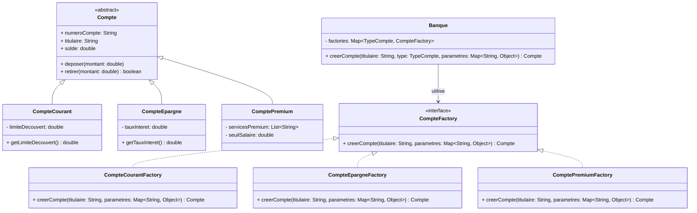
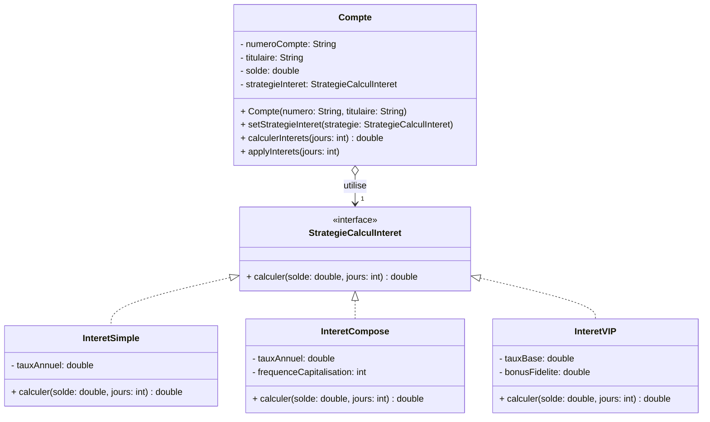
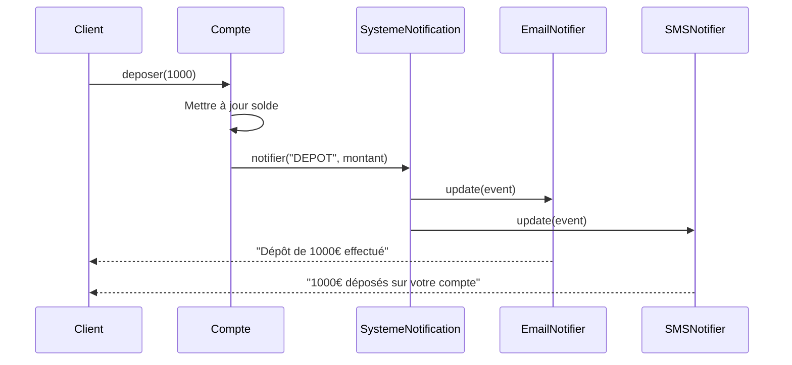
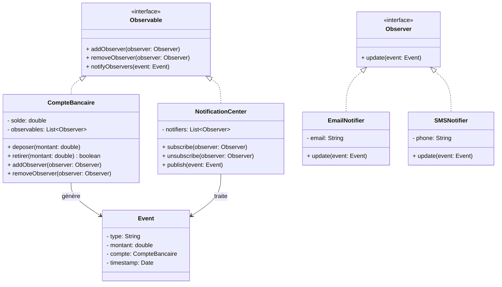
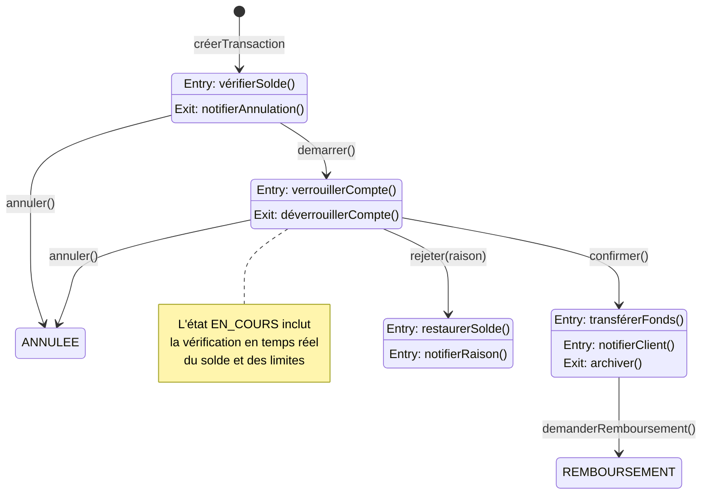

# Étude de Cas Bancaire — Niveau Moyen

## Guide de Préparation aux Examens : Design Patterns, UML Dynamique et Architecture Applicative

---

Ce deuxième document de préparation vous fera passer d'un niveau novice à un niveau intermédiaire en conception logicielle. Nous aborderons les design patterns, ces solutions éprouvées aux problèmes récurrents de conception, ainsi que les diagrammes UML dynamiques qui modélisent le comportement temporel des systèmes. L'objectif est de vous donner les outils conceptuels pour concevoir des architectures robustes, extensibles et maintenables.

Les exercices de ce niveau correspondent aux questions d'examen de fin de semester qui évaluent votre capacité à identifier les patterns de conception appropriés, à justifier leur utilisation, et à les implémenter correctement. Un étudiant maîtrise ce niveau lorsqu'il peut analyser un problème de conception, identifier les forces en présence (couplage, cohésion, extensibilité), et choisir les patterns adaptés pour les résoudre.

---

## Probleme 1 : Factory de Creation de Comptes — Pattern Creational

### Énoncé du Problème

On vous demande de refactoriser le système de création de comptes bancaires. Actuellement, le code de création est dispersé dans la classe `Banque` avec des instructions `switch` qui vérifient le type de compte à créer. Cette approche pose plusieurs problèmes : si on ajoute un nouveau type de compte, il faut modifier le code existant (violation du principe Ouvert/Fermé), le code de création est difficile à tester, et la configuration des paramètres de chaque type de compte est confuse.

Vous devez implémenter un pattern qui encapsule la logique de création dans des classes dédiées, permettant d'ajouter de nouveaux types de comptes sans modifier le code existant. Le système doit supporter la création de `CompteCourant`, `CompteEpargne`, et potentiellement de nouveaux types à l'avenir.

Ce problème illustre le besoin de séparrer la construction d'objets de leur utilisation, un principe fondamental de la conception orientée objet connu sous le nom de "préférer la composition à l'héritage". Les patterns creational (de création) résolvent précisément ce problème en fournissant des mécanismes flexibles pour instancier des objets.

### Concepts Abordés

Le pattern **Factory Method** définit une interface pour créer un objet, mais laisse les sous-classes décider quelle classe instancier. Ce pattern est utile lorsqu'une classe ne peut pas anticiper la classe des objets qu'elle doit créer, ou lorsqu'elle veut déléguer la création à ses sous-classes. Dans notre cas bancaire, chaque type de compte nécessite des paramètres différents (limite de découvert pour le compte courant, taux d'intérêt pour le compte épargne) — la factory permet d'encapsuler cette complexité de construction.

Le pattern **Abstract Factory** fournit une interface pour créer des familles d'objets apparentés sans spécifier leurs classes concrètes. Bien que notre exemple utilise une factory simple, le pattern Abstract Factory serait pertinent si notre banque créait non seulement des comptes mais aussi des cartes bancaires, des chéquiers et d'autres produits associés devant rester cohérents entre eux.

Le **Principe de Responsabilité Unique** (Single Responsibility Principle) stipule qu'une classe ne devrait avoir qu'une seule raison de changer. En extrayant la logique de création dans des classes dédiées (factories), nous respectons ce principe : la classe `Compte` gère le comportement bancaire, la factory gère la création, et la `Banque` gère la coordination.

Le **Principe Ouvert/Fermé** (Open/Closed Principle) states qu'une entité logicielle devrait être ouverte à l'extension mais fermée à la modification. Notre factory permet d'ajouter de nouveaux types de comptes en créant de nouvelles classes sans modifier le code existant — exactly what this principle advocates.

### Diagramme UML



### Implémentation en Java

```java
import java.util.Map;
import java.util.HashMap;
import java.util.function.BiFunction;

/**
 * Interface abstraite pour les factories de création de comptes.
 * Chaque factory concrète sait créer un type spécifique de compte.
 */
interface CompteFactory {
    /**
     * Crée un compte du type approprié.
     * @param titulaire nom du titulaire
     * @param parametres paramètres spécifiques au type de compte
     * @return le compte créé
     */
    Compte creer(String titulaire, Map<String, Object> parametres);
}

/**
 * Factory pour les comptes courants.
 */
class CompteCourantFactory implements CompteFactory {
    @Override
    public Compte creer(String titulaire, Map<String, Object> parametres) {
        String numeroCompte = genererNumero();
        double limiteDecouvert = getParametre(parametres, "limiteDecouvert", 200.0);
        return new CompteCourant(numeroCompte, titulaire, limiteDecouvert);
    }
    
    private String genererNumero() {
        return "CC" + System.currentTimeMillis();
    }
    
    private double getParametre(Map<String, Object> params, String key, double defaut) {
        if (params == null) return defaut;
        Object value = params.get(key);
        if (value instanceof Number) {
            return ((Number) value).doubleValue();
        }
        return defaut;
    }
}

/**
 * Factory pour les comptes épargne.
 */
class CompteEpargneFactory implements CompteFactory {
    @Override
    public Compte creer(String titulaire, Map<String, Object> parametres) {
        String numeroCompte = genererNumero();
        double tauxInteret = getParametre(parametres, "tauxInteret", 2.5);
        return new CompteEpargne(numeroCompte, titulaire, tauxInteret);
    }
    
    private String genererNumero() {
        return "CE" + System.currentTimeMillis();
    }
    
    private double getParametre(Map<String, Object> params, String key, double defaut) {
        if (params == null) return defaut;
        Object value = params.get(key);
        if (value instanceof Number) {
            return ((Number) value).doubleValue();
        }
        return defaut;
    }
}

/**
 * Banque utilisant les factories pour créer des comptes.
 * Le code de création est découplé des types concrets de comptes.
 */
class Banque {
    private final Map<TypeCompte, CompteFactory> factories;
    
    public Banque() {
        this.factories = new HashMap<>();
        // Enregistrement des factories par défaut
        this.factories.put(TypeCompte.COURANT, new CompteCourantFactory());
        this.factories.put(TypeCompte.EPARGNE, new CompteEpargneFactory());
    }
    
    /**
     * Enregistre une factory pour un type de compte.
     * Permet d'ajouter de nouveaux types sans modifier la classe Banque.
     */
    public void ajouterFactory(TypeCompte type, CompteFactory factory) {
        this.factories.put(type, factory);
    }
    
    /**
     * Crée un compte en utilisant la factory appropriée.
     */
    public Compte creerCompte(String titulaire, TypeCompte type, Map<String, Object> parametres) {
        CompteFactory factory = factories.get(type);
        if (factory == null) {
            throw new IllegalArgumentException("Type de compte non supporté: " + type);
        }
        return factory.creer(titulaire, parametres);
    }
    
    /**
     * Création simplifiée avec paramètres par défaut.
     */
    public Compte creerCompte(String titulaire, TypeCompte type) {
        return creerCompte(titulaire, type, null);
    }
    
    public enum TypeCompte {
        COURANT,
        EPARGNE
    }
}

// Classes de base (simplifiées pour l'exemple)
abstract class Compte {
    protected String numeroCompte;
    protected String titulaire;
    protected double solde;
    
    public Compte(String numeroCompte, String titulaire) {
        this.numeroCompte = numeroCompte;
        this.titulaire = titulaire;
        this.solde = 0.0;
    }
    
    public void deposer(double montant) {
        if (montant > 0) this.solde += montant;
    }
    
    public boolean retirer(double montant) {
        if (montant > 0 && this.solde >= montant) {
            this.solde -= montant;
            return true;
        }
        return false;
    }
    
    // Getters
    public String getNumeroCompte() { return numeroCompte; }
    public String getTitulaire() { return titulaire; }
    public double getSolde() { return solde; }
}

class CompteCourant extends Compte {
    private double limiteDecouvert;
    
    public CompteCourant(String numeroCompte, String titulaire, double limiteDecouvert) {
        super(numeroCompte, titulaire);
        this.limiteDecouvert = limiteDecouvert;
    }
    
    @Override
    public boolean retirer(double montant) {
        if (montant > 0 && (this.solde + limiteDecouvert) >= montant) {
            this.solde -= montant;
            return true;
        }
        return false;
    }
}

class CompteEpargne extends Compte {
    private double tauxInteret;
    
    public CompteEpargne(String numeroCompte, String titulaire, double tauxInteret) {
        super(numeroCompte, titulaire);
        this.tauxInteret = tauxInteret;
    }
    
    public void appliquerInterets() {
        this.solde += this.solde * tauxInteret / 100;
    }
}
```

### Implémentation en Python

```python
from abc import ABC, abstractmethod
from typing import Dict, Any, Type
import time
from dataclasses import dataclass

@dataclass
class Compte:
    """Classe de base abstraite pour les comptes."""
    numero_compte: str
    titulaire: str
    _solde: float = 0.0
    
    @property
    def solde(self) -> float:
        return self._solde
    
    def deposer(self, montant: float) -> None:
        if montant > 0:
            self._solde += montant
    
    def retirer(self, montant: float) -> bool:
        return False  # À redéfinir dans les sous-classes


class CompteCourant(Compte):
    """Compte courant avec découvert autorisé."""
    
    def __init__(self, numero_compte: str, titulaire: str, limite_decouvert: float = 200.0):
        super().__init__(numero_compte, titulaire)
        self._limite_decouvert = limite_decouvert
    
    @property
    def limite_decouvert(self) -> float:
        return self._limite_decouvert
    
    def retirer(self, montant: float) -> bool:
        if montant > 0 and (self._solde + self._limite_decouvert) >= montant:
            self._solde -= montant
            return True
        return False


class CompteEpargne(Compte):
    """Compte épargne avec intérêts."""
    
    def __init__(self, numero_compte: str, titulaire: str, taux_interet: float = 2.5):
        super().__init__(numero_compte, titulaire)
        self._taux_interet = taux_interet
    
    @property
    def taux_interet(self) -> float:
        return self._taux_interet
    
    def appliquer_interets(self) -> None:
        interets = self._solde * self._taux_interet / 100
        self._solde += interets
    
    def retirer(self, montant: float) -> bool:
        if montant > 0 and self._solde >= montant:
            self._solde -= montant
            return True
        return False


class ComptePremium(Compte):
    """Compte premium avec services exclusifs."""
    
    def __init__(self, numero_compte: str, titulaire: str, seuil_salaire: float = 5000.0):
        super().__init__(numero_compte, titulaire)
        self._seuil_salaire = seuil_salaire
        self._services: list[str] = ["concierge", "assistance 24/7", "tarifs préférentiels"]
    
    @property
    def services(self) -> list[str]:
        return self._services.copy()
    
    def retirer(self, montant: float) -> bool:
        # Le compte premium a un découvert illimité
        self._solde -= montant
        return True


class CompteFactory(ABC):
    """Interface abstraite pour les factories."""
    
    @abstractmethod
    def creer(self, titulaire: str, parametres: Dict[str, Any]) -> Compte:
        pass


class CompteCourantFactory(CompteFactory):
    """Factory pour les comptes courants."""
    
    def creer(self, titulaire: str, parametres: Dict[str, Any]) -> CompteCourant:
        numero = f"CC{int(time.time() * 1000) % 100000000000:012d}"
        limite = parametres.get("limite_decouvert", 200.0) if parametres else 200.0
        return CompteCourant(numero, titulaire, limite)


class CompteEpargneFactory(CompteFactory):
    """Factory pour les comptes épargne."""
    
    def creer(self, titulaire: str, parametres: Dict[str, Any]) -> CompteEpargne:
        numero = f"CE{int(time.time() * 1000) % 100000000000:012d}"
        taux = parametres.get("taux_interet", 2.5) if parametres else 2.5
        return CompteEpargne(numero, titulaire, taux)


class ComptePremiumFactory(CompteFactory):
    """Factory pour les comptes premium."""
    
    def creer(self, titulaire: str, parametres: Dict[str, Any]) -> ComptePremium:
        numero = f"CP{int(time.time() * 1000) % 100000000000:012d}"
        seuil = parametres.get("seuil_salaire", 5000.0) if parametres else 5000.0
        return ComptePremium(numero, titulaire, seuil)


class Banque:
    """Banque utilisant des factories pour créer des comptes."""
    
    def __init__(self):
        self._factories: Dict[str, CompteFactory] = {}
        self._enregistrer_factories_par_defaut()
    
    def _enregistrer_factories_par_defaut(self) -> None:
        """Enregistre les factories par défaut."""
        self._factories["courant"] = CompteCourantFactory()
        self._factories["epargne"] = CompteEpargneFactory()
        self._factories["premium"] = ComptePremiumFactory()
    
    def ajouter_factory(self, type_compte: str, factory: CompteFactory) -> None:
        """Ajoute une factory pour un nouveau type de compte."""
        self._factories[type_compte] = factory
    
    def creer_compte(self, titulaire: str, type_compte: str, 
                     parametres: Dict[str, Any] = None) -> Compte:
        """
        Crée un compte en utilisant la factory appropriée.
        
        Args:
            titulaire: Nom du titulaire du compte
            type_compte: Type de compte ('courant', 'epargne', 'premium', etc.)
            parametres: Paramètres spécifiques au type de compte
            
        Returns:
            Le compte créé
            
        Raises:
            ValueError: Si le type de compte n'est pas supporté
        """
        factory = self._factories.get(type_compte.lower())
        if factory is None:
            types_supportes = ", ".join(self._factories.keys())
            raise ValueError(
                f"Type de compte non supporté: '{type_compte}'. "
                f"Types disponibles: {types_supportes}"
            )
        
        params = parametres or {}
        compte = factory.creer(titulaire, params)
        print(f"Compte créé: {compte.numero_compte} ({type_compte}) pour {compte.titulaire}")
        return compte


# Démonstration
if __name__ == "__main__":
    banque = Banque()
    
    # Création de différents types de comptes
    compte_courant = banque.creer_compte(
        "Alice Martin", 
        "courant",
        {"limite_decouvert": 500.0}
    )
    
    compte_epargne = banque.creer_compte(
        "Bob Durand", 
        "epargne", 
        {"taux_interet": 3.5}
    )
    
    compte_premium = banque.creer_compte(
        "Carol Petit", 
        "premium"
    )
    
    # Ajout d'un nouveau type de compte via factory
    # (sans modifier le code existant de la classe Banque)
    print("\n--- Ajout d'un nouveau type de compte ---")
    
    # On pourrait facilement ajouter un CompteBusiness ainsi :
    # class CompteBusinessFactory(CompteFactory):
    #     def creer(self, titulaire: str, parametres: Dict[str, Any]) -> Compte:
    #         ...
    # banque.ajouter_factory("business", CompteBusinessFactory())
```

### Points Clés — Pourquoi Cette Conception ?

**Pourquoi le pattern Factory plutôt qu'un simple constructeur ?** Un constructeur standard ne peut pas avoir de nom personnalisé et ne peut pas retourner des types différents de la classe qu'il construit. Une factory peut créer différents types de comptes (polymorphisme de retour), avoir un nom explicite (`creerCompteProfessionnel`), et accepter des paramètres optionnels avec des valeurs par défaut. Plus important encore, une factory peut être configurée dynamiquement et partagée entre plusieurs composants du système.

**L'impact sur la testabilité :** Les factories sont facilement mockables, ce qui facilite les tests unitaires. On peut injecter une factory mock qui retourne des comptes de test avec des solde prédéfinis, sans toucher à la base de données. Cette capacité est cruciale pour pratiquer le Test-Driven Development (TDD).

**Ouverture à l'extension, Fermeture à la modification :** Grâce aux factories, ajouter un nouveau type de compte (par exemple, `CompteProfessionnel`) ne nécessite de modifier que le code qui enregistre la nouvelle factory. La classe `Banque` reste intacte, tout comme les factories existantes. Ce principe est fondamental pour maintenir la stabilité du code existant tout en l'étendant.

---

## Probleme 2 : Strategie de Calcul d'Interets — Pattern Behavioral

### Énoncé du Problème

La banque offre désormais plusieurs algorithmes de calcul d'intérêts qui peuvent varier selon les promotions, les types de clients, ou les conditions économiques. Les stratégies actuelles incluent l'intérêt simple (solde × taux), l'intérêt composé (capitalisation mensuelle), et des stratégies VIP avec des taux préférentiels. Le système doit permettre de changer la méthode de calcul à runtime sans modifier la classe `Compte`.

Ce problème illustre le pattern **Strategy**, qui encapsule des algorithmes interchangeables et les rend échangeables. Ce pattern est particulièrement utile lorsque plusieurs variantes d'un même comportement coexistent et doivent pouvoir être sélectionnées dynamiquement.

### Concepts Abordés

Le pattern **Strategy** fait partie des patterns comportementaux (behavioral) du catalogue GoF. Il définit une famille d'algorithmes, encapsule chacun d'eux, et les rend interchangeables. Strategy permet à l'algorithme de varier indépendamment des clients qui l'utilisent. Dans notre cas bancaire, différentes stratégies d'intérêt peuvent coexister et être sélectionnées selon le profil du client ou les promotions en cours.

L'**inversion de dépendance** (Dependency Inversion Principle) stipule que les modules de haut niveau ne doivent pas dépendre des modules de bas niveau — tous deux doivent dépendre d'abstractions. Notre classe `Compte` ne dépend pas des stratégies concrètes (`InteretSimple`, `InteretCompose`) mais de l'abstraction `StrategieInteret`. Cette inversion permet d'ajouter de nouvelles stratégies sans modifier le code de `Compte`.

La **méthode de stratégie** dans le diagramme UML est représentée par une interface (ou classe abstraite) que les stratégies concrètes implémentent. La classe contexte (`Compte`) maintient une référence vers la stratégie et peut la changer à tout moment.

### Diagramme UML



### Implémentation en Java

```java
import java.util.function.BiFunction;

/**
 * Interface définissant le contrat pour les stratégies de calcul d'intérêts.
 */
@FunctionalInterface
interface StrategieCalculInteret {
    /**
     * Calcule les intérêts pour un solde donné sur une période donnée.
     * @param solde le solde du compte
     * @param jours nombre de jours de la période
     * @return le montant des intérêts générés
     */
    double calculer(double solde, int jours);
    
    /**
     * Calcule et applique les intérêts au compte.
     * Méthode par défaut utilisant la stratégie définie.
     */
    default void appliquer(Compte compte, int jours) {
        double interets = calculer(compte.getSolde(), jours);
        compte.deposer(interets);
    }
}

/**
 * Stratégie d'intérêt simple : intérêts proportionnels au temps.
 * Intérêts = Solde × Taux × (Jours / 365)
 */
class InteretSimple implements StrategieCalculInteret {
    private final double tauxAnnuel;
    
    public InteretSimple(double tauxAnnuel) {
        if (tauxAnnuel < 0) {
            throw new IllegalArgumentException("Le taux ne peut pas être négatif");
        }
        this.tauxAnnuel = tauxAnnuel;
    }
    
    @Override
    public double calculer(double solde, int jours) {
        return solde * tauxAnnuel / 100 * jours / 365.0;
    }
}

/**
 * Stratégie d'intérêt composé : capitalisation périodique.
 * Les intérêts génèrent à leur tour des intérêts.
 */
class InteretCompose implements StrategieCalculInteret {
    private final double tauxAnnuel;
    private final int joursParCapitalisation;
    
    public InteretCompose(double tauxAnnuel, int joursParCapitalisation) {
        if (tauxAnnuel < 0) {
            throw new IllegalArgumentException("Le taux ne peut pas être négatif");
        }
        if (joursParCapitalisation <= 0) {
            throw new IllegalArgumentException("La fréquence de capitalisation doit être positive");
        }
        this.tauxAnnuel = tauxAnnuel;
        this.joursParCapitalisation = joursParCapitalisation;
    }
    
    @Override
    public double calculer(double solde, int jours) {
        // Formule des intérêts composés : A = P × (1 + r/n)^(nt) - P
        // où n est le nombre de capitalisations par an
        double tauxPeriodique = tauxAnnuel / 100 / (365.0 / joursParCapitalisation);
        int nombrePeriodes = jours / joursParCapitalisation;
        
        if (nombrePeriodes == 0) {
            return solde * tauxAnnuel / 100 * jours / 365.0;
        }
        
        double montantFinal = solde * Math.pow(1 + tauxPeriodique, nombrePeriodes);
        return montantFinal - solde;
    }
}

/**
 * Stratégie VIP avec bonus de fidélité.
 */
class InteretVIP implements StrategieCalculInteret {
    private static final double TAUX_BASE_DEFAUT = 4.0;
    private static final double BONUS_FIDELITE = 0.5;
    private final double tauxBase;
    private final double bonusFidelite;
    
    public InteretVIP() {
        this(TAUX_BASE_DEFAUT, BONUS_FIDELITE);
    }
    
    public InteretVIP(double tauxBase, double bonusFidelite) {
        this.tauxBase = tauxBase;
        this.bonusFidelite = bonusFidelite;
    }
    
    @Override
    public double calculer(double solde, int jours) {
        // Bonus de fidélité basé sur le solde
        double bonus = (solde > 10000) ? bonusFidelite : 0;
        double tauxEffectif = tauxBase + bonus;
        return solde * tauxEffectif / 100 * jours / 365.0;
    }
}

/**
 * Compte bancaire utilisant une stratégie d'intérêt interchangeable.
 */
class Compte {
    private String numeroCompte;
    private String titulaire;
    private double solde;
    private StrategieCalculInteret strategieInteret;
    
    public Compte(String numeroCompte, String titulaire) {
        this.numeroCompte = numeroCompte;
        this.titulaire = titulaire;
        this.solde = 0.0;
        // Stratégie par défaut : intérêt simple
        this.strategieInteret = new InteretSimple(2.5);
    }
    
    // Opérations de base
    public void deposer(double montant) {
        if (montant > 0) this.solde += montant;
    }
    
    public boolean retirer(double montant) {
        if (montant > 0 && this.solde >= montant) {
            this.solde -= montant;
            return true;
        }
        return false;
    }
    
    // Gestion de la stratégie
    public void setStrategieInteret(StrategieCalculInteret strategie) {
        this.strategieInteret = strategie;
    }
    
    /**
     * Calcule les intérêts avec la stratégie actuelle.
     */
    public double calculerInterets(int jours) {
        return strategieInteret.calculer(this.solde, jours);
    }
    
    /**
     * Calcule et applique les intérêts au solde.
     */
    public void appliquerInterets(int jours) {
        double interets = strategieInteret.calculer(this.solde, jours);
        this.solde += interets;
        System.out.printf("Intérêts de %.2f€ appliqués (stratégie: %s)%n", 
            interets, strategieInteret.getClass().getSimpleName());
    }
    
    // Getters
    public String getNumeroCompte() { return numeroCompte; }
    public String getTitulaire() { return titulaire; }
    public double getSolde() { return solde; }
}
```

### Implémentation en Python

```python
from abc import ABC, abstractmethod
from typing import Protocol

class StrategieCalculInteret(Protocol):
    """Protocole définissant l'interface pour les stratégies d'intérêts."""
    
    def calculer(self, solde: float, jours: int) -> float:
        """Calcule les intérêts pour un solde donné sur une période."""
        ...
    
    def appliquer(self, compte: 'Compte', jours: int) -> None:
        """Calcule et applique les intérêts au compte."""
        interets = self.calculer(compte.solde, jours)
        compte.deposer(interets)


class InteretSimple:
    """Stratégie d'intérêt simple : intérêts proportionnels au temps."""
    
    def __init__(self, taux_annuel: float):
        if taux_annuel < 0:
            raise ValueError("Le taux ne peut pas être négatif")
        self._taux_annuel = taux_annuel
    
    def calculer(self, solde: float, jours: int) -> float:
        return solde * self._taux_annuel / 100 * jours / 365.0
    
    def __str__(self) -> str:
        return f"Intérêt Simple ({self._taux_annuel}%)"


class InteretCompose:
    """Stratégie d'intérêt composé avec capitalisation périodique."""
    
    def __init__(self, taux_annuel: float, jours_capitalisation: int = 30):
        if taux_annuel < 0:
            raise ValueError("Le taux ne peut pas être négatif")
        if jours_capitalisation <= 0:
            raise ValueError("La fréquence de capitalisation doit être positive")
        self._taux_annuel = taux_annuel
        self._jours_capitalisation = jours_capitalisation
    
    def calculer(self, solde: float, jours: int) -> float:
        taux_periodique = self._taux_annuel / 100 / (365.0 / self._jours_capitalisation)
        nombre_periodes = jours // self._jours_capitalisation
        
        if nombre_periodes == 0:
            return solde * self._taux_annuel / 100 * jours / 365.0
        
        montant_final = solde * (1 + taux_periodique) ** nombre_periodes
        return montant_final - solde
    
    def __str__(self) -> str:
        return f"Intérêt Composé ({self._taux_annuel}%, capitalisation: {self._jours_capitalisation}j)"


class InteretVIP:
    """Stratégie VIP avec bonus de fidélité."""
    
    def __init__(self, taux_base: float = 4.0, bonus_fidelite: float = 0.5):
        self._taux_base = taux_base
        self._bonus_fidelite = bonus_fidelite
    
    def calculer(self, solde: float, jours: int) -> float:
        # Bonus de fidélité pour les gros soldes
        bonus = self._bonus_fidelite if solde > 10000 else 0.0
        taux_effectif = self._taux_base + bonus
        return solde * taux_effectif / 100 * jours / 365.0
    
    def __str__(self) -> str:
        return f"Intérêt VIP ({self._taux_base}% + bonus)"


class Compte:
    """Compte bancaire utilisant une stratégie d'intérêt interchangeable."""
    
    def __init__(self, numero_compte: str, titulaire: str):
        self.numero_compte = numero_compte
        self.titulaire = titulaire
        self._solde = 0.0
        self._strategie: StrategieCalculInteret = InteretSimple(2.5)
    
    @property
    def solde(self) -> float:
        return self._solde
    
    @property
    def strategie_interet(self) -> StrategieCalculInteret:
        return self._strategie
    
    @strategie_interet.setter
    def strategie_interet(self, strategie: StrategieCalculInteret) -> None:
        self._strategie = strategie
    
    def deposer(self, montant: float) -> None:
        if montant > 0:
            self._solde += montant
    
    def retirer(self, montant: float) -> bool:
        if montant > 0 and self._solde >= montant:
            self._solde -= montant
            return True
        return False
    
    def calculer_interets(self, jours: int) -> float:
        """Calcule les intérêts sans les appliquer."""
        return self._strategie.calculer(self._solde, jours)
    
    def appliquer_interets(self, jours: int) -> None:
        """Calcule et applique les intérêts au solde."""
        interets = self._strategie.calculer(self._solde, jours)
        self._solde += interets
        print(f"Intérêts de {interets:.2f}€ appliqués ({self._strategie})")
    
    def __str__(self) -> str:
        return f"Compte {self.numero_compte} - {self.titulaire} - Solde: {self._solde:.2f}€"


# Démonstration
if __name__ == "__main__":
    compte = Compte("FR7612345678901234567890189", "Jean Dupont")
    
    # Dépôt initial
    compte.deposer(15000.0)
    print(f"État initial: {compte}")
    
    # Calcul avec différentes stratégies
    print(f"\n--- Comparaison des stratégies (365 jours) ---")
    
    interet_simple = InteretSimple(2.5)
    interet_vip = InteretVIP(4.0, 0.5)
    interet_compose = InteretCompose(2.5, 30)  # Capitalisation mensuelle
    
    strategies = [
        ("Simple 2.5%", interet_simple),
        ("VIP 4%+", interet_vip),
        ("Composé 2.5% (mensuel)", interet_compose)
    ]
    
    for nom, strategie in strategies:
        compte.strategie_interet = strategie
        interets = compte.calculer_interets(365)
        print(f"  {nom}: {interets:.2f}€")
    
    # Application des intérêts VIP
    print(f"\n--- Application de la stratégie VIP ---")
    compte.strategie_interet = interet_vip
    compte.appliquer_interets(365)
    print(f"Nouveau solde: {compte}")
```

### Points Clés — Pourquoi Cette Conception ?

**Pourquoi ne pas utiliser des instructions if/else dans la classe Compte ?** Avec des conditions, ajouter une nouvelle stratégie impliquerait de modifier la classe `Compte` — violation du principe Ouvert/Fermé. Chaque nouvelle stratégie nécessiterait de recompiler, retester et redéployer le code existant. La stratégie pattern découple la logique de calcul de la classe qui l'utilise, permettant d'ajouter des stratégies sans toucher au code existant.

**Changement dynamique des comportements :** Le pattern Strategy permet de changer le comportement à runtime. Un compte pourrait commencer avec une stratégie d'intérêt simple, puis passer en stratégie VIP lorsque le solde dépasse un certain seuil. Cette flexibilité est impossible avec une hiérarchie de classes figée.

**Testabilité améliorée :** Chaque stratégie peut être testée indépendamment. On peut vérifier le comportement de `InteretCompose` avec des cas limites (solde nul, période incomplète) sans créer de vrai compte en base de données. Les mocks permettent d'isoler les tests unitaires.

---

## Probleme 3 : Systeme de Notification — Pattern Observer

### Énoncé du Problème

La banque souhaite notifier ses clients par différents canaux (email, SMS, notification push) lors d'événements importants : transactions réussies, alertes de solde bas, ou promotions. Le système doit permettre aux clients de s'abonner à certains types de notifications et de gérer leurs préférences de canal. Lorsqu'un événement se produit, tous les abonnés concernés doivent être informés automatiquement.

Ce problème illustre le pattern **Observer**, utilisé pour implémenter le mécanisme de publication/abonnement (publish-subscribe). Lorsqu'un objet change d'état, il notifie automatiquement tous les objets qui dépendent de lui. Ce pattern est fondamental pour construire des systèmes réactifs et découplés.

### Concepts Abordés

Le pattern **Observer** définit une relation un-à-plusieurs entre objets : quand un objet (le sujet ou observable) change d'état, tous ses observateurs sont notifies automatiquement. Ce pattern est le fondement de nombreux systèmes événementiels, des interfaces utilisateur (MVC) aux architectures microservices (event-driven).

Le **couplage faible** entre le sujet et les observateurs est l'avantage principal du pattern. Le sujet ne connaît pas les détails de ses observateurs — il connaît uniquement l'interface `Observer`. Cette abstraction permet d'ajouter, de supprimer ou de modifier des observateurs sans modifier le sujet.

La distinction entre **push** et **pull** dans les notifications : dans le modèle push, le sujet envoie les données aux observateurs. Dans le modèle pull, le sujet notifie seulement les observateurs qui viennent ensuite récupérer les données dont ils ont besoin. Notre implémentation utilise une approche hybride où le sujet passe les données pertinentes dans la notification.

### Diagramme UML de Séquence



### Diagramme UML de Classes



### Implémentation en Java

```java
import java.util.*;
import java.time.LocalDateTime;

/**
 * Représente un événement bancaire.
 */
class Event {
    public enum Type {
        DEPOT, RETRAIT, VIREMENT, ALERTE_SOLDE, ALERTE_FRAIS
    }
    
    private final Type type;
    private final double montant;
    private final String compteId;
    private final LocalDateTime timestamp;
    private final String message;
    
    public Event(Type type, double montant, String compteId, String message) {
        this.type = type;
        this.montant = montant;
        this.compteId = compteId;
        this.timestamp = LocalDateTime.now();
        this.message = message;
    }
    
    // Getters
    public Type getType() { return type; }
    public double getMontant() { return montant; }
    public String getCompteId() { return compteId; }
    public LocalDateTime getTimestamp() { return timestamp; }
    public String getMessage() { return message; }
    
    @Override
    public String toString() {
        return String.format("[%s] %s - Montant: %.2f€ - %s", 
            timestamp, type, montant, message);
    }
}

/**
 * Interface pour les observateurs (destinataires de notifications).
 */
interface Observer {
    void update(Event event);
}

/**
 * Interface pour les objets observables (sources d'événements).
 */
interface Observable {
    void addObserver(Observer observer);
    void removeObserver(Observer observer);
    void notifyObservers(Event event);
}

/**
 * Notifie par email.
 */
class EmailNotifier implements Observer {
    private final String email;
    
    public EmailNotifier(String email) {
        this.email = email;
    }
    
    @Override
    public void update(Event event) {
        System.out.println(String.format(
            "[EMAIL à %s] %s", email, event.getMessage()
        ));
        // Dans une vraie implémentation : intégration avec un service SMTP
    }
    
    public String getEmail() { return email; }
}

/**
 * Notifie par SMS.
 */
class SMSNotifier implements Observer {
    private final String telephone;
    
    public SMSNotifier(String telephone) {
        this.telephone = telephone;
    }
    
    @Override
    public void update(Event event) {
        // Les SMS ont une longueur limitée
        String messageCourt = event.getMessage();
        if (messageCourt.length() > 160) {
            messageCourt = messageCourt.substring(0, 157) + "...";
        }
        System.out.println(String.format(
            "[SMS à %s] %s", telephone, messageCourt
        ));
        // Dans une vraie implémentation : intégration avec une API SMS
    }
    
    public String getTelephone() { return telephone; }
}

/**
 * Compte bancaire qui notifie ses observateurs lors d'événements.
 */
class CompteBancaire implements Observable {
    private final String numeroCompte;
    private final String titulaire;
    private double solde;
    private final List<Observer> observers;
    
    public CompteBancaire(String numeroCompte, String titulaire) {
        this.numeroCompte = numeroCompte;
        this.titulaire = titulaire;
        this.solde = 0.0;
        this.observers = new ArrayList<>();
    }
    
    @Override
    public void addObserver(Observer observer) {
        if (!observers.contains(observer)) {
            observers.add(observer);
        }
    }
    
    @Override
    public void removeObserver(Observer observer) {
        observers.remove(observer);
    }
    
    @Override
    public void notifyObservers(Event event) {
        for (Observer observer : observers) {
            try {
                observer.update(event);
            } catch (Exception e) {
                System.err.println("Erreur lors de la notification: " + e.getMessage());
            }
        }
    }
    
    private void emit(Event.Type type, double montant, String message) {
        Event event = new Event(type, montant, numeroCompte, message);
        notifyObservers(event);
    }
    
    public void deposer(double montant) {
        if (montant <= 0) throw new IllegalArgumentException("Montant invalide");
        
        this.solde += montant;
        emit(Event.Type.DEPOT, montant, 
            String.format("Dépôt de %.2f€ effectué. Nouveau solde: %.2f€", montant, this.solde));
        
        // Alerte si le solde devient positif après être négatif
        if (this.solde >= 0) {
            emit(Event.Type.ALERTE_SOLDE, this.solde, 
                "Votre compte est de nouveau créditeur");
        }
    }
    
    public boolean retirer(double montant) {
        if (montant <= 0) throw new IllegalArgumentException("Montant invalide");
        
        if (this.solde < montant) {
            emit(Event.Type.ALERTE_SOLDE, this.solde, 
                "Retrait refusé : solde insuffisant");
            return false;
        }
        
        this.solde -= montant;
        emit(Event.Type.RETRAIT, montant, 
            String.format("Retrait de %.2f€ effectué. Solde: %.2f€", montant, this.solde));
        
        // Alerte si le solde devient critique
        if (this.solde < 100) {
            emit(Event.Type.ALERTE_SOLDE, this.solde, 
                "Alerte : votre solde est inférieur à 100€");
        }
        
        return true;
    }
    
    // Getters
    public String getNumeroCompte() { return numeroCompte; }
    public String getTitulaire() { return titulaire; }
    public double getSolde() { return solde; }
}
```

### Implémentation en Python

```python
from abc import ABC, abstractmethod
from dataclasses import dataclass
from datetime import datetime
from typing import List, Protocol, Callable, Any

@dataclass
class Event:
    """Représente un événement bancaire."""
    type: str
    montant: float
    compte_id: str
    message: str
    timestamp: datetime = None
    
    def __post_init__(self):
        if self.timestamp is None:
            self.timestamp = datetime.now()


class Observer(Protocol):
    """Protocole pour les observateurs."""
    
    def update(self, event: Event) -> None:
        ...


class CompteBancaire:
    """Compte bancaire avec système de notification."""
    
    def __init__(self, numero_compte: str, titulaire: str):
        self.numero_compte = numero_compte
        self.titulaire = titulaire
        self._solde = 0.0
        self._observers: List[Callable[[Event], None]] = []
    
    @property
    def solde(self) -> float:
        return self._solde
    
    def add_observer(self, observer: Callable[[Event], None]) -> None:
        """Ajoute un observateur."""
        if observer not in self._observers:
            self._observers.append(observer)
    
    def remove_observer(self, observer: Callable[[Event], None]) -> None:
        """Supprime un observateur."""
        if observer in self._observers:
            self._observers.remove(observer)
    
    def notify_observers(self, event: Event) -> None:
        """Notifie tous les observateurs."""
        for observer in self._observers:
            try:
                observer(event)
            except Exception as e:
                print(f"Erreur lors de la notification: {e}")
    
    def _emit(self, event_type: str, montant: float, message: str) -> None:
        """Émet un événement."""
        event = Event(event_type, montant, self.numero_compte, message)
        self.notify_observers(event)
    
    def deposer(self, montant: float) -> None:
        """Effectue un dépôt et notifie les observateurs."""
        if montant <= 0:
            raise ValueError("Le montant doit être positif")
        
        self._solde += montant
        self._emit("DEPOT", montant, 
            f"Dépôt de {montant:.2f}€ effectué. Solde: {self._solde:.2f}€")
        
        if self._solde >= 0 and hasattr(self, '_etait_negatif'):
            del self._etait_negatif
            self._emit("ALERTE_SOLDE", self._solde, "Votre compte est de nouveau créditeur")
    
    def retirer(self, montant: float) -> bool:
        """Effectue un retrait et notifie les observateurs."""
        if montant <= 0:
            raise ValueError("Le montant doit être positif")
        
        if self._solde < montant:
            self._emit("RETRAIT", 0, f"Retrait de {montant:.2f}€ refusé : solde insuffisant")
            return False
        
        self._solde -= montant
        
        # Marquer si le solde devient négatif
        if self._solde < 0:
            self._etait_negatif = True
        
        self._emit("RETRAIT", montant, 
            f"Retrait de {montant:.2f}€ effectué. Solde: {self._solde:.2f}€")
        
        # Alerte si le solde devient critique
        if self._solde < 100:
            self._emit("ALERTE_SOLDE", self._solde, 
                f"Alerte : votre solde est critique ({self._solde:.2f}€)")
        
        return True


# Implémentations concrètes d'observateurs
class EmailNotifier:
    """Notifie par email."""
    
    def __init__(self, email: str):
        self.email = email
    
    def __call__(self, event: Event) -> None:
        print(f"[EMAIL à {self.email}] {event.message}")
        # Dans la réalité : envoi via SMTP ou API email


class SMSNotifier:
    """Notifie par SMS."""
    
    def __init__(self, telephone: str):
        self.telephone = telephone
    
    def __call__(self, event: Event) -> None:
        message = event.message[:160]  # Limite SMS
        print(f"[SMS à {self.telephone}] {message}")
        # Dans la réalité : envoi via API SMS


class ConsoleNotifier:
    """Affiche les notifications dans la console (pour le debug)."""
    
    def __call__(self, event: Event) -> None:
        print(f"[CONSOLE] {event}")


# Démonstration
if __name__ == "__main__":
    # Création du compte
    compte = CompteBancaire("FR7612345678901234567890189", "Marie Dupont")
    
    # Ajout des observateurs
    email_notifier = EmailNotifier("marie.dupont@email.com")
    sms_notifier = SMSNotifier("+33612345678")
    console_notifier = ConsoleNotifier()
    
    compte.add_observer(email_notifier)
    compte.add_observer(sms_notifier)
    compte.add_observer(console_notifier)
    
    # Opérations
    print("=== Démonstration du système de notification ===\n")
    
    print("1. Dépôt de 1000€:")
    compte.deposer(1000.0)
    
    print("\n2. Retrait de 300€:")
    compte.retirer(300.0)
    
    print("\n3. Retrait important (950€):")
    compte.retirer(950.0)
    
    print("\n4. Tentative de retrait avec solde insuffisant:")
    compte.retirer(100.0)
```

### Points Clés — Pourquoi Cette Conception ?

**Découplage entre la logique métier et les notifications :** La classe `CompteBancaire` ne se préoccupe pas de la manière dont les notifications sont envoyées (email, SMS, push). Elle émet simplement des événements. Cette séparation permet d'ajouter de nouveaux canaux de notification sans modifier le code du compte, et permet aux clients de choisir leurs canaux préférés sans affecter le comportement du compte.

**Pattern Observer vs Couplage direct :** Sans le pattern Observer, chaque type de notification devrait être codé directement dans la classe `Compte`, créant un couplage fort. Ajouter une nouvelle notification nécessiterait de modifier `Compte`, et tous les comptes seraient obligés de supporter toutes les notifications, même celles dont ils n'ont pas besoin.

**Gestion des erreurs de notification :** Dans notre implémentation, si une notification échoue (serveur SMTP indisponible, API SMS en panne), les autres notifications sont toujours envoyées. Cette résilience est cruciale dans les systèmes financiers où la perte d'une notification pourrait avoir des conséquences graves.

---

## Probleme 4 : Machine a Etats d'une Transaction — Diagramme d'Etats-Transitions

### Énoncé du Problème

On vous demande de modéliser le cycle de vie d'une transaction bancaire. Une transaction peut être dans différents états : EN_ATTENTE, EN_COURS, VALIDEE, REJETEE, ou ANNULEE. Les transitions entre ces états sont régies par des règles métier précises : une transaction ne peut pas passer directement de EN_ATTENTE à VALIDEE sans passer par EN_COURS, et une transaction VALIDEE ne peut pas être annulée.

Ce problème illustre les diagrammes d'états-transitions UML, utilisés pour modéliser le comportement dynamique d'un objet au cours de son cycle de vie. Ces diagrammes sont essentiels pour comprendre les systèmes avec des workflows complexes.

### Concepts Abordés

Le **diagramme d'états-transitions** modélise les états possibles d'un objet et les événements qui provoquent des transitions entre ces états. Chaque état représente une condition stable, et chaque transition représente un changement d'état déclenché par un événement.

Les **états composites** permettent de représenter des comportements complexes avec des sous-états. Par exemple, l'état EN_COURS pourrait être décomposé en VERIFICATION, TRAITEMENT, et CONFIRMATION.

Les **gardes** sont des conditions booléennes qui doivent être vraies pour qu'une transition soit activée. Par exemple, une transition vers VALIDEE pourrait avoir une garde vérifiant que le solde est suffisant.

Les **actions d'entrée et de sortie** sont des comportements exécutés respectivement à l'entrée et à la sortie d'un état. Ces actions permettent de exécuter du code à des moments précis du cycle de vie.

### Diagramme UML d'Etats-Transitions



### Implémentation en Java

```java
import java.time.LocalDateTime;
import java.util.function.Consumer;

/**
 * Représente les différents états possibles d'une transaction.
 */
enum StatutTransaction {
    EN_ATTENTE("En attente de traitement"),
    EN_COURS("Traitement en cours"),
    VALIDEE("Transaction validée"),
    REJETEE("Transaction rejetée"),
    ANNULEE("Transaction annulée"),
    REMBOURSEMENT("Remboursement en cours");
    
    private final String description;
    
    StatutTransaction(String description) {
        this.description = description;
    }
    
    public String getDescription() {
        return description;
    }
}

/**
 * Événements déclenchant des transitions d'état.
 */
enum EventTransaction {
    DEMARRER,
    CONFIRMER,
    REJETER,
    ANNULER,
    DEMANDER_REMBOURSEMENT
}

/**
 * Contexte de la machine à états.
 */
class ContexteTransaction {
    public final String idTransaction;
    public final double montant;
    public final String compteSource;
    public final String compteDestination;
    public StatutTransaction statut;
    public LocalDateTime dateCreation;
    public LocalDateTime dateModif;
    public String raisonRejet;
    public String message;
    
    public ContexteTransaction(String idTransaction, double montant, 
                               String compteSource, String compteDestination) {
        this.idTransaction = idTransaction;
        this.montant = montant;
        this.compteSource = compteSource;
        this.compteDestination = compteDestination;
        this.statut = StatutTransaction.EN_ATTENTE;
        this.dateCreation = LocalDateTime.now();
        this.dateModif = this.dateCreation;
    }
    
    public void setStatut(StatutTransaction nouveauStatut) {
        this.statut = nouveauStatut;
        this.dateModif = LocalDateTime.now();
    }
}

/**
 * Interface pour les états de la machine à états.
 */
abstract class EtatTransaction {
    protected ContexteTransaction contexte;
    
    public void setContexte(ContexteTransaction contexte) {
        this.contexte = contexte;
    }
    
    public abstract void handle(EventTransaction event);
    
    protected void changerStatut(StatutTransaction nouveauStatut) {
        contexte.setStatut(nouveauStatut);
    }
}

/**
 * État initial : la transaction est créée mais pas encore traitée.
 */
class EtatAttente extends EtatTransaction {
    @Override
    public void handle(EventTransaction event) {
        switch (event) {
            case DEMARRER:
                System.out.println("[" + contexte.idTransaction + "] Démarrage du traitement");
                changerStatut(StatutTransaction.EN_COURS);
                break;
            case ANNULER:
                System.out.println("[" + contexte.idTransaction + "] Annulation avant traitement");
                changerStatut(StatutTransaction.ANNULEE);
                break;
            default:
                System.out.println("[" + contexte.idTransaction + "] Événement non autorisé: " + event);
        }
    }
}

/**
 * État de traitement : la transaction est en cours de validation.
 */
classEtatEnCours extends EtatTransaction {
    @Override
    public void handle(EventTransaction event) {
        switch (event) {
            case CONFIRMER:
                System.out.println("[" + contexte.idTransaction + "] Confirmation de la transaction");
                changerStatut(StatutTransaction.VALIDEE);
                break;
            case REJETER:
                System.out.println("[" + contexte.idTransaction + "] Rejet de la transaction");
                changerStatut(StatutTransaction.REJETEE);
                contexte.raisonRejet = "Solde insuffisant";
                break;
            case ANNULER:
                System.out.println("[" + contexte.idTransaction + "] Annulation pendant le traitement");
                changerStatut(StatutTransaction.ANNULEE);
                break;
            default:
                System.out.println("[" + contexte.idTransaction + "] Événement non autorisé: " + event);
        }
    }
}

/**
 * État final : la transaction est validée.
 */
class EtatValidee extends EtatTransaction {
    @Override
    public void handle(EventTransaction event) {
        switch (event) {
            case DEMANDER_REMBOURSEMENT:
                System.out.println("[" + contexte.idTransaction + "] Demande de remboursement");
                changerStatut(StatutTransaction.REMBOURSEMENT);
                break;
            default:
                System.out.println("[" + contexte.idTransaction + "] Événement non autorisé: " + event);
        }
    }
}

/**
 * Machine à états finis pour gérer les transitions.
 */
class MachineEtatsTransaction {
    private final Map<StatutTransaction, EtatTransaction> etats;
    private ContexteTransaction contexte;
    
    public MachineEtatsTransaction() {
        this.etats = new HashMap<>();
        this.etats.put(StatutTransaction.EN_ATTENTE, new EtatAttente());
        this.etats.put(StatutTransaction.EN_COURS, new EtatEnCours());
        this.etats.put(StatutTransaction.VALIDEE, new EtatValidee());
    }
    
    public void demarrer(ContexteTransaction contexte) {
        this.contexte = contexte;
        etats.get(contexte.statut).setContexte(contexte);
    }
    
    public void traiter(EventTransaction event) {
        if (contexte == null) {
            throw new IllegalStateException("Aucune transaction n'est active");
        }
        etats.get(contexte.statut).handle(event);
    }
    
    public StatutTransaction getStatutActuel() {
        return contexte != null ? contexte.statut : null;
    }
}
```

### Implémentation en Python

```python
from dataclasses import dataclass, field
from datetime import datetime
from typing import Dict, Optional
from enum import Enum, auto
from abc import ABC, abstractmethod


class StatutTransaction(Enum):
    """États possibles d'une transaction."""
    EN_ATTENTE = auto()
    EN_COURS = auto()
    VALIDEE = auto()
    REJETEE = auto()
    ANNULEE = auto()
    REMBOURSEMENT = auto()
    
    def __str__(self):
        return self.name.replace("_", " ").title()


class EventTransaction(Enum):
    """Événements déclenchant des transitions."""
    DEMARRER = auto()
    CONFIRMER = auto()
    REJETER = auto()
    ANNULER = auto()
    DEMANDER_REMBOURSEMENT = auto()


@dataclass
class ContexteTransaction:
    """Contexte de la transaction (données métier)."""
    id_transaction: str
    montant: float
    compte_source: str
    compte_destination: str
    statut: StatutTransaction = StatutTransaction.EN_ATTENTE
    date_creation: datetime = field(default_factory=datetime.now)
    date_modif: datetime = field(default_factory=datetime.now)
    raison_rejet: Optional[str] = None
    
    def changer_statut(self, nouveau_statut: StatutTransaction) -> None:
        self.statut = nouveau_statut
        self.date_modif = datetime.now()


class EtatTransaction(ABC):
    """Classe de base pour les états."""
    
    def __init__(self, contexte: Optional[ContexteTransaction] = None):
        self._contexte = contexte
    
    def set_contexte(self, contexte: ContexteTransaction) -> None:
        self._contexte = contexte
    
    @abstractmethod
    def handle(self, event: EventTransaction) -> None:
        """Gère un événement et effectue la transition appropriée."""
        pass
    
    def changer_statut(self, nouveau_statut: StatutTransaction) -> None:
        if self._contexte:
            print(f"  → Transition: {self._contexte.statut} → {nouveau_statut}")
            self._contexte.changer_statut(nouveau_statut)


class EtatAttente(EtatTransaction):
    """État initial : en attente de traitement."""
    
    def handle(self, event: EventTransaction) -> None:
        if not self._contexte:
            return
            
        match event:
            case EventTransaction.DEMARRER:
                print(f"[{self._contexte.id_transaction}] Démarrage du traitement")
                self.changer_statut(StatutTransaction.EN_COURS)
                
            case EventTransaction.ANNULER:
                print(f"[{self._contexte.id_transaction}] Annulation avant traitement")
                self.changer_statut(StatutTransaction.ANNULEE)
                
            case _:
                print(f"[{self._contexte.id_transaction}] Événement non autorisé: {event.name}")


class EtatEnCours(EtatTransaction):
    """État de traitement en cours."""
    
    def handle(self, event: EventTransaction) -> None:
        if not self._contexte:
            return
            
        match event:
            case EventTransaction.CONFIRMER:
                print(f"[{self._contexte.id_transaction}] Confirmation de la transaction")
                self.changer_statut(StatutTransaction.VALIDEE)
                
            case EventTransaction.REJETER:
                print(f"[{self._contexte.id_transaction}] Rejet de la transaction")
                self.changer_statut(StatutTransaction.REJETEE)
                self._contexte.raison_rejet = "Solde insuffisant"
                
            case EventTransaction.ANNULER:
                print(f"[{self._contexte.id_transaction}] Annulation pendant le traitement")
                self.changer_statut(StatutTransaction.ANNULEE)
                
            case _:
                print(f"[{self._contexte.id_transaction}] Événement non autorisé: {event.name}")


class EtatValidee(EtatTransaction):
    """État final : transaction validée."""
    
    def handle(self, event: EventTransaction) -> None:
        if not self._contexte:
            return
            
        match event:
            case EventTransaction.DEMANDER_REMBOURSEMENT:
                print(f"[{self._contexte.id_transaction}] Demande de remboursement")
                self.changer_statut(StatutTransaction.REMBOURSEMENT)
                
            case _:
                print(f"[{self._contexte.id_transaction}] Événement non autorisé: {event.name}")


class MachineEtatsTransaction:
    """Machine à états finis pour les transactions."""
    
    def __init__(self):
        self._etats: Dict[StatutTransaction, EtatTransaction] = {
            StatutTransaction.EN_ATTENTE: EtatAttente(),
            StatutTransaction.EN_COURS: EtatEnCours(),
            StatutTransaction.VALIDEE: EtatValidee(),
        }
        self._contexte: Optional[ContexteTransaction] = None
    
    def demarrer(self, contexte: ContexteTransaction) -> None:
        """Initialise la machine avec un contexte."""
        self._contexte = contexte
        self._etats[contexte.statut].set_contexte(contexte)
        print(f"\n=== Transaction {contexte.id_transaction} créée ===")
        print(f"  Montant: {contexte.montant}€")
        print(f"  Statut initial: {contexte.statut}")
    
    def traiter(self, event: EventTransaction) -> None:
        """Traite un événement."""
        if not self._contexte:
            raise ValueError("Aucune transaction active")
        
        etat_courant = self._etats[self._contexte.statut]
        etat_courant.handle(event)
    
    @property
    def statut(self) -> Optional[StatutTransaction]:
        return self._contexte.statut if self._contexte else None


# Démonstration
if __name__ == "__main__":
    print("=== Démonstration de la Machine à États ===\n")
    
    # Créer une transaction
    contexte = ContexteTransaction(
        id_transaction="TXN-2024-001",
        montant=1000.0,
        compte_source="FR7612345678901234567890189",
        compte_destination="FR7698765432109876543210987"
    )
    
    # Créer et démarrer la machine
    machine = MachineEtatsTransaction()
    machine.demarrer(contexte)
    
    # Scénario de transaction réussie
    print("\n--- Scénario 1 : Transaction réussie ---")
    machine.traiter(EventTransaction.DEMARRER)
    machine.traiter(EventTransaction.CONFIRMER)
    
    # Scénario de transaction annulée
    print("\n--- Scénario 2 : Transaction annulée ---")
    contexte2 = ContexteTransaction(
        id_transaction="TXN-2024-002",
        montant=500.0,
        compte_source="FR7612345678901234567890189",
        compte_destination="FR7698765432109876543210987"
    )
    machine.demarrer(contexte2)
    machine.traiter(EventTransaction.ANNULER)
    
    # Scénario de transaction rejetée
    print("\n--- Scénario 3 : Transaction rejetée ---")
    contexte3 = ContexteTransaction(
        id_transaction="TXN-2024-003",
        montant=5000.0,
        compte_source="FR7612345678901234567890189",
        compte_destination="FR7698765432109876543210987"
    )
    machine.demarrer(contexte3)
    machine.traiter(EventTransaction.DEMARRER)
    machine.traiter(EventTransaction.REJETER)
```

### Points Clés — Pourquoi Cette Conception ?

**Pourquoi une machine à états plutôt que des simples conditions ?** Sans machine à états, le code de gestion des transitions serait jonché de conditions if/else impossibles à maintenir. Ajouter un nouvel état ou une nouvelle transition nécessiterait de modifier de nombreuses parties du code. La machine à états encapsule toute la logique de transition dans un endroit centralisé, facilitant la compréhension et la maintenance.

**Validation à la compilation :** Les patterns comme le State Pattern (implémentation objet) permettent de détecter certaines erreurs à la compilation. EnJava, si on essaie de编译 un état qui n'existe pas, le compilateur signalera l'erreur. EnPython, les vérifications sont dynamiques mais les tests peuvent compenser.

**Traçabilité des transitions :** La machine à états enregistre chaque transition, ce qui est crucial pour l'audit des transactions bancaires. Chaque changement d'état est horodaté et peut être tracé, satisfaisant aux exigences réglementaires des systèmes financiers.

---

## Resume du Niveau Moyen

Ce niveau intermédiaire vous a permis de découvrir les design patterns fondamentaux et leur application dans le contexte bancaire. Le pattern Factory découple la création d'objets de leur utilisation, permettant d'ajouter de nouveaux types de comptes sans modifier le code existant. Le pattern Strategy encapsule des algorithmes interchangeables, permettant de changer dynamiquement les comportements comme le calcul d'intérêts. Le pattern Observer implémente le mécanisme de publication/abonnement pour les notifications. Enfin, les diagrammes d'états-transitions modélisent le cycle de vie complexe des objets.

Les concepts clés à retenir pour l'examen sont les suivants. Premièrement, les design patterns ne sont pas des solutions miracles mais des outils éprouvés pour résoudre des problèmes récurrents — leur utilisation doit être justifiée par un besoin réel. Deuxièmement, les patterns creational (Factory) gèrent la création d'objets, les patterns behavioral (Strategy, Observer) gèrent les comportements et les interactions. Troisièmement, les diagrammes UML dynamiques (séquence, états) complètent les diagrammes statiques en montrant comment les objets interagissent dans le temps.

Pour le niveau suivant (Senior), nous aborderons l'architecture système à grande échelle : patterns d'architecture (Microservices, Event-Driven), gestion de la concurrence et des transactions distribuées, et les protocoles réseau utilisés dans les systèmes bancaires modernes.
