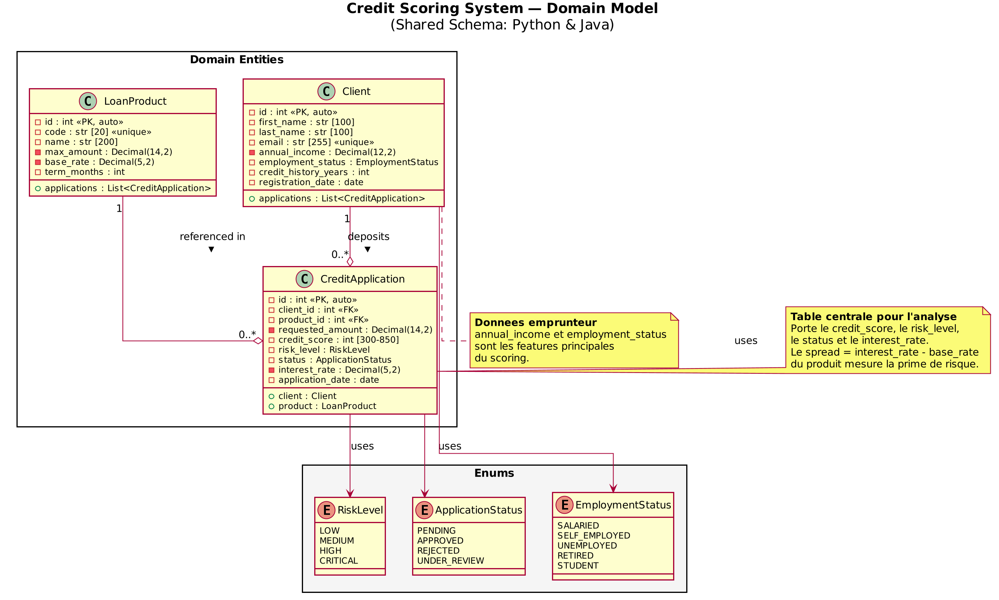
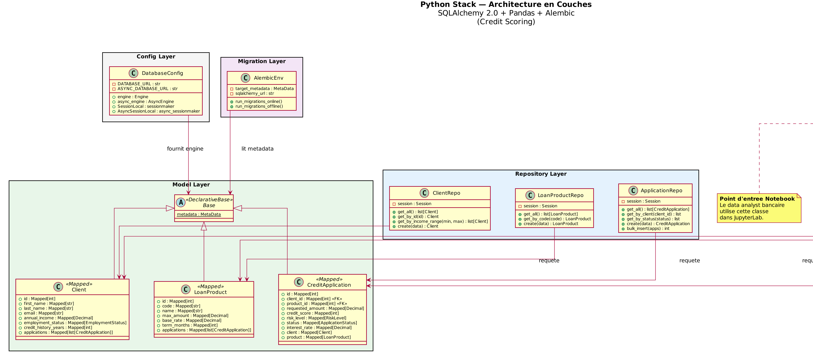
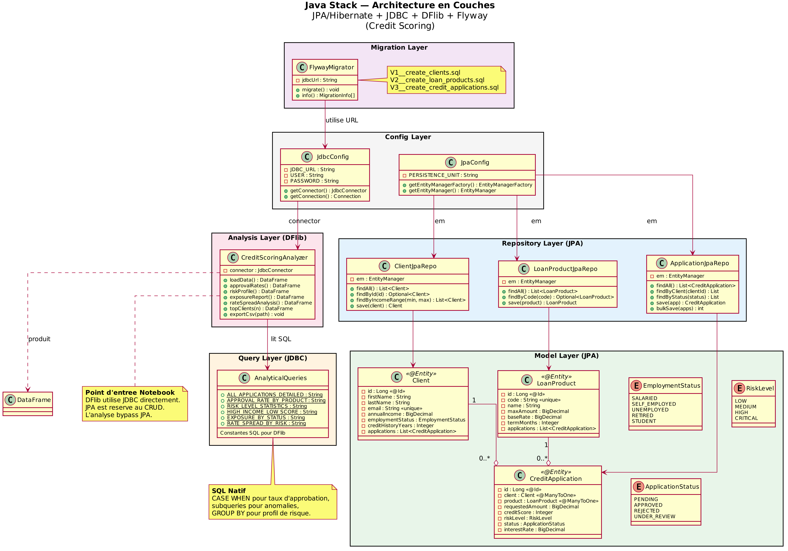
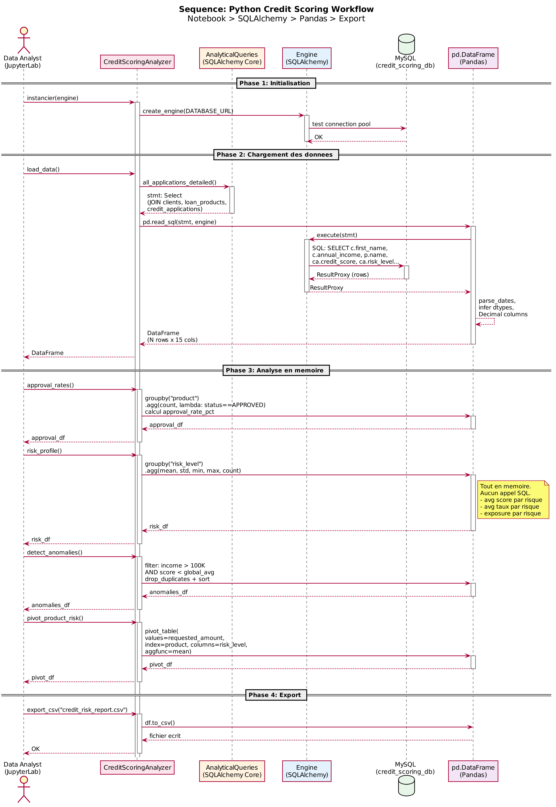
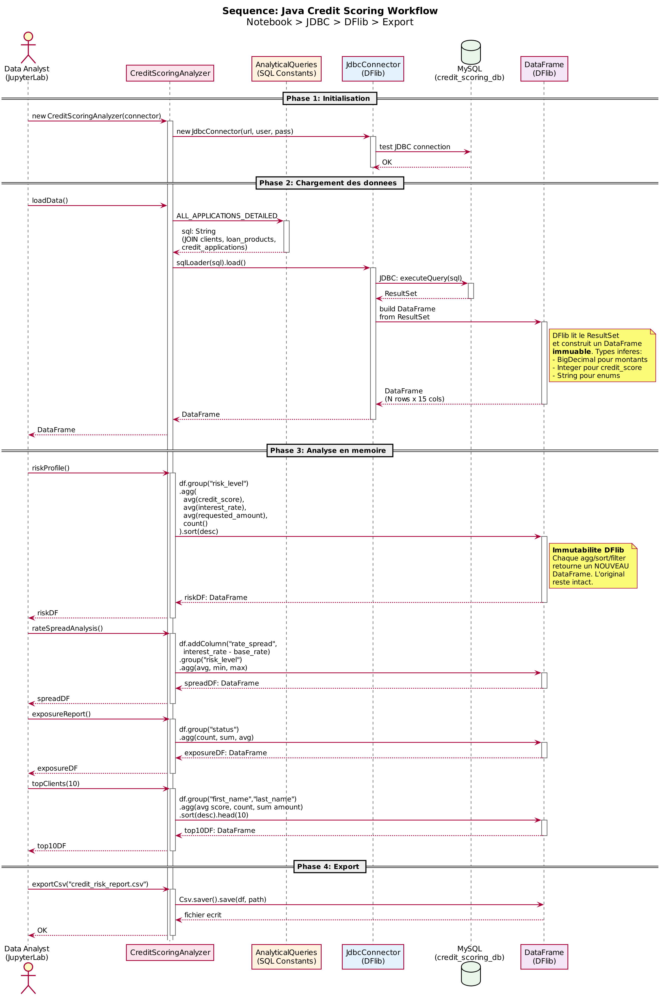
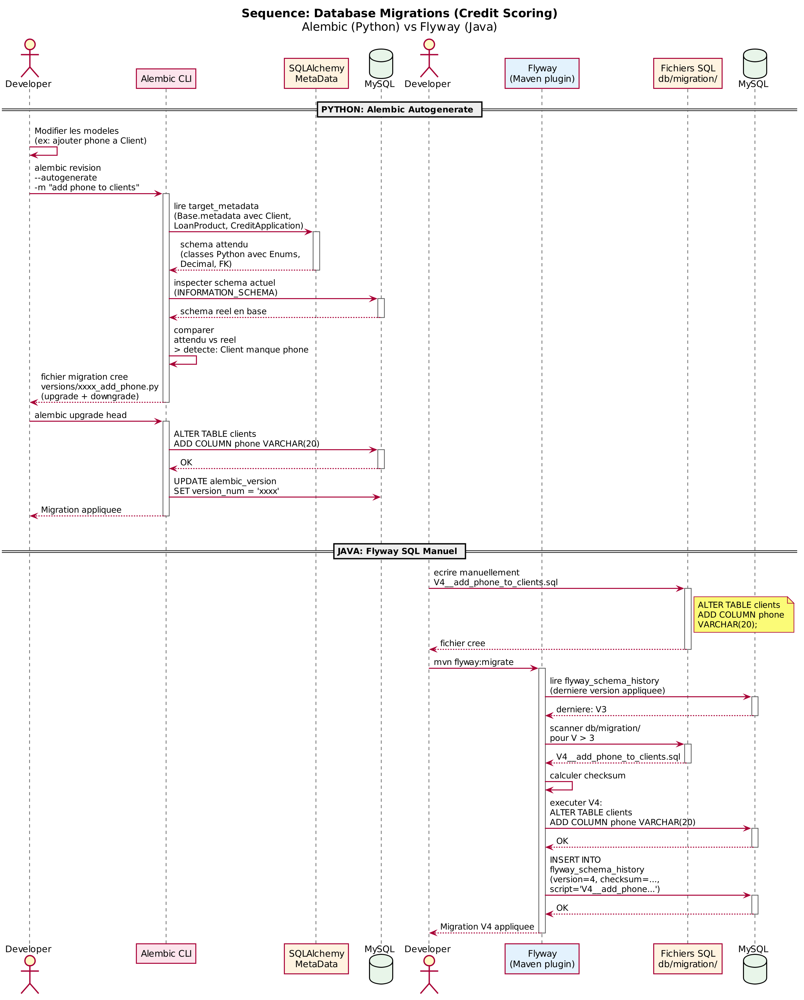
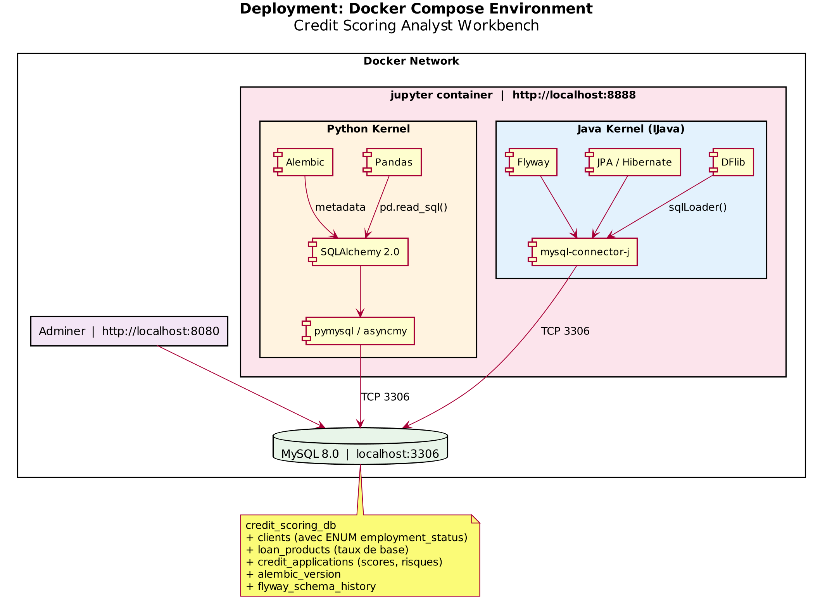

# Phase Conception — Architecture Technique du Credit Scoring System

**Objectif :** Concevoir un workbench data analyst bancaire avec deux stacks parallèles (Python et Java) opérant sur la même base MySQL, dans un environnement Docker avec JupyterLab.

---

## 1. Modèle du Domaine (Class Diagram)



### Explication

Le domaine modélise un système de **credit scoring bancaire** — l'évaluation du risque d'un emprunteur lors d'une demande de crédit. Trois entités plus trois enums :

**Client** — L'emprunteur. Porte les données démographiques et financières qui alimentent le scoring : `annual_income` (revenu annuel), `employment_status` (SALARIED, SELF_EMPLOYED, UNEMPLOYED, RETIRED, STUDENT), et `credit_history_years` (ancienneté de l'historique crédit). Ces trois attributs sont les **features** principales du modèle de scoring.

**LoanProduct** — Le type de prêt proposé par la banque. Chaque produit a un `code` unique (MORTGAGE, AUTO, PERSONAL, etc.), un `max_amount` (plafond), un `base_rate` (taux de base avant ajustement au risque), et un `term_months` (durée du prêt en mois).

**CreditApplication** — La table **centrale** pour toute l'analyse. C'est une entité de jonction enrichie entre Client et LoanProduct. Elle porte :
- `requested_amount` — le montant demandé par le client
- `credit_score` — le score calculé (300-850, échelle FICO)
- `risk_level` — le niveau de risque déduit du score (LOW ≥ 750, MEDIUM 650-749, HIGH 550-649, CRITICAL < 550)
- `status` — le statut du dossier (PENDING, APPROVED, REJECTED, UNDER_REVIEW)
- `interest_rate` — le taux effectivement accordé (base_rate + prime de risque)

**Décision de conception :** CreditApplication n'est pas une simple table de jonction. Elle porte la logique métier du scoring. Le **spread** (interest_rate - base_rate du produit) mesure la prime de risque que la banque applique à chaque client. C'est un indicateur analytique clé.

---

## 2. Architecture Python (Class Diagram)



### Explication des couches

L'architecture Python est organisée en **5 couches**, chacune avec une responsabilité claire :

**Config Layer** — `DatabaseConfig` centralise la création de l'engine SQLAlchemy (sync et async) et les session factories. C'est le seul endroit où l'URL de connexion est définie.

**Model Layer** — Les trois entités héritent de `Base` (DeclarativeBase). Particularité bancaire : les **Enums Python** (`EmploymentStatus`, `RiskLevel`, `ApplicationStatus`) se mappent directement vers des `ENUM` MySQL via `Mapped[EmploymentStatus] = mapped_column(Enum(EmploymentStatus, native_enum=True))`. Les montants financiers utilisent `Mapped[Decimal] = mapped_column(DECIMAL(12,2))` pour la précision.

**Repository Layer** — Pattern CRUD classique. `ApplicationRepo` a des méthodes spécifiques au domaine : `get_by_status(status)` pour filtrer les dossiers en attente, `bulk_insert(apps)` pour le chargement massif de données de test.

**Query Layer** — `AnalyticalQueries` contient les requêtes SQLAlchemy Core spécifiques au credit scoring :
- `approval_rate_by_product()` utilise `case()` pour calculer le taux d'approbation
- `high_income_low_score_anomalies()` utilise `scalar_subquery()` pour comparer à la moyenne globale
- `rate_spread_by_risk()` calcule la prime de risque par niveau
- `exposure_by_status()` mesure l'exposition totale de la banque

**Analysis Layer** — `CreditScoringAnalyzer` est le point d'entrée notebook. Méthodes spécifiques :
- `approval_rates()` — taux d'approbation par produit
- `risk_profile()` — statistiques par niveau de risque
- `detect_anomalies()` — clients haut revenu / score bas
- `pivot_product_risk()` — matrice Produit × Risque → montant moyen
- `exposure_report()` — exposition totale par statut

### Décision architecturale clé

La séparation Query Layer / Analysis Layer est cruciale dans le bancaire. Les requêtes SQL qui calculent les métriques de risque doivent être **auditables** et **reproductibles**. En les isolant dans `AnalyticalQueries`, on peut les versionner, les tester unitairement, et les réutiliser dans d'autres contextes (API de reporting, dashboards, alertes).

---

## 3. Architecture Java (Class Diagram)



### Explication des couches

**Chemin JPA** (gauche) — Pour le CRUD : enregistrer des clients, créer des produits, soumettre des demandes. Les enums Java (`EmploymentStatus`, `RiskLevel`, `ApplicationStatus`) sont annotées `@Enumerated(EnumType.STRING)` — **jamais ORDINAL** (qui stocke l'index numérique et casse si on réordonne l'enum).

**Chemin JDBC/DFlib** (droite) — Pour l'analyse. `AnalyticalQueries` contient les mêmes requêtes qu'en Python, mais sous forme de **constantes SQL String**. Les requêtes bancaires (CASE WHEN pour taux d'approbation, subqueries pour anomalies) sont écrites en SQL natif, pas en JPQL — c'est plus lisible et plus proche de ce qu'un data analyst écrirait directement.

### Pourquoi deux chemins en Java ?

En Python, SQLAlchemy fait tout : le Core exprime le `CASE WHEN` programmatiquement, et `pd.read_sql()` consomme le résultat. En Java, JPA ne supporte pas `CASE WHEN` en JPQL de manière aussi fluide, et DFlib ne parle pas JPA. La séparation est donc naturelle et assumée.

**Pour un data analyst bancaire en Java : ignorer JPA, passer par JDBC + DFlib.** JPA reste disponible pour le seeding et les opérations CRUD transactionnelles.

---

## 4. Workflow Python (Sequence Diagram)



### Lecture du diagramme

**Phase 2 — Chargement.** La requête principale fait un triple JOIN (clients + loan_products + credit_applications) et remonte 15 colonnes. `pd.read_sql()` gère le parsing des dates et l'inférence des types Decimal.

**Phase 3 — Analyse en mémoire.** Quatre opérations analytiques typiques du credit scoring :
1. `approval_rates()` — groupby produit + lambda pour compter les APPROVED → taux d'approbation
2. `risk_profile()` — groupby risk_level + agrégations (mean, std, min, max, count)
3. `detect_anomalies()` — filtrage booléen combiné (income > 100K AND score < moyenne globale)
4. `pivot_product_risk()` — pivot_table pour la matrice Produit × Risque

**Point bancaire :** Les anomalies (haut revenu, score bas) sont un signal de fraude potentielle ou d'erreur de scoring. Cette requête est stratégique pour l'audit.

---

## 5. Workflow Java (Sequence Diagram)



### Différences avec Python

**Phase 3 — Immuabilité.** En DFlib, le calcul du `rate_spread` (interest_rate - base_rate) retourne un nouveau DataFrame. En Pandas, `df["rate_spread"] = ...` modifie en place. Pour le data analyst : toujours capturer le résultat en variable.

**Limitations DFlib vs Pandas :**
- Pas de `pd.cut()` pour le binning des scores en tranches FICO → faire le calcul côté SQL avec CASE WHEN
- Pas de lambda dans `agg()` pour le taux d'approbation → précalculer côté SQL ou post-traiter avec des filtres
- Pas de `pivot_table()` natif → combiner group + reshape manuellement

**Conséquence :** Pour le credit scoring en Java, il est souvent plus efficace de pousser la logique métier dans les constantes SQL de `AnalyticalQueries` plutôt que de la faire en DFlib.

---

## 6. Migrations (Sequence Diagram)



### Particularités bancaires

**Enums dans les migrations.** Les `ENUM` MySQL (employment_status, risk_level, status) sont codés en dur dans le DDL. Si on ajoute une valeur (par exemple `PART_TIME` dans EmploymentStatus) :
- **Alembic** : autogenerate détecte le changement dans le modèle Python et génère un `ALTER TABLE ... MODIFY COLUMN`
- **Flyway** : il faut écrire manuellement `V4__add_part_time_employment.sql` avec le `ALTER TABLE`

**Convention pour le projet :** Alembic est la source de vérité du schéma. Les fichiers Flyway répliquent les mêmes DDL en SQL pur pour le côté Java.

---

## 7. Environnement Docker (Component Diagram)



### Base credit_scoring_db

La base contient :
- `clients` — avec ENUM employment_status, DECIMAL annual_income
- `loan_products` — avec DECIMAL base_rate et max_amount
- `credit_applications` — avec ENUM risk_level et status, INT credit_score, DECIMAL interest_rate
- `alembic_version` — tracking Python
- `flyway_schema_history` — tracking Java

---

## 8. Structure de Projet Proposée

```
credit-scoring-analyst/
├── docker-compose.yml
├── Dockerfile.jupyter
│
├── python/
│   ├── pyproject.toml
│   ├── src/
│   │   ├── config.py                 # DatabaseConfig (sync + async)
│   │   ├── models.py                 # Client, LoanProduct, CreditApplication + Enums
│   │   ├── repositories/
│   │   │   ├── client_repo.py
│   │   │   ├── loan_product_repo.py
│   │   │   └── application_repo.py
│   │   ├── queries.py                # AnalyticalQueries (SQLAlchemy Core)
│   │   ├── analyzer.py               # CreditScoringAnalyzer (Pandas)
│   │   └── seed.py                   # Données de test (clients, produits, demandes)
│   └── migrations/
│       ├── alembic.ini
│       ├── env.py
│       └── versions/
│
├── java/
│   ├── pom.xml
│   ├── src/main/java/com/creditscoring/
│   │   ├── config/
│   │   │   ├── JdbcConfig.java
│   │   │   └── JpaConfig.java
│   │   ├── model/
│   │   │   ├── Client.java
│   │   │   ├── LoanProduct.java
│   │   │   ├── CreditApplication.java
│   │   │   ├── EmploymentStatus.java
│   │   │   ├── RiskLevel.java
│   │   │   └── ApplicationStatus.java
│   │   ├── repository/
│   │   │   ├── ClientJpaRepo.java
│   │   │   ├── LoanProductJpaRepo.java
│   │   │   └── ApplicationJpaRepo.java
│   │   ├── queries/
│   │   │   └── AnalyticalQueries.java
│   │   ├── analysis/
│   │   │   └── CreditScoringAnalyzer.java
│   │   └── seed/
│   │       └── DataSeeder.java
│   └── src/main/resources/
│       ├── META-INF/persistence.xml
│       └── db/migration/
│           ├── V1__create_clients.sql
│           ├── V2__create_loan_products.sql
│           └── V3__create_credit_applications.sql
│
└── notebooks/
    ├── 01_python_credit_scoring.ipynb
    ├── 02_java_credit_scoring.ipynb
    └── 03_comparison.ipynb
```

---

## 9. Décisions de Conception Récapitulatives

| Décision | Choix | Justification |
|----------|-------|---------------|
| ORM Python | SQLAlchemy 2.0 nouvelle API | Enum natif, DECIMAL précis, type-safe |
| ORM Java | JPA/Hibernate (CRUD seulement) | Standard Jakarta, @Enumerated(STRING) |
| Analyse Java | JDBC + DFlib (bypass JPA) | SQL natif pour CASE WHEN, subqueries |
| Requêtes Python | SQLAlchemy Core select() | case(), scalar_subquery(), composable |
| Requêtes Java | SQL natif en constantes String | CASE WHEN lisible, proche du SQL analyst |
| Enums | Python Enum → MySQL ENUM natif | Type safety + contrainte DB |
| Montants | DECIMAL(12,2) / DECIMAL(14,2) | Jamais de FLOAT pour les montants financiers |
| Migration lead | Alembic (source de vérité) | Autogenerate détecte les changements d'enum |
| Migration Java | Flyway (réplique DDL) | SQL pur, convention V{n}__ |
| Base | MySQL 8.0 | ENUM natif, DECIMAL précis |
| Notebook | JupyterLab dual kernel | Exploration interactive Python + Java |
