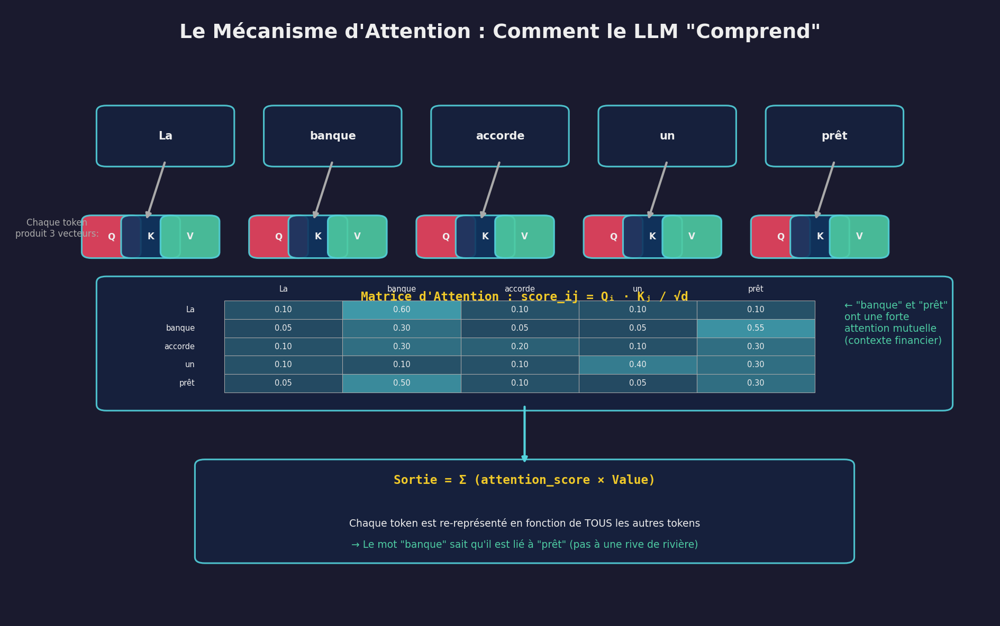
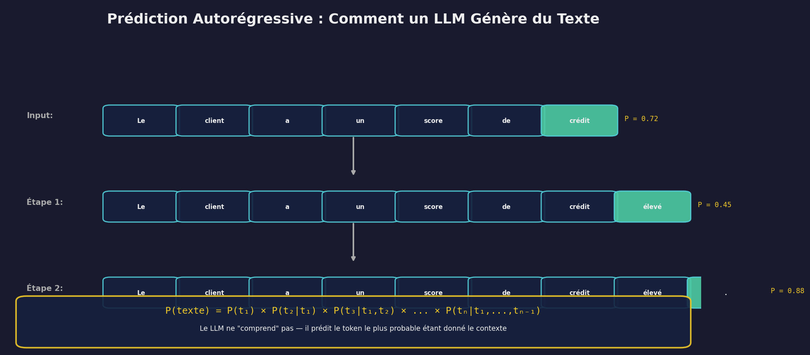
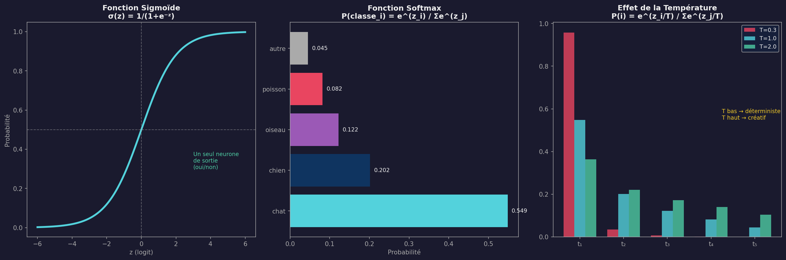
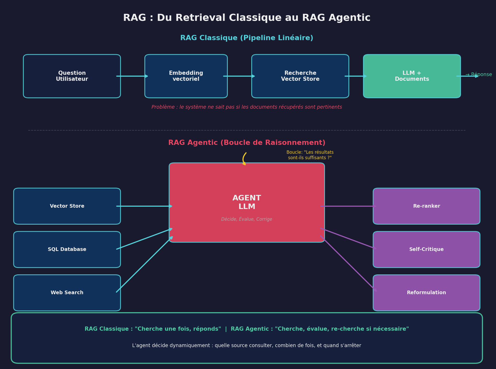
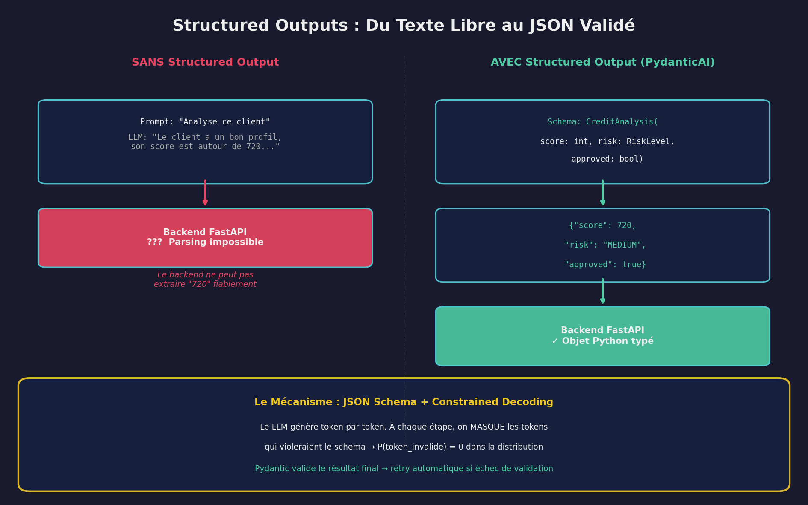
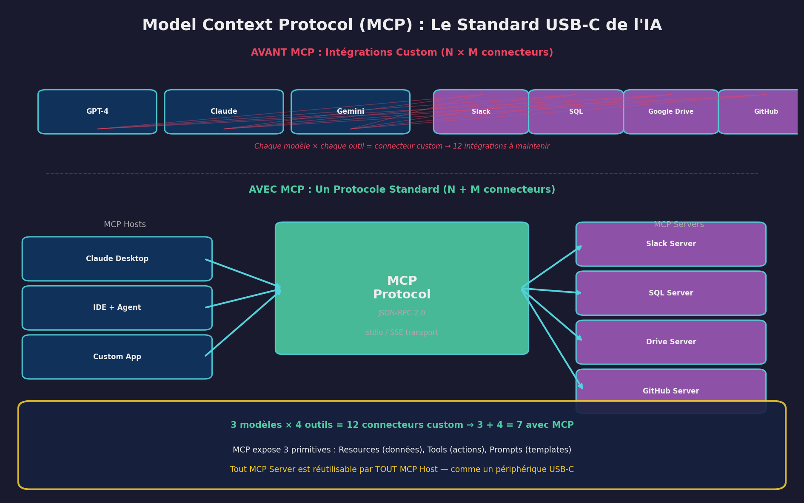

# Fondations Théoriques de l'IA Agentique

## Cours Magistral — Des Large Language Models aux Systèmes Autonomes

**Auteur :** Formation Avancée en Architecture de Systèmes IA  
**Destinataire :** Alexandro Disla  
**Contexte :** Programme Tekkod — Agentic Shift, Phase 1 : The Foundational Shift  
**Prérequis :** Familiarité avec Python, les APIs REST, et les bases de données relationnelles

---

## Introduction Générale

L'industrie du logiciel traverse, depuis 2023, une transformation comparable en ampleur à l'avènement du web dans les années 1990. La différence fondamentale est la suivante : là où le web a changé le **canal** de distribution du logiciel (du bureau au navigateur), les Large Language Models changent la **nature même** de ce que le logiciel peut faire.

Un logiciel classique exécute des instructions déterministes. Un système agentique **raisonne**, **planifie**, **utilise des outils**, et **s'autocorrige**. Ce changement de paradigme n'est pas un effet de mode — il repose sur des fondations mathématiques précises et des avancées en calcul distribué que ce cours va décomposer.

Ce document constitue le socle théorique de ton programme Agentic Shift. Il couvre huit domaines fondamentaux, chacun étant un prérequis pour les suivants.

---

## Structure du Cours

| Chapitre | Intitulé | Objectif Pédagogique |
|----------|----------|---------------------|
| **1** | Les Large Language Models (LLMs) | Comprendre la genèse, l'architecture, et les fondations mathématiques |
| **2** | La Prédiction Autorégressive | Comment un LLM génère du texte token par token |
| **3** | L'AI Mindset | Passer de la pensée déterministe à la pensée probabiliste |
| **4** | Le Prompt Engineering | L'art de formuler des instructions efficaces |
| **5** | Le Context Engineering | L'orchestration de tout ce que le modèle doit savoir |
| **6** | Le Retrieval-Augmented Generation (RAG) | Du retrieval classique au RAG agentique |
| **7** | Les Structured Outputs et PydanticAI | Garantir des sorties exploitables par un backend |
| **8** | Le Model Context Protocol (MCP) | Le standard de connexion modèle ↔ systèmes |
| **9** | L'Écosystème des Outils | n8n, LangGraph, PydanticAI — qui fait quoi |

---

# Chapitre 1 : Les Large Language Models (LLMs)

## 1.1 Genèse — Pourquoi les LLMs Existent

Pour comprendre les LLMs, il faut comprendre le problème qu'ils résolvent et pourquoi les solutions précédentes échouaient.

### 1.1.1 Le Problème Fondamental : Comprendre le Langage

Le langage naturel est, du point de vue computationnel, l'un des problèmes les plus difficiles qui existent. Contrairement à une requête SQL ou à un appel d'API, une phrase humaine est :

**Ambiguë** — « La banque est fermée » peut signifier qu'un établissement financier n'est pas ouvert ou qu'une rive de rivière est clôturée. Le sens dépend du **contexte**.

**Implicite** — « Il fait froid, tu veux un café ? » implique une relation causale (froid → besoin de se réchauffer → café) que la machine doit inférer.

**Composable à l'infini** — On peut construire une infinité de phrases grammaticalement correctes et jamais vues auparavant. Aucune table de correspondance ne peut couvrir tous les cas.

Le défi informatique est donc de construire un système qui, étant donné une séquence de mots, peut **prédire le mot suivant** de manière cohérente avec le sens de la phrase. Ce problème, en apparence simple, est en réalité la clé qui a déverrouillé l'intelligence artificielle moderne.

### 1.1.2 L'Évolution des Solutions

L'histoire des LLMs est une succession de goulots d'étranglement computationnels et des solutions inventées pour les contourner.

**Étape 1 — Le Neurone Artificiel (1943)**

McCulloch et Pitts ont formalisé un modèle mathématique du neurone biologique. Un neurone artificiel prend des entrées x₁, x₂, ..., xₙ, les multiplie par des poids w₁, w₂, ..., wₙ, somme le tout, et applique une fonction d'activation :

$$y = \sigma\left(\sum_{i=1}^{n} w_i x_i + b\right)$$

où σ est une fonction d'activation (sigmoïde, ReLU, etc.) et b est le biais.

**Limite computationnelle :** Un neurone seul ne peut résoudre que des problèmes **linéairement séparables**. Le problème XOR (ou exclusif) est insoluble par un seul neurone — Minsky et Papert l'ont démontré en 1969, provoquant le premier « hiver de l'IA ».

**Étape 2 — Le Réseau Multicouche et la Rétropropagation (1986)**

Rumelhart, Hinton et Williams ont résolu le problème en empilant des neurones en couches (le perceptron multicouche) et en inventant l'algorithme de **rétropropagation** (backpropagation). Cet algorithme calcule le gradient de l'erreur par rapport à chaque poids en utilisant la **règle de la chaîne** du calcul différentiel :

$$\frac{\partial L}{\partial w_{ij}} = \frac{\partial L}{\partial a_j} \cdot \frac{\partial a_j}{\partial z_j} \cdot \frac{\partial z_j}{\partial w_{ij}}$$

où L est la fonction de perte, aⱼ est l'activation du neurone j, et zⱼ est la somme pondérée avant activation.

Le réseau apprend en ajustant chaque poids dans la direction qui **minimise l'erreur** :

$$w_{ij} \leftarrow w_{ij} - \eta \frac{\partial L}{\partial w_{ij}}$$

où η est le taux d'apprentissage (learning rate).

**Limite computationnelle :** Ces réseaux n'ont aucune notion de **séquence**. Ils traitent chaque entrée comme indépendante. Pour le langage, c'est fatal : « Le chat mange la souris » et « La souris mange le chat » contiennent exactement les mêmes mots. L'**ordre** est essentiel.

**Étape 3 — Les Réseaux Récurrents (RNN) et LSTM (1997)**

Pour capturer la séquentialité, Hochreiter et Schmidhuber ont inventé le LSTM (Long Short-Term Memory). L'idée est de donner au réseau une **mémoire** qui persiste d'un token au suivant :

$$h_t = f(h_{t-1}, x_t)$$

L'état caché hₜ est une fonction de l'état précédent hₜ₋₁ et de l'entrée courante xₜ. Le réseau « se souvient » de ce qui est venu avant.

**Limite computationnelle — le goulot séquentiel :** Le traitement est **strictement séquentiel**. Pour calculer h₁₀₀, il faut d'abord calculer h₁, puis h₂, ..., puis h₉₉. Ceci signifie :

- La complexité temporelle est O(n) **séquentiel** — impossible de paralléliser sur GPU
- Pour des séquences longues (un document de 10 000 mots), le temps de traitement devient prohibitif
- Le gradient s'atténue exponentiellement sur les longues séquences (**vanishing gradient**), même avec LSTM

En pratique, un LSTM ne « se souvient » efficacement que de quelques centaines de tokens. Pour un système qui doit comprendre un document entier, c'est insuffisant.

**Étape 4 — Le Transformer (2017)**

Le papier « Attention Is All You Need » de Vaswani et al. a résolu le goulot séquentiel d'une manière radicale : **supprimer la récurrence entièrement**.

## 1.2 L'Architecture Transformer

Le Transformer est le fondement de tous les LLMs modernes (GPT, Claude, Gemini, Llama). Son innovation centrale est le **mécanisme d'attention**.

### 1.2.1 Le Mécanisme d'Attention

L'idée fondamentale de l'attention est la suivante : pour comprendre le sens d'un mot dans une phrase, il faut savoir **quels autres mots sont pertinents**.

Prenons la phrase : « La banque accorde un prêt ». Pour comprendre « banque », le modèle doit accorder une forte attention au mot « prêt » (contexte financier) et une faible attention à d'autres mots.

Le mécanisme fonctionne en trois étapes :

**Étape 1 — Projection en trois espaces**

Chaque token est projeté en trois vecteurs par des matrices de poids apprises :

$$Q = X W_Q \quad (\text{Query — « que cherche ce token ? »})$$
$$K = X W_K \quad (\text{Key — « qu'est-ce que ce token offre ? »})$$
$$V = X W_V \quad (\text{Value — « quel est le contenu informationnel de ce token ? »})$$

où X est la matrice des embeddings d'entrée et W_Q, W_K, W_V sont des matrices de poids apprises pendant l'entraînement.

L'analogie la plus claire : imagine une bibliothèque. Le Query est ta question de recherche, le Key est l'index du catalogue, et le Value est le contenu du livre. Tu cherches (Q), tu trouves les livres pertinents via l'index (K), et tu lis leur contenu (V).

**Étape 2 — Calcul des scores d'attention**

Le score d'attention entre le token i (qui « cherche ») et le token j (qui « offre ») est le produit scalaire de leurs vecteurs Q et K, normalisé :

$$\text{score}_{ij} = \frac{Q_i \cdot K_j}{\sqrt{d_k}}$$

où d_k est la dimension des vecteurs Key. La division par √d_k est cruciale : sans elle, les produits scalaires deviennent très grands en haute dimension, ce qui pousse le softmax vers des distributions quasi-binaires (0 ou 1), rendant l'apprentissage instable.

**Pourquoi √d_k ?** Si les éléments de Q et K sont des variables aléatoires de variance 1, alors le produit scalaire Q·K a une variance proportionnelle à d_k. Diviser par √d_k ramène la variance à 1, stabilisant les gradients.

**Étape 3 — Softmax et agrégation**

Les scores sont transformés en probabilités via la fonction softmax, puis utilisés pour calculer une somme pondérée des Values :

$$\text{Attention}(Q, K, V) = \text{softmax}\left(\frac{QK^T}{\sqrt{d_k}}\right) V$$

La sortie pour chaque token est donc une **combinaison pondérée** de tous les autres tokens, où les poids reflètent la pertinence contextuelle.

### 1.2.2 Multi-Head Attention

Un seul mécanisme d'attention capture un seul « type » de relation. En pratique, les Transformers utilisent **plusieurs têtes d'attention** en parallèle :

$$\text{MultiHead}(Q, K, V) = \text{Concat}(\text{head}_1, ..., \text{head}_h) W_O$$

où chaque tête opère dans un sous-espace différent. Intuitivement, une tête peut capturer les relations syntaxiques (sujet-verbe), une autre les relations sémantiques (banque-prêt), une autre les relations positionnelles (premier-dernier mot).

### 1.2.3 Complexité Computationnelle

La matrice d'attention QKᵀ a une taille n × n où n est la longueur de la séquence. Ceci donne :

- **Complexité temporelle :** O(n²·d) — quadratique en la longueur de séquence
- **Complexité mémoire :** O(n²) — pour stocker la matrice d'attention

**Comparaison avec le RNN :**

| Aspect | RNN/LSTM | Transformer |
|--------|----------|-------------|
| Complexité par couche | O(n·d²) | O(n²·d) |
| Opérations séquentielles | O(n) | O(1) |
| Parallélisable sur GPU | Non | Oui |
| Portée contextuelle | ~100-500 tokens | n tokens (fenêtre complète) |

Le Transformer est **quadratique** en longueur de séquence (ce qui pose problème pour les très longs documents), mais **constant** en opérations séquentielles (tout est parallélisable). Pour un GPU moderne avec des milliers de cœurs, c'est un échange extrêmement favorable.

**Conséquence pratique — la fenêtre de contexte :** La complexité O(n²) impose une limite sur la longueur des séquences traitables. C'est pourquoi les LLMs ont une « fenêtre de contexte » (context window) : 4K tokens pour GPT-3, 128K pour GPT-4, 200K pour Claude. Augmenter cette fenêtre nécessite des optimisations architecturales (Flash Attention, Ring Attention, etc.) qui réduisent le facteur constant sans changer la complexité asymptotique.

## 1.3 Du Transformer au LLM

Un LLM est un Transformer entraîné à très grande échelle sur un corpus massif de texte. Le processus se décompose en deux étapes.

### 1.3.1 Le Pré-entraînement (Pre-training)

On prend un Transformer avec des milliards de paramètres (les poids W_Q, W_K, W_V, et tous les autres) et on l'entraîne sur un objectif simple : **prédire le token suivant**.

Étant donné une séquence « Le client a un score de », le modèle doit prédire « crédit » avec une probabilité élevée. La fonction de perte est la **cross-entropy** :

$$L = -\sum_{t=1}^{T} \log P(x_t | x_1, ..., x_{t-1})$$

Le modèle est entraîné sur des milliers de milliards de tokens (le web, les livres, le code, etc.). Le coût computationnel est colossal : GPT-4 aurait coûté plus de 100 millions de dollars en calcul GPU.

### 1.3.2 Les Scaling Laws — Pourquoi « Plus Gros = Plus Intelligent »

Kaplan et al. (2020) ont découvert des lois d'échelle empiriques reliant la taille du modèle à sa performance :

$$L(N) \propto N^{-\alpha}$$

où L est la perte, N le nombre de paramètres, et α ≈ 0.076. Cette relation est une **loi de puissance** (power law) : la performance s'améliore de manière prévisible en augmentant la taille du modèle.

Plus remarquable : au-delà d'un certain seuil de taille, des **capacités émergentes** apparaissent. Le modèle commence à résoudre des problèmes de raisonnement arithmétique, de programmation, et de logique qu'il n'a jamais explicitement appris. Ce phénomène d'émergence est l'une des découvertes les plus marquantes de l'IA moderne.

### 1.3.3 L'Alignement (Fine-tuning)

Le modèle pré-entraîné est un excellent prédicteur de texte, mais il n'est pas un bon assistant. Il peut compléter « Comment fabriquer une bombe : » aussi volontiers que « Comment préparer un gâteau : ».

L'alignement consiste à affiner le modèle pour qu'il soit utile, honnête, et inoffensif. Deux techniques principales :

**Supervised Fine-Tuning (SFT) :** On entraîne le modèle sur des paires (instruction, réponse idéale) rédigées par des humains.

**Reinforcement Learning from Human Feedback (RLHF) :** On entraîne un modèle de récompense à évaluer les réponses, puis on utilise des algorithmes de reinforcement learning (PPO) pour optimiser les réponses du LLM selon ce modèle de récompense.

---

# Chapitre 2 : La Prédiction Autorégressive

## 2.1 Le Processus de Génération

Un LLM génère du texte **un token à la fois**, de gauche à droite. À chaque étape, le modèle :

1. Prend en entrée tous les tokens précédents
2. Calcule une distribution de probabilité sur l'ensemble du vocabulaire (~50 000 à 200 000 tokens possibles)
3. Sélectionne le prochain token selon cette distribution
4. Ajoute ce token à la séquence et recommence

La probabilité de la séquence complète est le produit des probabilités conditionnelles :

$$P(\text{texte}) = \prod_{t=1}^{T} P(x_t | x_1, x_2, ..., x_{t-1})$$

## 2.2 Les Fondations Mathématiques

### 2.2.1 La Fonction Softmax

À la dernière couche du Transformer, le modèle produit un vecteur de **logits** z de dimension V (la taille du vocabulaire). La fonction softmax transforme ces logits en une distribution de probabilité :

$$P(x_i) = \frac{e^{z_i}}{\sum_{j=1}^{V} e^{z_j}}$$

Propriétés clés :

- Toutes les probabilités sont positives et somment à 1
- Les logits plus élevés correspondent à des probabilités plus élevées
- La fonction est **différentiable**, ce qui permet l'apprentissage par gradient

### 2.2.2 Le Rôle de la Température

La température T est un hyperparamètre qui contrôle la « confiance » du modèle :

$$P(x_i) = \frac{e^{z_i / T}}{\sum_{j=1}^{V} e^{z_j / T}}$$

- **T → 0 :** La distribution se concentre sur le token le plus probable → réponses **déterministes** et répétitives
- **T = 1 :** Distribution standard — équilibre entre diversité et cohérence
- **T → ∞ :** Distribution uniforme → réponses **aléatoires** et incohérentes

En contexte bancaire (rapports d'audit, analyses de risque), on utilise des températures basses (0.0 - 0.3) pour maximiser la reproductibilité. En contexte créatif (brainstorming, génération d'idées), on utilise des températures plus élevées (0.7 - 1.0).

### 2.2.3 Stratégies de Décodage

La température n'est qu'un des mécanismes de contrôle de la génération :

**Top-K Sampling :** À chaque étape, on ne considère que les K tokens les plus probables et on redistribue la probabilité entre eux.

**Top-P (Nucleus) Sampling :** On sélectionne le plus petit ensemble de tokens dont la probabilité cumulée atteint P (typiquement 0.9 ou 0.95). Ceci s'adapte automatiquement : si le modèle est très confiant, seuls 2-3 tokens sont considérés ; s'il hésite, l'ensemble est plus large.

**Pourquoi c'est important pour toi :** Quand tu construiras des agents agentic pour le contexte bancaire de Tekkod, le choix de la stratégie de décodage impacte directement la fiabilité des sorties. Un agent qui approuve des crédits doit être déterministe (T=0). Un agent qui génère des rapports d'analyse peut tolérer plus de variation.

## 2.3 Le Concept de Token

Un token n'est pas un mot. C'est un sous-mot (subword) issu d'un algorithme de tokenisation (typiquement Byte-Pair Encoding ou SentencePiece).

Des exemples concrets :
- « Hello » → 1 token
- « extraordinaire » → 2-3 tokens (selon le tokenizer)
- « anticonstitutionnellement » → 4-5 tokens
- Un espace ou une ponctuation peut être un token

**Impact financier :** Les LLMs sont facturés au token (input et output). Optimiser la quantité de tokens envoyés et reçus est une compétence directement liée au coût opérationnel des systèmes IA de Tekkod.

---

# Chapitre 3 : L'AI Mindset

## 3.1 Le Changement de Paradigme

Tu viens du développement backend déterministe. En FastAPI, quand tu écris `if status == "APPROVED": return True`, le résultat est prévisible à 100%. Le même input produit toujours le même output. C'est le fondement de la programmation classique.

Un LLM ne fonctionne pas ainsi. Il opère dans l'espace des **probabilités**. La même question posée deux fois peut produire des réponses différentes. Ce n'est pas un bug — c'est le fonctionnement normal d'un système probabiliste.

### 3.1.1 Déterminisme vs Probabilisme

| Aspect | Logique Déterministe | Raisonnement Probabiliste |
|--------|---------------------|---------------------------|
| Relation input→output | Bijection (1 input → 1 output) | Distribution (1 input → N outputs possibles) |
| Erreur | Bug (0% ou 100% correct) | Incertitude (degré de confiance) |
| Gestion des cas ambigus | Impossible sans règle explicite | Natif (le modèle évalue les probabilités) |
| Scalabilité aux cas non prévus | Nulle | Généralisation naturelle |
| Debugging | Trace d'exécution linéaire | Observation des distributions et des choix |
| Garantie de résultat | Absolue | Statistique |

### 3.1.2 Les Implications Pratiques

Adopter l'AI Mindset signifie concevoir des systèmes qui **embrassent l'incertitude** plutôt que de la combattre. Concrètement :

**1. Concevoir pour la robustesse, pas pour la perfection.** Un agent IA qui répond correctement 95% du temps est utile si tu as des mécanismes de détection et de correction pour les 5% restants. Un agent qui doit être correct 100% du temps n'est pas un bon candidat pour l'IA.

**2. Valider les sorties, toujours.** Comme un LLM peut « halluciner » (produire des informations factuellement incorrectes avec confiance), chaque sortie critique doit passer par une couche de validation. C'est exactement le rôle de PydanticAI (Chapitre 7).

**3. Penser en boucles, pas en lignes.** Un workflow déterministe est linéaire : A → B → C. Un workflow agentique est une boucle : l'agent essaie, évalue le résultat, et recommence si nécessaire. LangGraph (Chapitre 9) est construit autour de cette idée.

**4. Quantifier l'incertitude.** Au lieu de « le client est à haut risque », un système bien conçu dit « le client a un score de risque de 0.87 avec un intervalle de confiance de [0.82, 0.92] ». Cette approche est cohérente avec ta formation en économie appliquée.

---

# Chapitre 4 : Le Prompt Engineering

## 4.1 Définition et Portée

Le prompt engineering est l'art de formuler des instructions efficaces pour un LLM. C'est le **point d'entrée** de tout travail avec l'IA, et c'est aussi le composant le plus souvent mal compris.

Un prompt est une séquence de tokens envoyée au modèle. Il peut inclure des instructions, du contexte, des exemples, et des contraintes. La qualité du prompt détermine directement la qualité de la sortie.

### 4.1.1 Pourquoi ça Fonctionne — In-Context Learning

Le phénomène qui rend le prompt engineering possible s'appelle **in-context learning**. Un LLM suffisamment grand peut « apprendre » une tâche à partir d'exemples fournis dans le prompt, **sans modifier ses paramètres** (sans réentraînement).

Ce phénomène n'était pas prévu par les théoriciens. Il émerge naturellement du pré-entraînement à grande échelle. Le modèle a vu tellement de patterns pendant l'entraînement qu'il peut reconnaître et reproduire un pattern présenté dans le prompt.

### 4.1.2 Les Techniques Fondamentales

**Zero-Shot :** On donne uniquement l'instruction, sans exemple.
*« Classifie ce texte comme positif ou négatif. »*

**Few-Shot :** On donne quelques exemples avant la tâche.
*« Exemples — "Service excellent" → positif. "Attente interminable" → négatif. Maintenant classifie : "Livraison rapide" → ? »*

**Chain-of-Thought (CoT) :** On demande au modèle de raisonner étape par étape.
*« Réfléchis étape par étape avant de répondre. »*

Le Chain-of-Thought est particulièrement puissant pour les tâches de raisonnement (mathématiques, logique, analyse). Wei et al. (2022) ont montré que l'ajout de « Réfléchis étape par étape » améliore de manière significative la performance sur des tâches arithmétiques — un résultat surprenant étant donné la simplicité de la technique.

### 4.1.3 Limites du Prompt Engineering

Le prompt engineering, aussi sophistiqué soit-il, est **limité** par la fenêtre de contexte du modèle. Si tu as besoin de :

- Mémoire entre les sessions → le prompt ne persiste pas
- Données en temps réel → le prompt n'a accès qu'à ce qu'on y injecte
- Actions sur des systèmes externes → le prompt seul ne peut pas exécuter de code

Ces limitations sont exactement ce que le Context Engineering résout.

---

# Chapitre 5 : Le Context Engineering

## 5.1 Au-delà du Prompt

Le prompt engineering, c'est rédiger une bonne question. Le context engineering, c'est **orchestrer tout ce que le modèle doit savoir, quand il doit le savoir, et comment il doit le recevoir**.

En 2026, le prompt n'est qu'un des multiples composants injectés au modèle. L'ensemble de ces composants forme le **contexte**.

## 5.2 Les Composants du Contexte

Un LLM moderne reçoit, pour chaque requête, un « paquet » de contexte composé de :

### 5.2.1 Le System Prompt (Instructions Système)

Instructions persistantes qui définissent le comportement du modèle : son rôle, ses contraintes, son style de réponse. C'est l'équivalent de la fiche de poste d'un employé.

### 5.2.2 La Mémoire Long-Terme

Ce que le modèle « retient » entre les sessions. Le LLM lui-même n'a aucune mémoire — chaque requête est traitée indépendamment. La mémoire long-terme est un système **externe** (base de données, vector store) dont le contenu est injecté dans le contexte à chaque requête.

L'analogie avec ta formation en ORM est directe : la mémoire long-terme est une table `user_memories` que l'on query et dont on injecte les résultats dans le prompt, exactement comme tu ferais un `pd.read_sql()` pour alimenter un dashboard.

### 5.2.3 L'État de Session (Conversation History)

L'historique de la conversation en cours. Comme le LLM n'a pas de mémoire intrinsèque, **toute la conversation précédente** est renvoyée à chaque requête. C'est pourquoi les conversations longues deviennent plus coûteuses (plus de tokens à traiter) et peuvent dépasser la fenêtre de contexte.

### 5.2.4 Les Documents Récupérés (RAG)

Les informations extraites de sources externes (bases de données, documents, web) en réponse à la requête. C'est le cœur du RAG (Chapitre 6).

### 5.2.5 Les Outils Disponibles (Tool Descriptions)

La description des outils que le modèle peut utiliser : APIs, bases de données, fonctions Python. Le modèle reçoit un « catalogue » d'outils et peut décider lequel utiliser.

### 5.2.6 Le Profil Utilisateur

Les préférences, le rôle, et les permissions de l'utilisateur. En contexte bancaire, c'est critique : un analyste risque n'a pas accès aux mêmes données qu'un directeur d'agence.

## 5.3 L'Ingénierie du Contexte

Le défi du context engineering n'est pas de fournir beaucoup d'informations, mais de fournir **les bonnes informations au bon moment**.

**Le problème de la fenêtre finie :** La fenêtre de contexte est limitée (128K-200K tokens pour les modèles actuels). Si tu injectes trop d'informations, tu satures la fenêtre et le modèle « oublie » les premières informations (effet de récence). Si tu n'en injectes pas assez, le modèle manque de contexte.

**La loi de Pareto appliquée au contexte :** 20% du contexte pertinent génère 80% de la qualité de la réponse. Identifier et injecter ces 20% critiques est l'essence du context engineering.

**Le budget de tokens :** Pour chaque requête, tu dois allouer la fenêtre de contexte entre :

| Composant | Budget typique | Rôle |
|-----------|---------------|------|
| System prompt | 500-2000 tokens | Instructions permanentes |
| Mémoire long-terme | 500-1000 tokens | Personnalisation |
| Historique conversation | 2000-10000 tokens | Continuité |
| Documents RAG | 2000-8000 tokens | Données factuelles |
| Descriptions d'outils | 500-2000 tokens | Capacités disponibles |
| Prompt utilisateur | Variable | La requête actuelle |

Le context engineering est l'art de **maximiser la pertinence de chaque token** dans cette fenêtre. C'est un problème d'optimisation sous contrainte — un concept qui devrait parler à un économiste.

---

# Chapitre 6 : Le Retrieval-Augmented Generation (RAG)

## 6.1 Le Problème que RAG Résout

Un LLM est entraîné une fois, puis déployé. Son « savoir » est figé au moment de l'entraînement. Il ne connaît pas :

- Les documents internes de Tekkod
- Les données récentes (après sa date de coupure)
- Les informations confidentielles des clients

Le RAG (Retrieval-Augmented Generation) résout ce problème en ajoutant une étape de **recherche** avant la génération. Au lieu de répondre uniquement à partir de ses paramètres, le modèle consulte d'abord une base de connaissances externe.

## 6.2 RAG Classique — Le Pipeline Linéaire

Le RAG classique suit un pipeline en quatre étapes :

### Étape 1 — Indexation (hors-ligne)

Les documents sont découpés en **chunks** (fragments de 200-1000 tokens), puis chaque chunk est transformé en un **vecteur d'embedding** par un modèle d'embedding.

Un embedding est une représentation mathématique du sens d'un texte dans un espace vectoriel de haute dimension (typiquement 768 à 3072 dimensions). Des textes sémantiquement proches ont des vecteurs proches dans cet espace.

$$\text{embedding}(\text{"prêt hypothécaire"}) \approx \text{embedding}(\text{"crédit immobilier"})$$

La distance entre deux embeddings est typiquement mesurée par la similarité cosinus :

$$\text{sim}(A, B) = \frac{A \cdot B}{\|A\| \cdot \|B\|}$$

Les vecteurs sont stockés dans un **vector store** (base de données spécialisée comme Pinecone, Weaviate, ChromaDB, ou pgvector dans PostgreSQL).

### Étape 2 — Embedding de la requête (temps réel)

La question de l'utilisateur est transformée en vecteur par le même modèle d'embedding.

### Étape 3 — Recherche par similarité

On cherche dans le vector store les K chunks les plus proches de la requête (par similarité cosinus). C'est une recherche **approximative** des K plus proches voisins (Approximate Nearest Neighbors, ANN), qui s'effectue en temps quasi-constant grâce à des structures d'index spécialisées (HNSW, IVF).

### Étape 4 — Génération augmentée

Les chunks récupérés sont injectés dans le contexte du LLM, qui génère sa réponse en s'appuyant sur ces informations.

## 6.3 Limites du RAG Classique

Le pipeline linéaire a des faiblesses :

**1. Pas de rétroaction.** Si les documents récupérés ne sont pas pertinents, le modèle n'a aucun moyen de demander « cherche autre chose ». Il répond avec ce qu'il a, même si c'est insuffisant.

**2. Requête unique.** La question originale de l'utilisateur peut être mal formulée ou trop vague pour une recherche efficace. Un humain reformulerait sa recherche — le RAG classique ne le fait pas.

**3. Pas de résolution de conflits.** Si deux documents récupérés se contredisent, le RAG classique les envoie tous les deux au modèle sans indication de lequel est plus fiable.

## 6.4 RAG Agentic — La Boucle de Raisonnement

Le RAG agentic résout ces problèmes en donnant au système la capacité de **décider** et de **boucler**.

**L'agent décide dynamiquement :**

- **Quelle source consulter :** Vector store ? Base SQL ? API externe ? Web ?
- **Comment reformuler la recherche :** Si les premiers résultats sont pauvres, reformuler la requête
- **Quand s'arrêter :** L'agent évalue la pertinence des résultats et décide si une recherche supplémentaire est nécessaire
- **Comment résoudre les conflits :** Si deux sources se contredisent, l'agent peut chercher une troisième source pour trancher

Ce pattern — observer, décider, agir, évaluer, boucler — est le cœur de la pensée agentique. C'est l'équivalent IA de ce qu'un analyste humain ferait naturellement.

## 6.5 Les Composants du RAG

| Composant | Rôle | Exemples |
|-----------|------|----------|
| **Embedding Model** | Convertir le texte en vecteurs | OpenAI `text-embedding-3`, Cohere Embed, Sentence-Transformers |
| **Vector Store** | Stocker et rechercher les vecteurs | Pinecone, Weaviate, ChromaDB, pgvector |
| **Chunking Strategy** | Découper les documents en fragments | Fixed-size, recursive, semantic |
| **Re-ranker** | Reclasser les résultats par pertinence | Cohere Rerank, cross-encoder models |
| **Query Router** | Diriger la requête vers la bonne source | LLM-based routing |

---

# Chapitre 7 : Les Structured Outputs et PydanticAI

## 7.1 Le Problème : Le LLM Parle, le Backend Code

Un LLM génère du texte libre. Ton backend FastAPI attend des objets Python typés. Ce fossé est l'un des problèmes les plus concrets du développement IA en production.

Considère cet exemple bancaire : tu demandes au LLM d'analyser un dossier de crédit. Le LLM répond :

*« Le client Jean Dupont présente un profil de risque moyen. Son score de crédit est de 680, ce qui est correct mais pourrait être amélioré. Je recommanderais un taux d'intérêt légèrement supérieur au taux de base. »*

Comment extrais-tu le score (680), le niveau de risque ("MEDIUM"), et la recommandation (approved/rejected) de ce texte ? En pratique, le parsing de texte libre est fragile, non-reproductible, et cauchemardesque à maintenir.

## 7.2 La Solution : Forcer le LLM à Produire du JSON Structuré

Les structured outputs résolvent ce problème en forçant le LLM à générer sa réponse dans un schema JSON prédéfini. Le mécanisme repose sur le **constrained decoding** (décodage contraint).

### 7.2.1 Le Constrained Decoding — Comment ça Marche

Rappel : à chaque étape de génération, le LLM produit une distribution de probabilité sur ~50 000 tokens. Normalement, il peut choisir n'importe lequel.

Avec le constrained decoding, on **masque** les tokens qui violeraient le schema JSON en cours de construction. Si le schema dit que le prochain champ doit être un entier, les tokens qui ne sont pas des chiffres sont mis à probabilité 0.

$$P'(x_i) = \begin{cases} \frac{P(x_i)}{\sum_{j \in \text{valid}} P(x_j)} & \text{si } x_i \text{ est valide selon le schema} \\ 0 & \text{sinon} \end{cases}$$

C'est une redistribution de la masse probabiliste sur les tokens valides. Le modèle conserve sa capacité de raisonnement, mais il est **contraint** de produire une sortie structurellement valide.

## 7.3 PydanticAI — Le Pont entre LLM et Backend

PydanticAI est un framework Python qui combine l'écosystème Pydantic (que tu connais déjà via FastAPI) avec les capacités des LLMs. Son rôle :

**1. Définir le schema de sortie** via des modèles Pydantic — exactement comme tu définis des schemas de réponse dans FastAPI.

**2. Appeler le LLM** avec ce schema comme contrainte. Le modèle est forcé de produire un JSON conforme.

**3. Valider le résultat** via le mécanisme de validation Pydantic. Si le JSON est structurellement valide mais sémantiquement incorrect (un score de crédit de -500 par exemple), la validation Pydantic le rejette.

**4. Retry automatique** en cas d'échec de validation. PydanticAI renvoie l'erreur au LLM avec une indication de ce qui a échoué, et le LLM réessaie.

### 7.3.1 Pourquoi PydanticAI et pas un Parser Manuel

| Approche | Fiabilité | Maintenabilité | Intégration Backend |
|----------|-----------|----------------|---------------------|
| Regex sur texte libre | ~60-70% | Cauchemar | Fragile |
| JSON.parse() sans schema | ~80-85% | Moyenne | Pas de type safety |
| JSON Schema enforcement | ~95-98% | Bonne | Bonne |
| PydanticAI (schema + validation + retry) | ~99%+ | Excellente | Native (c'est Pydantic) |

Pour Tekkod, dont le backend est déjà construit sur FastAPI/Pydantic, PydanticAI est l'extension naturelle. Les mêmes modèles Pydantic qui valident les requêtes HTTP entrantes peuvent servir de schema pour les sorties LLM.

---

# Chapitre 8 : Le Model Context Protocol (MCP)

## 8.1 Le Problème : N × M Intégrations

Imagine que Tekkod développe des agents pour 3 clients. Chaque client utilise des outils différents : Slack, Google Drive, une base SQL, GitHub. Et chaque agent peut être basé sur un modèle différent : GPT-4, Claude, Gemini.

Sans standard, tu as besoin de **N × M** connecteurs custom. 3 modèles × 4 outils = 12 intégrations à développer, tester, et maintenir. Chaque nouvel outil ou modèle ajouté multiplie le travail.

## 8.2 La Solution : Un Protocole Standard

Le **Model Context Protocol (MCP)**, développé par Anthropic et adopté comme standard ouvert, résout ce problème de la même manière que USB-C a résolu le problème des câbles de charge.

MCP définit un protocole de communication standardisé entre un **Host** (l'application qui contient le LLM) et un **Server** (un service qui expose des données ou des actions).

### 8.2.1 L'Architecture MCP

L'architecture est composée de trois éléments :

**MCP Host :** L'application qui héberge le LLM et qui initie les connexions. Exemples : Claude Desktop, un IDE avec intégration AI, une application custom de Tekkod.

**MCP Client :** Le composant technique dans le Host qui gère la connexion au protocole. Un Host peut avoir plusieurs Clients.

**MCP Server :** Un service qui expose des capacités (données, actions, templates) via le protocole MCP. Exemples : un serveur qui donne accès à Slack, un autre à une base SQL, un autre à Google Drive.

### 8.2.2 Les Trois Primitives MCP

Tout MCP Server expose ses capacités via trois primitives :

**Resources (Données) :** Des sources de données que le modèle peut lire. Similaire à un endpoint GET dans une API REST. Exemple : les dernières conversations Slack, un document dans Google Drive.

**Tools (Actions) :** Des fonctions que le modèle peut exécuter. Similaire à un endpoint POST. Exemple : envoyer un message Slack, créer un fichier dans Drive, exécuter une requête SQL.

**Prompts (Templates) :** Des templates d'interaction prédéfinis que le serveur propose au modèle. Exemple : un template « Résumé de conversation » optimisé pour les données Slack.

### 8.2.3 Le Transport

MCP utilise **JSON-RPC 2.0** comme protocole de communication (le même standard utilisé par les Language Servers dans les IDE). Le transport peut être :

**stdio :** Communication via les flux standard (stdin/stdout). Optimal pour les serveurs locaux.

**Server-Sent Events (SSE) :** Communication HTTP en temps réel. Optimal pour les serveurs distants.

### 8.2.4 Pourquoi MCP est Stratégique pour Tekkod

MCP transforme la proposition de valeur de Tekkod. Au lieu de vendre des « intégrations custom » (un travail de plomberie), Tekkod peut vendre des **MCP Servers réutilisables** que les clients branchent dans leur propre écosystème IA.

Un MCP Server développé une fois pour accéder à une base MySQL bancaire peut être utilisé par Claude, par GPT-4, par Gemini, ou par n'importe quel autre Host compatible MCP. L'effort d'intégration passe de N × M à N + M.

---

# Chapitre 9 : L'Écosystème des Outils — n8n, LangGraph, PydanticAI

## 9.1 Vue d'Ensemble

Trois outils, trois rôles distincts et complémentaires. La confusion entre ces outils est fréquente chez les développeurs débutants en IA agentique. Clarifions.

## 9.2 n8n — Le Plombier

**Qu'est-ce que c'est :** Un outil d'automatisation de workflows no-code/low-code, self-hosted, avec plus de 400 intégrations pré-construites.

**Le problème qu'il résout :** Connecter des systèmes hétérogènes (Slack → LLM → Google Sheets → Email) sans écrire des milliers de lignes de « glue code ».

**Comment il fonctionne :** Tu construis visuellement un workflow (graphe orienté de nœuds). Chaque nœud est une action : recevoir un webhook, appeler un LLM, insérer dans une base, envoyer un email. Les nœuds sont connectés par des arêtes qui passent les données.

**Quand l'utiliser :**

- Automatisations métier où le LLM est **un composant parmi d'autres** (pas le centre du système)
- Intégrations rapides entre services existants
- Prototypage de workflows avant de les coder proprement
- Quand le client veut modifier le workflow sans toucher au code

**Quand NE PAS l'utiliser :**

- Si le workflow nécessite des **boucles de raisonnement** complexes (l'agent qui réfléchit, évalue, reboucle)
- Si la logique est fortement couplée au raisonnement du LLM
- Si tu as besoin d'un contrôle fin sur la gestion d'état

## 9.3 LangGraph — L'Architecte

**Qu'est-ce que c'est :** Un framework Python pour construire des agents et des workflows agentiques sous forme de **graphes d'état**.

**Le problème qu'il résout :** Les workflows agentiques ne sont pas linéaires. Un agent doit pouvoir boucler (réessayer une recherche), conditionner (si le résultat est insuffisant, chercher ailleurs), attendre (pause pour approbation humaine), et persister (sauvegarder l'état entre les étapes).

**Concepts clés :**

**State (État) :** Un objet Python (typiquement un TypedDict ou un dataclass Pydantic) qui contient tout ce que le workflow sait à un instant donné. L'état est passé de nœud en nœud et évolue au fil du traitement.

**Nodes (Nœuds) :** Des fonctions Python qui reçoivent l'état, effectuent une action (appeler un LLM, exécuter une requête, valider un résultat), et retournent un état modifié.

**Edges (Arêtes) :** Les transitions entre nœuds. Elles peuvent être inconditionnelles (A → B) ou conditionnelles (si le score > 0.8, aller à C ; sinon, retourner à A).

**Checkpointing :** L'état peut être sérialisé et stocké à chaque étape. Ceci permet de reprendre un workflow interrompu, de rejouer une étape en debug, ou de gérer le Human-in-the-Loop (HITL).

**Quand l'utiliser :**

- Agents avec des boucles de raisonnement (RAG agentique, auto-correction)
- Workflows nécessitant une approbation humaine (Human-in-the-Loop)
- Systèmes multi-agents (un « manager » qui coordonne des « workers »)
- Quand tu as besoin de **contrôle total** sur le flux d'exécution

## 9.4 PydanticAI — L'Ingénieur

**Qu'est-ce que c'est :** Un framework Python pour construire des agents LLM dont les sorties sont des objets Pydantic validés.

**Le problème qu'il résout :** Garantir que les sorties du LLM sont **structurées, typées, et validées** — directement exploitables par un backend.

**Positionnement :** PydanticAI n'est pas un concurrent de LangGraph. Il opère à un niveau d'abstraction différent :

- LangGraph gère le **flux** (dans quel ordre les étapes s'exécutent, avec quelles conditions)
- PydanticAI gère la **qualité** (que les sorties de chaque étape sont structurellement et sémantiquement valides)

Les deux sont souvent utilisés ensemble : un graphe LangGraph dont les nœuds utilisent PydanticAI pour les interactions avec le LLM.

**Caractéristiques clés :**

- **Multi-modèle :** Supporte OpenAI, Anthropic, Google, et d'autres. Tu peux changer de modèle sans réécrire le code.
- **Tool calling natif :** Les agents PydanticAI peuvent utiliser des « tools » (fonctions Python décorées) que le LLM peut appeler.
- **Retry intelligent :** Si la sortie du LLM échoue à la validation Pydantic, l'erreur est renvoyée au LLM avec le détail du problème, et une nouvelle tentative est effectuée automatiquement.
- **Streaming :** Les réponses peuvent être streamées token par token pour une meilleure latence perçue.

## 9.5 Matrice de Décision

| Scénario | Outil |
|----------|-------|
| « Quand un email arrive, extrais les infos et enregistre-les dans Sheets » | n8n |
| « L'agent cherche des documents, évalue la pertinence, reformule si nécessaire, et propose un résumé à un humain pour validation » | LangGraph |
| « L'API reçoit un texte libre et retourne un objet CreditAnalysis validé » | PydanticAI |
| « L'agent complexe coordonne plusieurs LLMs, utilise des outils, boucle, et produit des sorties structurées » | LangGraph + PydanticAI |
| « Automatise un workflow métier entier avec des étapes AI intercalées » | n8n avec des nœuds LLM |

## 9.6 Positionnement dans le Stack Tekkod

Pour l'infrastructure agentique de Tekkod, les trois outils occupent des positions complémentaires :

| Couche | Outil | Rôle chez Tekkod |
|--------|-------|-----------------|
| **Orchestration métier** | n8n | Workflows client (notifications, triggers, ETL léger) |
| **Orchestration AI** | LangGraph | Raisonnement agentique (boucles, HITL, multi-agent) |
| **Qualité des sorties** | PydanticAI | Validation et typage des réponses LLM |
| **Connectivité** | MCP (FastMCP) | Connexion aux systèmes externes (SQL, Slack, Drive) |
| **Observabilité** | LangSmith | Traces, coûts, debug des décisions agentiques |

---

# Synthèse et Questions de Validation

## Ce que Tu Dois Retenir

**1. Un LLM est un prédicteur de tokens.** C'est un Transformer entraîné à grande échelle qui prédit le token suivant étant donné le contexte. Il ne « comprend » pas au sens humain — il exploite des patterns statistiques à une échelle suffisante pour que le résultat ressemble à de la compréhension.

**2. L'attention est le mécanisme clé.** La formule Attention(Q,K,V) = softmax(QKᵀ/√d)V est le cœur du Transformer. Elle permet à chaque token de « consulter » tous les autres tokens de la séquence, en parallèle.

**3. Le passage du déterminisme au probabilisme est le vrai changement de mindset.** Tu ne programmes plus des règles — tu conçois des systèmes qui évaluent des probabilités, tolèrent l'incertitude, et se corrigent.

**4. Le context engineering subsume le prompt engineering.** Le prompt n'est qu'un composant parmi six (system prompt, mémoire, historique, RAG, outils, profil). Orchestrer l'ensemble est le vrai métier.

**5. RAG agentic > RAG classique.** L'agent qui décide quand chercher, comment reformuler, et quand s'arrêter surpasse largement le pipeline linéaire « cherche une fois, réponds ».

**6. PydanticAI est le pont entre le monde probabiliste et le monde déterministe.** Les sorties structurées + la validation + le retry transforment un LLM non-fiable en composant fiable d'un backend.

**7. MCP est le futur de la connectivité IA.** Le standard N+M au lieu de N×M change l'économie des intégrations.

**8. n8n, LangGraph, PydanticAI ne sont pas concurrents.** Ils opèrent à des niveaux d'abstraction différents et sont souvent utilisés ensemble.

## Questions que Tu Devrais Pouvoir Répondre

1. « Pourquoi le Transformer a-t-il remplacé le LSTM ? Quelle est la différence de complexité ? »

2. « Un LLM comprend-il ce qu'il dit ? Justifie ta réponse avec le mécanisme de génération. »

3. « Quelle est la différence entre la température 0 et la température 1 ? Quand utiliser chacune ? »

4. « Tu as un agent RAG qui retourne des résultats médiocres. Quelles sont les trois premières choses que tu vérifies ? »

5. « Ton backend attend un objet CreditApplication. Le LLM retourne du texte libre. Comment résous-tu ce problème ? »

6. « Un client veut connecter Claude à sa base SQL et à Slack. Combien de composants MCP dois-tu développer ? Lesquels ? »

7. « On te demande de construire un workflow où un agent analyse un document, propose une décision, et attend qu'un humain valide avant d'exécuter. Quel outil utilises-tu pour l'orchestration ? Pourquoi ? »

---

## Ressources pour Aller Plus Loin

### Papiers Fondamentaux

- **Vaswani et al. (2017).** "Attention Is All You Need." — Le papier fondateur du Transformer
- **Brown et al. (2020).** "Language Models are Few-Shot Learners." — GPT-3 et l'in-context learning
- **Wei et al. (2022).** "Chain-of-Thought Prompting Elicits Reasoning." — La technique CoT
- **Lewis et al. (2020).** "Retrieval-Augmented Generation for Knowledge-Intensive NLP Tasks." — Le papier fondateur du RAG
- **Kaplan et al. (2020).** "Scaling Laws for Neural Language Models." — Les lois d'échelle

### Documentation Technique

- **PydanticAI :** https://ai.pydantic.dev/
- **LangGraph :** https://langchain-ai.github.io/langgraph/
- **MCP Specification :** https://modelcontextprotocol.io/
- **n8n :** https://docs.n8n.io/

### Ressources Vidéo (Phase 1 du Programme Tekkod)

- **LangChain Academy — LangGraph Essentials :** Le cours de référence pour les graphes d'état
- **S3CloudHub — Agentic AI Workflows :** Introduction pratique aux workflows multi-étapes

---

## Prochaine Étape

Ce document constitue le socle théorique de la **Phase 1 — Foundational Shift** du programme Tekkod. La suite logique est l'exploration pratique de chaque outil, en commençant par PydanticAI (le pont le plus naturel depuis ton expertise FastAPI/Pydantic existante), puis LangGraph pour l'orchestration agentique.

*Fin du Cours Magistral — Fondations de l'IA Agentique*
