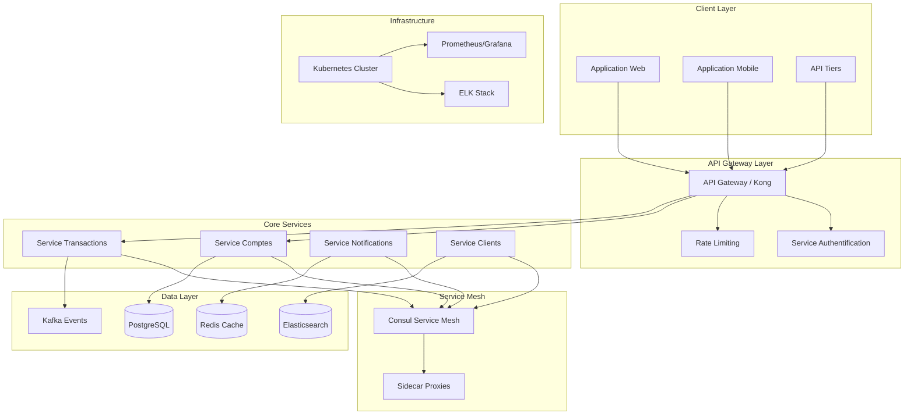
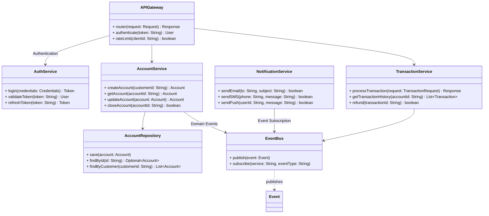
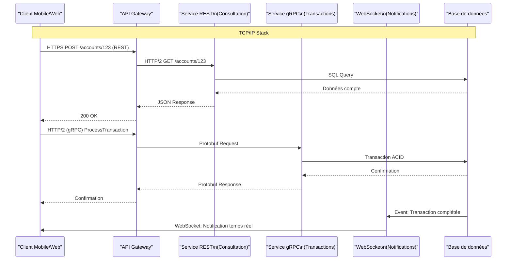
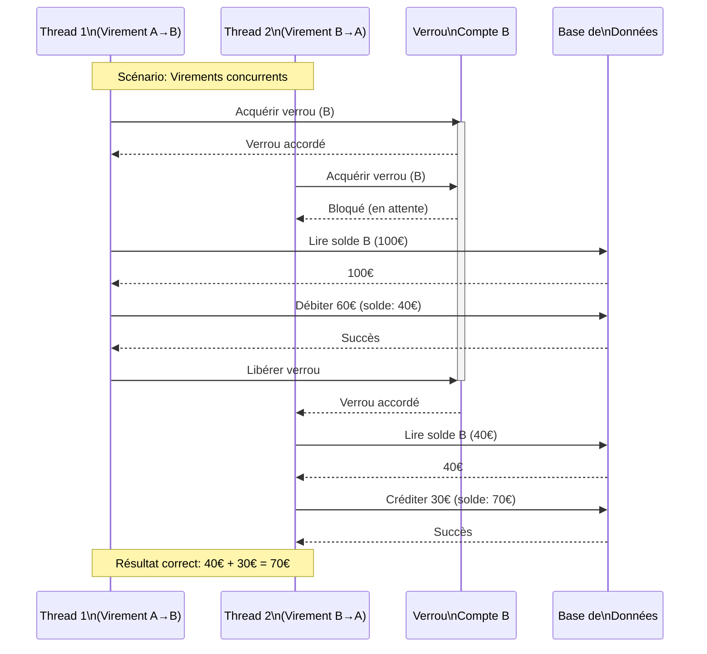

# Étude de Cas Bancaire — Niveau Senior

## Guide de Préparation aux Examens : Architecture Système, Microservices et Protocoles Réseau

---

Ce troisième document vous propulse vers le niveau expert en conception logicielle. Nous aborderons l'architecture d'entreprise, les patterns de microservices, les protocoles réseau et les défis de la haute disponibilité dans les systèmes bancaires modernes. L'objectif est de vous donner une vision globale de la conception de systèmes financiers distribués à grande échelle.

Les exercices de ce niveau correspondent aux questions d'examen avancées qui évaluent votre capacité à concevoir des architectures complètes, à comprendre les compromis entre différents patterns d'architecture, et à maîtriser les protocoles de communication utilisés dans l'industrie. Un étudiant maîtrise ce niveau lorsqu'il peut justifier ses choix architecturaux en termes de scalabilité, résilience et maintenabilité.

---

## Probleme 1 : Architecture Microservices pour une Banque

### Énoncé du Problème

On vous demande de concevoir l'architecture d'un système bancaire moderne devant traiter des millions de transactions par jour avec une disponibilité de 99,99%. L'architecture monolithique actuelle ne peut plus évoluer et les pannes d'un composant mettent tout le système hors service. Vous devez proposer une architecture en microservices avec les caractéristiques suivantes : découplage des fonctionnalités (gestion de comptes, transactions, notifications, authentification), scalabilité horizontale indépendante pour chaque service, et résilience face aux pannes partielles.

Ce problème illustre les défis de l'architecture distribuée et l'évolution depuis le monolith vers les microservices. Les microservices ne sont pas simplement de petits services — c'est une philosophie architecturale qui implique une organisation autour des capacités métier, un déploiement indépendant, et une tolérance aux pannes.

### Concepts Abordés

L'**architecture microservices** structure une application comme un ensemble de services faiblement couplés, chacun exécutant un processus métier unique et pouvant être déployé indépendamment. Cette approche contraste avec l'architecture monolithique où tous les composants sont tightly coupled et déployés ensemble. Les avantages incluent le déploiement indépendant (un service peut être mis à jour sans redémarrer tout le système), la scalabilité granulaire (seuls les services bottleneck sont scale-up), et l'isolation des pannes (la défaillance d'un service n'entraîne pas la chute du système entier).

L'**API Gateway** constitue le point d'entrée unique pour tous les clients (web, mobile, tiers). Elle route les requêtes vers les services appropriés, gère l'authentification, rate limiting, et peut agréger les réponses de plusieurs services. Sans API Gateway, chaque client devrait connaître l'URL de chaque service, gérer l'authentification pour chacun, et agréger les données — une complexité considérable.

Le **Service Discovery** permet aux services de se trouver dynamiquement. Dans un environnement cloud, les services sont éphémères — leurs adresses IP changent. Un registre de services (comme Eureka, Consul, ou etcd) maintient une liste à jour des instances disponibles. Les clients interrogent ce registre pour découvrir les services au lieu de coder en dur les adresses.

### Diagramme d'Architecture Globale



### Diagramme UML de Composants



### Implémentation d'une Architecture Microservices en Java (Spring Boot)

```java
// ==================== API GATEWAY ====================
package com.bank.gateway;

import org.springframework.cloud.gateway.route.RouteLocator;
import org.springframework.cloud.gateway.route.builder.RouteLocatorBuilder;
import org.springframework.context.annotation.Bean;
import org.springframework.context.annotation.Configuration;
import org.springframework.web.cors.CorsConfiguration;
import org.springframework.web.cors.reactive.CorsWebFilter;
import org.springframework.web.cors.reactive.UrlBasedCorsConfigurationSource;

@Configuration
public class GatewayConfig {
    
    @Bean
    public RouteLocator routes(RouteLocatorBuilder builder) {
        return builder.routes()
            .route("account-service", r -> r
                .path("/api/v1/accounts/**")
                .uri("lb://account-service"))
            .route("transaction-service", r -> r
                .path("/api/v1/transactions/**")
                .uri("lb://transaction-service"))
            .route("notification-service", r -> r
                .path("/api/v1/notifications/**")
                .uri("lb://notification-service"))
            .route("auth-service", r -> r
                .path("/api/v1/auth/**")
                .uri("lb://auth-service"))
            .build();
    }
    
    @Bean
    public CorsWebFilter corsFilter() {
        CorsConfiguration config = new CorsConfiguration();
        config.addAllowedOrigin("*");
        config.addAllowedMethod("*");
        config.addAllowedHeader("*");
        UrlBasedCorsConfigurationSource source = new UrlBasedCorsConfigurationSource();
        source.registerCorsConfiguration("/**", config);
        return new CorsWebFilter(source);
    }
}

// ==================== SERVICE COMPTES ====================
package com.bank.accounts;

import org.springframework.boot.SpringApplication;
import org.springframework.boot.autoconfigure.SpringBootApplication;
import org.springframework.cloud.client.discovery.EnableDiscoveryClient;
import org.springframework.data.jpa.repository.JpaRepository;
import org.springframework.stereotype.Repository;
import org.springframework.web.bind.annotation.*;

import jakarta.persistence.*;
import java.time.LocalDateTime;
import java.util.List;
import java.util.Optional;

@SpringBootApplication
@EnableDiscoveryClient
public class AccountServiceApplication {
    public static void main(String[] args) {
        SpringApplication.run(AccountServiceApplication.class, args);
    }
}

@Entity
@Table(name = "accounts")
class Account {
    @Id
    private String id;
    
    @Column(name = "customer_id", nullable = false)
    private String customerId;
    
    @Enumerated(EnumType.STRING)
    @Column(name = "account_type")
    private AccountType accountType;
    
    @Column(name = "balance", precision = 19, scale = 4)
    private java.math.BigDecimal balance;
    
    @Column(name = "currency")
    private String currency;
    
    @Column(name = "status")
    private AccountStatus status;
    
    @Column(name = "created_at")
    private LocalDateTime createdAt;
    
    @Column(name = "updated_at")
    private LocalDateTime updatedAt;
    
    @Version
    private Long version;
    
    // Constructeurs
    public Account() {
        this.createdAt = LocalDateTime.now();
        this.updatedAt = LocalDateTime.now();
        this.status = AccountStatus.ACTIVE;
        this.balance = java.math.BigDecimal.ZERO;
        this.currency = "EUR";
    }
    
    // Getters et Setters
    public String getId() { return id; }
    public void setId(String id) { this.id = id; }
    public String getCustomerId() { return customerId; }
    public void setCustomerId(String customerId) { this.customerId = customerId; }
    public java.math.BigDecimal getBalance() { return balance; }
    public void setBalance(java.math.BigDecimal balance) { this.balance = balance; }
    // ... autres getters/setters
}

enum AccountType {
    CURRENT, SAVINGS, PREMIUM, BUSINESS
}

enum AccountStatus {
    ACTIVE, FROZEN, CLOSED, PENDING
}

@Repository
interface AccountRepository extends JpaRepository<Account, String> {
    List<Account> findByCustomerId(String customerId);
    List<Account> findByCustomerIdAndStatus(String customerId, AccountStatus status);
}

@RestController
@RequestMapping("/api/v1/accounts")
class AccountController {
    
    private final AccountRepository repository;
    private final EventPublisher eventPublisher;
    
    public AccountController(AccountRepository repository, EventPublisher eventPublisher) {
        this.repository = repository;
        this.eventPublisher = eventPublisher;
    }
    
    @PostMapping
    public Account createAccount(@RequestBody CreateAccountRequest request) {
        Account account = new Account();
        account.setId(java.util.UUID.randomUUID().toString());
        account.setCustomerId(request.getCustomerId());
        account.setAccountType(request.getAccountType());
        
        Account saved = repository.save(account);
        
        // Publication d'un événement pour les autres services
        eventPublisher.publish(new AccountCreatedEvent(saved));
        
        return saved;
    }
    
    @GetMapping("/{id}")
    public ResponseEntity<Account> getAccount(@PathVariable String id) {
        return repository.findById(id)
            .map(ResponseEntity::ok)
            .orElse(ResponseEntity.notFound().build());
    }
    
    @PutMapping("/{id}/balance")
    public Account updateBalance(@PathVariable String id, @RequestBody UpdateBalanceRequest request) {
        Account account = repository.findById(id)
            .orElseThrow(() -> new AccountNotFoundException(id));
        
        account.setBalance(request.getNewBalance());
        Account saved = repository.save(account);
        
        eventPublisher.publish(new BalanceUpdatedEvent(saved, request.getOldBalance()));
        
        return saved;
    }
}

interface EventPublisher {
    void publish(Object event);
}

// ==================== SERVICE TRANSACTIONS ====================
package com.bank.transactions;

@SpringBootApplication
@EnableDiscoveryClient
class TransactionServiceApplication {
    public static void main(String[] args) {
        SpringApplication.run(TransactionServiceApplication.class, args);
    }
}

@Entity
@Table(name = "transactions")
class Transaction {
    @Id
    private String id;
    
    @Column(name = "account_id", nullable = false)
    private String accountId;
    
    @Enumerated(EnumType.STRING)
    @Column(name = "transaction_type")
    private TransactionType type;
    
    @Column(name = "amount", precision = 19, scale = 4)
    private java.math.BigDecimal amount;
    
    @Column(name = "currency")
    private String currency;
    
    @Enumerated(EnumType.STRING)
    @Column(name = "status")
    private TransactionStatus status;
    
    @Column(name = "description")
    private String description;
    
    @Column(name = "reference")
    private String reference;
    
    @Column(name = "created_at")
    private LocalDateTime createdAt;
    
    @PrePersist
    protected void onCreate() {
        if (id == null) {
            id = java.util.UUID.randomUUID().toString();
        }
        createdAt = LocalDateTime.now();
    }
}

enum TransactionType {
    DEPOSIT, WITHDRAWAL, TRANSFER, PAYMENT, REFUND
}

enum TransactionStatus {
    PENDING, PROCESSING, COMPLETED, FAILED, REVERSED
}

@Service
class TransactionService {
    
    private final TransactionRepository repository;
    private final AccountServiceClient accountClient;
    private final EventPublisher eventPublisher;
    private final CircuitBreaker circuitBreaker;
    
    @CircuitBreaker(name = "accountService", fallbackMethod = "fallbackProcessTransaction")
    public TransactionResult processTransaction(TransactionRequest request) {
        // 1. Vérifier le compte source
        AccountInfo sourceAccount = accountClient.getAccount(request.getSourceAccountId());
        
        if (!sourceAccount.isSufficientBalance(request.getAmount())) {
            return TransactionResult.rejected("Solde insuffisant");
        }
        
        // 2. Vérifier le compte destination (pour virements)
        if (request.getType() == TransactionType.TRANSFER) {
            AccountInfo destAccount = accountClient.getAccount(request.getDestAccountId());
            if (destAccount == null) {
                return TransactionResult.rejected("Compte destination invalide");
            }
        }
        
        // 3. Créer la transaction en état PENDING
        Transaction transaction = createTransaction(request, TransactionStatus.PENDING);
        
        // 4. Bloquer les fonds sur le compte source
        accountClient.freezeFunds(request.getSourceAccountId(), request.getAmount());
        
        // 5. Mettre à jour le statut
        transaction.setStatus(TransactionStatus.PROCESSING);
        repository.save(transaction);
        
        // 6. Exécuter la transaction
        boolean success = executeTransaction(transaction);
        
        if (success) {
            transaction.setStatus(TransactionStatus.COMPLETED);
            eventPublisher.publish(new TransactionCompletedEvent(transaction));
        } else {
            transaction.setStatus(TransactionStatus.FAILED);
            accountClient.unfreezeFunds(request.getSourceAccountId(), request.getAmount());
            eventPublisher.publish(new TransactionFailedEvent(transaction));
        }
        
        return TransactionResult.success(transaction);
    }
    
    private Transaction createTransaction(TransactionRequest request, TransactionStatus status) {
        Transaction tx = new Transaction();
        tx.setId(java.util.UUID.randomUUID().toString());
        tx.setAccountId(request.getSourceAccountId());
        tx.setType(request.getType());
        tx.setAmount(request.getAmount());
        tx.setCurrency("EUR");
        tx.setStatus(status);
        tx.setDescription(request.getDescription());
        tx.setReference(generateReference());
        return repository.save(tx);
    }
    
    private String generateReference() {
        return "TXN" + System.currentTimeMillis() + 
            String.format("%04d", new java.util.Random().nextInt(10000));
    }
}

class TransactionResult {
    private final boolean success;
    private final Transaction transaction;
    private final String errorMessage;
    
    private TransactionResult(boolean success, Transaction tx, String error) {
        this.success = success;
        this.transaction = tx;
        this.errorMessage = error;
    }
    
    public static TransactionResult success(Transaction tx) {
        return new TransactionResult(true, tx, null);
    }
    
    public static TransactionResult rejected(String reason) {
        return new TransactionResult(false, null, reason);
    }
}

interface AccountServiceClient {
    AccountInfo getAccount(String accountId);
    boolean freezeFunds(String accountId, java.math.BigDecimal amount);
    boolean unfreezeFunds(String accountId, java.math.BigDecimal amount);
}

record AccountInfo(String id, java.math.BigDecimal balance, boolean active) {
    boolean isSufficientBalance(java.math.BigDecimal amount) {
        return balance.compareTo(amount) >= 0;
    }
}

// ==================== CIRCUIT BREAKER ====================
class CircuitBreaker {
    private final String name;
    private final int failureThreshold;
    private final long resetTimeout;
    private volatile CircuitState state;
    private int failureCount;
    private long lastFailureTime;
    
    public CircuitBreaker(String name, int failureThreshold, long resetTimeout) {
        this.name = name;
        this.failureThreshold = failureThreshold;
        this.resetTimeout = resetTimeout;
        this.state = CircuitState.CLOSED;
    }
    
    public <T> T execute(Supplier<T> operation, Supplier<T> fallback) {
        if (state == CircuitState.OPEN) {
            if (System.currentTimeMillis() - lastFailureTime > resetTimeout) {
                state = CircuitState.HALF_OPEN;
            } else {
                return fallback.get();
            }
        }
        
        try {
            T result = operation.get();
            onSuccess();
            return result;
        } catch (Exception e) {
            onFailure();
            return fallback.get();
        }
    }
    
    private void onSuccess() {
        failureCount = 0;
        state = CircuitState.CLOSED;
    }
    
    private void onFailure() {
        failureCount++;
        if (failureCount >= failureThreshold) {
            state = CircuitState.OPEN;
            lastFailureTime = System.currentTimeMillis();
        }
    }
}

enum CircuitState {
    CLOSED,      // Fonctionnement normal
    OPEN,        // Circuit ouvert, appels rapides échoués
    HALF_OPEN   // Tentative de récupération
}
```

### Implémentation en Python avec FastAPI et Microservices

```python
# ==================== API GATEWAY ====================
# gateway/main.py
from fastapi import FastAPI, HTTPException, Depends
from fastapi.middleware.cors import CORSMiddleware
from typing import Dict, Any, List
import httpx
import os

app = FastAPI(title="Banking API Gateway")

app.add_middleware(
    CORSMiddleware,
    allow_origins=["*"],
    allow_methods=["*"],
    allow_headers=["*"],
)

# Configuration des services
SERVICES = {
    "account": {"url": os.getenv("ACCOUNT_SERVICE_URL", "http://account-service:8000")},
    "transaction": {"url": os.getenv("TRANSACTION_SERVICE_URL", "http://transaction-service:8000")},
    "notification": {"url": os.getenv("NOTIFICATION_SERVICE_URL", "http://notification-service:8000")},
    "auth": {"url": os.getenv("AUTH_SERVICE_URL", "http://auth-service:8000")},
}

# Rate limiting simple (en production, utiliser Redis)
client_usage: Dict[str, List[float]] = {}

async def rate_limit_client(client_id: str, max_requests: int = 100, window: int = 60) -> bool:
    """Vérifie si le client a dépassé le quota de requêtes."""
    now = now()
    client_usage.setdefault(client_id, [])
    
    # Nettoyer les anciennes requêtes
    client_usage[client_id] = [t for t in client_usage[client_id] if now - t < window]
    
    if len(client_usage[client_id]) >= max_requests:
        return False
    
    client_usage[client_id].append(now)
    return True

async def proxy_request(service_name: str, path: str, method: str, data: Dict = None) -> Dict[str, Any]:
    """Transmet une requête au service approprié."""
    service = SERVICES.get(service_name)
    if not service:
        raise HTTPException(status_code=404, detail=f"Service not found: {service_name}")
    
    url = f"{service['url']}{path}"
    async with httpx.AsyncClient() as client:
        if method == "GET":
            response = await client.get(url)
        elif method == "POST":
            response = await client.post(url, json=data)
        elif method == "PUT":
            response = await client.put(url, json=data)
        elif method == "DELETE":
            response = await client.delete(url)
        else:
            raise HTTPException(status_code=405, detail="Method not allowed")
        
        return response.json()

@app.get("/api/v1/accounts/{account_id}")
async def get_account(account_id: str):
    """Récupère les informations d'un compte."""
    return await proxy_request("account", f"/accounts/{account_id}", "GET")

@app.post("/api/v1/accounts")
async def create_account(data: Dict[str, Any]):
    """Crée un nouveau compte."""
    return await proxy_request("account", "/accounts", "POST", data)

@app.post("/api/v1/transactions")
async def create_transaction(data: Dict[str, Any]):
    """Crée une nouvelle transaction."""
    return await proxy_request("transaction", "/transactions", "POST", data)

@app.get("/api/v1/transactions/{transaction_id}")
async def get_transaction(transaction_id: str):
    """Récupère les détails d'une transaction."""
    return await proxy_request("transaction", f"/transactions/{transaction_id}", "GET")

# ==================== SERVICE COMPTES ====================
# account_service/main.py
from fastapi import FastAPI, HTTPException, Depends
from pydantic import BaseModel, Field
from typing import List, Optional
from datetime import datetime
from enum import Enum
from motor.motor_asyncio import AsyncIOMotorClient
from bson import ObjectId

app = FastAPI(title="Account Service")

class AccountType(str, Enum):
    CURRENT = "current"
    SAVINGS = "savings"
    PREMIUM = "premium"
    BUSINESS = "business"

class AccountStatus(str, Enum):
    ACTIVE = "active"
    FROZEN = "frozen"
    CLOSED = "closed"
    PENDING = "pending"

class Account(BaseModel):
    id: Optional[str] = None
    customer_id: str
    account_type: AccountType
    balance: float = 0.0
    currency: str = "EUR"
    status: AccountStatus = AccountStatus.ACTIVE
    created_at: datetime = Field(default_factory=datetime.now)
    updated_at: datetime = Field(default_factory=datetime.now)

# Simulation de base de données
accounts_db: Dict[str, Account] = {}

@app.post("/accounts", response_model=Account)
async def create_account(account: Account):
    """Crée un nouveau compte bancaire."""
    import uuid
    account.id = str(uuid.uuid4())
    accounts_db[account.id] = account
    return account

@app.get("/accounts/{account_id}", response_model=Account)
async def get_account(account_id: str):
    """Récupère un compte par son ID."""
    account = accounts_db.get(account_id)
    if not account:
        raise HTTPException(status_code=404, detail="Compte non trouvé")
    return account

@app.get("/customers/{customer_id}/accounts", response_model=List[Account])
async def get_customer_accounts(customer_id: str):
    """Récupère tous les comptes d'un client."""
    return [acc for acc in accounts_db.values() if acc.customer_id == customer_id]

@app.put("/accounts/{account_id}/balance")
async def update_balance(account_id: str, new_balance: float):
    """Met à jour le solde d'un compte."""
    account = accounts_db.get(account_id)
    if not account:
        raise HTTPException(status_code=404, detail="Compte non trouvé")
    account.balance = new_balance
    account.updated_at = datetime.now()
    return account

# ==================== SERVICE TRANSACTIONS ====================
# transaction_service/main.py
from fastapi import FastAPI, HTTPException, BackgroundTasks
from pydantic import BaseModel, Field
from typing import Optional, Dict, Any
from datetime import datetime
from enum import Enum
import uuid
import asyncio

app = FastAPI(title="Transaction Service")

class TransactionType(str, Enum):
    DEPOSIT = "deposit"
    WITHDRAWAL = "withdrawal"
    TRANSFER = "transfer"
    PAYMENT = "payment"
    REFUND = "refund"

class TransactionStatus(str, Enum):
    PENDING = "pending"
    PROCESSING = "processing"
    COMPLETED = "completed"
    FAILED = "failed"
    REVERSED = "reversed"

class TransactionRequest(BaseModel):
    account_id: str
    transaction_type: TransactionType
    amount: float = Field(gt=0)
    description: Optional[str] = None
    dest_account_id: Optional[str] = None

class Transaction(BaseModel):
    id: Optional[str] = None
    account_id: str
    transaction_type: TransactionType
    amount: float
    status: TransactionStatus = TransactionStatus.PENDING
    description: Optional[str] = None
    reference: Optional[str] = None
    created_at: datetime = Field(default_factory=datetime.now)
    processed_at: Optional[datetime] = None

# Simulation de base de données
transactions_db: Dict[str, Transaction] = {}
account_balances: Dict[str, float] = {}  # Simplified for demo

# Event bus simulé
class EventBus:
    def __init__(self):
        self.subscribers: Dict[str, list] = {}
    
    def publish(self, event_type: str, payload: Dict[str, Any]):
        if event_type in self.subscribers:
            for callback in self.subscribers[event_type]:
                try:
                    callback(payload)
                except Exception as e:
                    print(f"Error in subscriber: {e}")
    
    def subscribe(self, event_type: str, callback):
        self.subscribers.setdefault(event_type, []).append(callback)

event_bus = EventBus()

@app.post("/transactions", response_model=Transaction)
async def create_transaction(request: TransactionRequest, background_tasks: BackgroundTasks):
    """Crée et traite une transaction."""
    # Générer l'ID et la référence
    tx_id = str(uuid.uuid4())
    reference = f"TXN{datetime.now().strftime('%Y%m%d%H%M%S')}{str(tx_id)[:4]}"
    
    transaction = Transaction(
        id=tx_id,
        account_id=request.account_id,
        transaction_type=request.transaction_type,
        amount=request.amount,
        description=request.description,
        reference=reference
    )
    
    # Traiter la transaction en arrière-plan
    background_tasks.add_task(process_transaction, transaction, request)
    
    transactions_db[tx_id] = transaction
    return transaction

async def process_transaction(transaction: Transaction, request: TransactionRequest):
    """Traite la transaction de manière asynchrone."""
    transaction.status = TransactionStatus.PROCESSING
    
    # Simuler le traitement
    await asyncio.sleep(0.1)
    
    # Vérifier le solde pour les retraits et transferts
    current_balance = account_balances.get(transaction.account_id, 0)
    
    if transaction.transaction_type in [TransactionType.WITHDRAWAL, TransactionType.TRANSFER]:
        if current_balance < transaction.amount:
            transaction.status = TransactionStatus.FAILED
            event_bus.publish("transaction.failed", {"id": transaction.id, "reason": "Solde insuffisant"})
            return
    
    # Appliquer la transaction
    if transaction.transaction_type == TransactionType.DEPOSIT:
        account_balances[transaction.account_id] = current_balance + transaction.amount
    else:
        account_balances[transaction.account_id] = current_balance - transaction.amount
    
    transaction.status = TransactionStatus.COMPLETED
    transaction.processed_at = datetime.now()
    
    # Publier un événement
    event_bus.publish("transaction.completed", {
        "id": transaction.id,
        "account_id": transaction.account_id,
        "amount": transaction.amount,
        "type": transaction.transaction_type.value
    })

@app.get("/transactions/{transaction_id}", response_model=Transaction)
async def get_transaction(transaction_id: str):
    """Récupère une transaction par son ID."""
    transaction = transactions_db.get(transaction_id)
    if not transaction:
        raise HTTPException(status_code=404, detail="Transaction non trouvée")
    return transaction

# ==================== SERVICE NOTIFICATIONS ====================
# notification_service/main.py
from fastapi import FastAPI, HTTPException
from pydantic import BaseModel
from typing import Dict, Any

app = FastAPI(title="Notification Service")

# Abonnement aux événements
def handle_transaction_completed(payload: Dict[str, Any]):
    """Envoie une notification lors d'une transaction complétée."""
    print(f"[NOTIFICATION] Transaction {payload['id']} complétée: {payload['amount']}€")
    # Dans la réalité : envoi d'email, SMS, push notification

# S'abonner aux événements (dans un système réel, utiliser un vrai event bus)
event_bus.subscribe("transaction.completed", handle_transaction_completed)
```

### Points Clés — Pourquoi Cette Conception ?

**Pourquoi l'architecture microservices plutôt qu'un monolith ?** Le monolith devient un goulet d'étranglement à mesure que l'application grandit. Un seul bug peut mettre tout le système hors service. Le déploiement de nouvelles fonctionnalités nécessite de redéployer l'application entière. Avec les microservices, chaque service peut être développé, déployé et scale indépendamment. Si le service de transactions est défaillant, le service de consultation de comptes peut continuer à fonctionner.

**Le rôle crucial de l'API Gateway :** Sans API Gateway, chaque client devrait connaître l'URL interne de chaque service, gérer l'authentification pour chacun, et agréger les réponses. L'API Gateway centralise ces préoccupations transversales : authentication, rate limiting, logging, et routing. Elle offre également une couche d'abstraction — les services peuvent être restructurés sans impacter les clients.

**Le Circuit Breaker comme protection :** Dans un système distribué, les pannes sont inévitables. Si le service de comptes devient lent ou indisponible, les appels successifs pourraient épuiser les ressources du service de transactions et provoquer un effondrement en cascade. Le Circuit Breaker coupe rapidement les appels vers un service défaillant, permettant à ce service de récupérer et évitant de surcharger le système.

**L'équilibre complexité/avantage :** Les microservices introduisent une complexité considérable (monitoring distribué, traçabilité des transactions, gestion des pannes, cohérence des données). Cette complexité ne se justifie que pour les applications à grande échelle. Pour un petit projet, un monolith bien structuré est souvent preferable.

---

## Probleme 2 : Protocoles Réseau pour la Communication Bancaire

### Énoncé du Problème

On vous demande de concevoir la couche de communication d'un système bancaire moderne. Le système doit supporter plusieurs types de communications : des requêtes synchrones pour les opérations interactives (consultation de solde, virements), des notifications asynchrones pour les alertes et confirmations, et des communications à haute performance pour les transactions en temps réel. Vous devez choisir les protocoles appropriés (TCP, UDP, REST, gRPC, WebSocket) et justifier vos choix.

Ce problème explore les protocoles de communication et leurs cas d'usage dans les systèmes financiers. Le choix du protocole affecte directement les performances, la fiabilité et la sécurité du système.

### Concepts Abordés

**TCP (Transmission Control Protocol)** et **UDP (User Datagram Protocol)** sont les protocoles de transport fondamentaux. TCP est orienté connexion, garantit la livraison ordonnée des données, et inclut la détection d'erreurs. UDP est sans connexion, ne garantit pas la livraison ni l'ordre, mais offre des performances supérieures. Pour les transactions bancaires où chaque byte compte, TCP est indispensable — une transaction perdue ou corrompue pourrait avoir des conséquences financières graves.

**REST (Representational State Transfer)** est un style architectural utilisant HTTP comme protocole de transport. Les ressources sont identifiées par des URLs, et les opérations sont mappées aux méthodes HTTP (GET, POST, PUT, DELETE). REST est idéal pour les APIs publiques et les intégrations tierces grâce à son universalité et sa familiarité.

**gRPC** est un framework RPC (Remote Procedure Call) développé par Google, utilisant Protocol Buffers pour la sérialisation et HTTP/2 comme transport. gRPC offre des performances supérieures à REST grâce à la sérialisation binaire et au multiplexing des requêtes. Il supporte également les streaming bidirectionnels, useful pour les mises à jour en temps réel.

**WebSocket** établit une connexion persistante bidirectionnelle entre client et serveur, unlike HTTP qui est request-response. WebSocket est idéal pour les applications nécessitant des mises à jour en temps réel (prix boursiers, notifications).

### Diagramme de Communication



### Implémentation gRPC en Java

```protobuf
// ==================== PROTOCOL BUFFERS DEFINITION ====================
// banking.proto
syntax = "proto3";

package com.bank.grpc;

option java_multiple_files = true;
option java_package = "com.bank.grpc.generated";
option java_outer_classname = "BankingProto";

// Service de gestion des transactions
service TransactionService {
    // Streaming bidirectionnel pour les transactions en lot
    rpc ProcessTransaction(stream TransactionRequest) returns (stream TransactionResponse);
    
    // Requête simple pour une transaction
    rpc GetTransaction(GetTransactionRequest) returns (Transaction);
    
    // Streaming serveur pour l'historique
    rpc GetTransactionHistory(HistoryRequest) returns (stream Transaction);
}

// Service de gestion des comptes
service AccountService {
    rpc GetAccount(GetAccountRequest) returns (Account);
    rpc CreateAccount(CreateAccountRequest) returns (Account);
    rpc UpdateAccount(UpdateAccountRequest) returns (Account);
    rpc DeleteAccount(DeleteAccountRequest) returns (DeleteAccountResponse);
    
    // Streaming bidirectionnel pour les comptes
    rpc StreamAccounts(StreamAccountsRequest) returns (stream Account);
}

// Types de messages
message Money {
    int64 amount_cents = 1;  // Montant en centimes pour éviter les erreurs de virgule flottante
    string currency = 2;     // Code devise ISO 4217 (EUR, USD, GBP)
}

message Transaction {
    string id = 1;
    string account_id = 2;
    TransactionType type = 3;
    Money amount = 4;
    TransactionStatus status = 5;
    string description = 6;
    string reference = 7;
    int64 created_at = 8;  // Unix timestamp
    int64 processed_at = 9;
}

enum TransactionType {
    TRANSACTION_TYPE_UNSPECIFIED = 0;
    DEPOSIT = 1;
    WITHDRAWAL = 2;
    TRANSFER = 3;
    PAYMENT = 4;
    REFUND = 5;
}

enum TransactionStatus {
    TRANSACTION_STATUS_UNSPECIFIED = 0;
    PENDING = 1;
    PROCESSING = 2;
    COMPLETED = 3;
    FAILED = 4;
    REVERSED = 5;
}

message TransactionRequest {
    string account_id = 1;
    TransactionType type = 2;
    Money amount = 3;
    string description = 4;
    string correlation_id = 5;  // Pour la traçabilité
}

message TransactionResponse {
    string transaction_id = 1;
    TransactionStatus status = 2;
    string message = 3;
    Money final_balance = 4;
}

message GetTransactionRequest {
    string transaction_id = 1;
}

message Account {
    string id = 1;
    string customer_id = 2;
    AccountType type = 3;
    Money balance = 4;
    AccountStatus status = 5;
    int64 created_at = 6;
    int64 updated_at = 7;
}

enum AccountType {
    ACCOUNT_TYPE_UNSPECIFIED = 0;
    CURRENT = 1;
    SAVINGS = 2;
    PREMIUM = 3;
    BUSINESS = 4;
}

enum AccountStatus {
    ACCOUNT_STATUS_UNSPECIFIED = 0;
    ACTIVE = 1;
    FROZEN = 2;
    CLOSED = 3;
    PENDING = 4;
}

message GetAccountRequest {
    string account_id = 1;
}

message CreateAccountRequest {
    string customer_id = 1;
    AccountType type = 2;
    Money initial_balance = 3;
}

message UpdateAccountRequest {
    string account_id = 1;
    Money new_balance = 2;
}

message DeleteAccountRequest {
    string account_id = 1;
    string reason = 2;
}

message DeleteAccountResponse {
    bool success = 1;
    string message = 2;
}

message HistoryRequest {
    string account_id = 1;
    int64 from_timestamp = 2;
    int64 to_timestamp = 3;
    int32 max_results = 4;
}

message StreamAccountsRequest {
    repeated string customer_ids = 1;
    AccountStatus status_filter = 2;
}
```

```java
// ==================== GRPC SERVICE IMPLEMENTATION ====================
package com.bank.grpc;

import com.bank.grpc.generated.*;
import io.grpc.stub.StreamObserver;

public class TransactionServiceImpl extends TransactionServiceGrpc.TransactionServiceImplBase {
    
    private final TransactionRepository transactionRepository;
    private final AccountServiceClient accountService;
    private final EventPublisher eventPublisher;
    
    @Override
    public void getTransaction(GetTransactionRequest request, StreamObserver<Transaction> responseObserver) {
        try {
            Transaction tx = transactionRepository.findById(request.getTransactionId())
                .orElseThrow(() -> new TransactionNotFoundException(request.getTransactionId()));
            
            responseObserver.onNext(tx);
            responseObserver.onCompleted();
            
        } catch (Exception e) {
            responseObserver.onError(io.grpc.Status.NOT_FOUND
                .withDescription(e.getMessage())
                .asRuntimeException());
        }
    }
    
    @Override
    public StreamObserver<TransactionRequest> processTransaction(StreamObserver<TransactionResponse> responseObserver) {
        return new StreamObserver<TransactionRequest>() {
            private final List<TransactionRequest> batch = new ArrayList<>();
            
            @Override
            public void onNext(TransactionRequest request) {
                batch.add(request);
            }
            
            @Override
            public void onError(Throwable t) {
                responseObserver.onError(io.grpc.Status.INTERNAL
                    .withDescription("Erreur lors du traitement: " + t.getMessage())
                    .asRuntimeException());
            }
            
            @Override
            public void onCompleted() {
                // Traiter toutes les transactions du lot
                for (TransactionRequest request : batch) {
                    try {
                        TransactionResult result = processSingleTransaction(request);
                        
                        TransactionResponse response = TransactionResponse.newBuilder()
                            .setTransactionId(result.getTransactionId())
                            .setStatus(convertStatus(result.getStatus()))
                            .setMessage(result.getMessage())
                            .setFinalBalance(Money.newBuilder()
                                .setAmountCents(result.getFinalBalance())
                                .setCurrency("EUR")
                                .build())
                            .build();
                        
                        responseObserver.onNext(response);
                        
                    } catch (Exception e) {
                        responseObserver.onNext(TransactionResponse.newBuilder()
                            .setStatus(TransactionStatus.FAILED)
                            .setMessage("Erreur: " + e.getMessage())
                            .build());
                    }
                }
                responseObserver.onCompleted();
            }
        };
    }
    
    private TransactionResult processSingleTransaction(TransactionRequest request) {
        // Logique de traitement
        String txId = UUID.randomUUID().toString();
        
        // Vérification du compte
        AccountInfo account = accountService.getAccount(request.getAccountId());
        if (!account.isActive()) {
            return TransactionResult.failed(txId, "Compte inactif");
        }
        
        // Vérification du solde
        if (request.getType() == TransactionType.WITHDRAWAL || 
            request.getType() == TransactionType.TRANSFER) {
            if (account.getBalance() < request.getAmount().getAmountCents()) {
                return TransactionResult.failed(txId, "Solde insuffisant");
            }
        }
        
        // Exécution de la transaction
        accountService.debit(request.getAccountId(), request.getAmount().getAmountCents());
        
        // Création de l'enregistrement
        Transaction tx = Transaction.newBuilder()
            .setId(txId)
            .setAccountId(request.getAccountId())
            .setType(request.getType())
            .setAmount(request.getAmount())
            .setStatus(TransactionStatus.COMPLETED)
            .setReference(generateReference())
            .setCreatedAt(System.currentTimeMillis())
            .build();
        
        transactionRepository.save(tx);
        
        // Publication de l'événement
        eventPublisher.publish(new TransactionCompletedEvent(tx));
        
        return TransactionResult.success(tx, account.getBalance());
    }
    
    private String generateReference() {
        return "TXN" + System.currentTimeMillis() + 
            String.format("%04d", new Random().nextInt(10000));
    }
}
```

### Implémentation REST API en Python avec FastAPI

```python
# ==================== REST API AVEC FASTAPI ====================
# api/main.py
from fastapi import FastAPI, HTTPException, Depends, Header, Query
from pydantic import BaseModel, Field, EmailStr
from typing import List, Optional, Dict, Any
from datetime import datetime
from enum import Enum
from decimal import Decimal
import uuid

app = FastAPI(
    title="Banking REST API",
    description="API REST pour le service bancaire",
    version="1.0.0",
    docs_url="/docs",
    redoc_url="/redoc"
)

# ==================== MODÈLES Pydantic ====================

class Currency(str, Enum):
    EUR = "EUR"
    USD = "USD"
    GBP = "GBP"

class Money(BaseModel):
    """Représente un montant monétaire en centimes pour éviter les erreurs de virgule flottante."""
    amount_cents: int = Field(..., gt=0, description="Montant en centimes")
    currency: Currency = Field(default=Currency.EUR, description="Code devise ISO 4217")
    
    @property
    def amount_euros(self) -> float:
        return self.amount_cents / 100.0
    
    class Config:
        json_schema_extra = {
            "example": {"amount_cents": 10000, "currency": "EUR"}
        }

class AccountType(str, Enum):
    CURRENT = "current"
    SAVINGS = "savings"
    PREMIUM = "premium"
    BUSINESS = "business"

class AccountStatus(str, Enum):
    ACTIVE = "active"
    FROZEN = "frozen"
    CLOSED = "closed"
    PENDING = "pending"

class Account(BaseModel):
    """Représente un compte bancaire."""
    id: Optional[str] = None
    customer_id: str
    account_type: AccountType
    balance: Money = Field(default=Money(amount_cents=0))
    status: AccountStatus = AccountStatus.ACTIVE
    created_at: datetime = Field(default_factory=datetime.now)
    updated_at: datetime = Field(default_factory=datetime.now)
    
    class Config:
        json_schema_extra = {
            "example": {
                "id": "acc-123456",
                "customer_id": "cust-789",
                "account_type": "current",
                "balance": {"amount_cents": 10000, "currency": "EUR"},
                "status": "active"
            }
        }

class TransactionType(str, Enum):
    DEPOSIT = "deposit"
    WITHDRAWAL = "withdrawal"
    TRANSFER = "transfer"
    PAYMENT = "payment"
    REFUND = "refund"

class TransactionStatus(str, Enum):
    PENDING = "pending"
    PROCESSING = "processing"
    COMPLETED = "completed"
    FAILED = "failed"
    REVERSED = "reversed"

class TransactionRequest(BaseModel):
    """Requête de création de transaction."""
    account_id: str
    transaction_type: TransactionType
    amount: Money
    description: Optional[str] = Field(None, max_length=255)
    dest_account_id: Optional[str] = None
    
    class Config:
        json_schema_extra = {
            "example": {
                "account_id": "acc-123456",
                "transaction_type": "transfer",
                "amount": {"amount_cents": 5000, "currency": "EUR"},
                "description": "Virement mensuel",
                "dest_account_id": "acc-789012"
            }
        }

class Transaction(BaseModel):
    """Représente une transaction bancaire."""
    id: Optional[str] = None
    account_id: str
    transaction_type: TransactionType
    amount: Money
    status: TransactionStatus = TransactionStatus.PENDING
    description: Optional[str] = None
    reference: Optional[str] = None
    created_at: datetime = Field(default_factory=datetime.now)
    processed_at: Optional[datetime] = None
    failure_reason: Optional[str] = None

class TransactionListResponse(BaseModel):
    """Réponse paginée pour les listes de transactions."""
    transactions: List[Transaction]
    total: int
    page: int
    page_size: int
    has_more: bool

# ==================== BASE DE DONNÉES SIMULÉE ====================

accounts_db: Dict[str, Account] = {}
transactions_db: Dict[str, Transaction] = {}

def generate_reference() -> str:
    """Génère une référence de transaction unique."""
    return f"TXN{datetime.now().strftime('%Y%m%d%H%M%S')}{str(uuid.uuid4())[:8].upper()}"

# ==================== ENDPOINTS ====================

@app.get("/")
async def root():
    """Point d'entrée de l'API."""
    return {
        "name": "Banking REST API",
        "version": "1.0.0",
        "status": "operational",
        "documentation": "/docs"
    }

@app.get("/health")
async def health_check():
    """Vérification de l'état de santé de l'API."""
    return {"status": "healthy", "timestamp": datetime.now().isoformat()}

# --- Gestion des comptes ---

@app.post("/api/v1/accounts", response_model=Account, status_code=201)
async def create_account(account: Account):
    """Crée un nouveau compte bancaire."""
    account.id = f"acc-{uuid.uuid4().hex[:12]}"
    account.created_at = datetime.now()
    account.updated_at = datetime.now()
    
    accounts_db[account.id] = account
    return account

@app.get("/api/v1/accounts/{account_id}", response_model=Account)
async def get_account(account_id: str):
    """Récupère les informations d'un compte."""
    account = accounts_db.get(account_id)
    if not account:
        raise HTTPException(status_code=404, detail="Compte non trouvé")
    return account

@app.get("/api/v1/customers/{customer_id}/accounts", response_model=List[Account])
async def get_customer_accounts(customer_id: str):
    """Récupère tous les comptes d'un client."""
    return [acc for acc in accounts_db.values() if acc.customer_id == customer_id]

@app.patch("/api/v1/accounts/{account_id}/status")
async def update_account_status(account_id: str, status: AccountStatus):
    """Met à jour le statut d'un compte."""
    account = accounts_db.get(account_id)
    if not account:
        raise HTTPException(status_code=404, detail="Compte non trouvé")
    
    account.status = status
    account.updated_at = datetime.now()
    return account

# --- Gestion des transactions ---

@app.post("/api/v1/transactions", response_model=Transaction, status_code=201)
async def create_transaction(request: TransactionRequest):
    """
    Crée et traite une transaction.
    
    Cette endpoint est idempotent — les requêtes avec le même ID de corrélation
    ne seront traitées qu'une seule fois.
    """
    # Vérifier que le compte existe
    account = accounts_db.get(request.account_id)
    if not account:
        raise HTTPException(status_code=404, detail="Compte source non trouvé")
    
    if account.status != AccountStatus.ACTIVE:
        raise HTTPException(status_code=400, detail="Le compte n'est pas actif")
    
    # Vérifications spécifiques au type de transaction
    if request.transaction_type in [TransactionType.WITHDRAWAL, TransactionType.TRANSFER]:
        if account.balance.amount_cents < request.amount.amount_cents:
            raise HTTPException(
                status_code=400, 
                detail="Solde insuffisant"
            )
    
    if request.transaction_type == TransactionType.TRANSFER:
        if not request.dest_account_id:
            raise HTTPException(
                status_code=400, 
                detail="Le compte destination est requis pour un virement"
            )
        dest_account = accounts_db.get(request.dest_account_id)
        if not dest_account:
            raise HTTPException(status_code=404, detail="Compte destination non trouvé")
    
    # Créer la transaction
    tx = Transaction(
        id=f"txn-{uuid.uuid4().hex[:12]}",
        account_id=request.account_id,
        transaction_type=request.transaction_type,
        amount=request.amount,
        status=TransactionStatus.COMPLETED,
        description=request.description,
        reference=generate_reference(),
        processed_at=datetime.now()
    )
    
    # Appliquer les modifications de solde
    if request.transaction_type == TransactionType.DEPOSIT:
        account.balance.amount_cents += request.amount.amount_cents
    else:
        account.balance.amount_cents -= request.amount.amount_cents
    
    account.updated_at = datetime.now()
    transactions_db[tx.id] = tx
    
    return tx

@app.get("/api/v1/transactions/{transaction_id}", response_model=Transaction)
async def get_transaction(transaction_id: str):
    """Récupère les détails d'une transaction."""
    tx = transactions_db.get(transaction_id)
    if not tx:
        raise HTTPException(status_code=404, detail="Transaction non trouvée")
    return tx

@app.get("/api/v1/accounts/{account_id}/transactions", response_model=TransactionListResponse)
async def get_account_transactions(
    account_id: str,
    page: int = Query(1, ge=1, description="Numéro de page"),
    page_size: int = Query(20, ge=1, le=100, description="Éléments par page"),
    transaction_type: Optional[TransactionType] = Query(None, description="Filtre par type"),
    status: Optional[TransactionStatus] = Query(None, description="Filtre par statut"),
    from_date: Optional[datetime] = Query(None, description="Date de début"),
    to_date: Optional[datetime] = Query(None, description="Date de fin")
):
    """Récupère l'historique des transactions d'un compte avec pagination et filtres."""
    # Filtrer les transactions
    transactions = [
        tx for tx in transactions_db.values()
        if tx.account_id == account_id
    ]
    
    if transaction_type:
        transactions = [tx for tx in transactions if tx.transaction_type == transaction_type]
    if status:
        transactions = [tx for tx in transactions if tx.status == status]
    if from_date:
        transactions = [tx for tx in transactions if tx.created_at >= from_date]
    if to_date:
        transactions = [tx for tx in transactions if tx.created_at <= to_date]
    
    # Trier par date décroissante
    transactions.sort(key=lambda x: x.created_at, reverse=True)
    
    # Pagination
    total = len(transactions)
    start = (page - 1) * page_size
    end = start + page_size
    paginated_transactions = transactions[start:end]
    
    return TransactionListResponse(
        transactions=paginated_transactions,
        total=total,
        page=page,
        page_size=page_size,
        has_more=end < total
    )

# ==================== DÉMARRAGE ====================

if __name__ == "__main__":
    import uvicorn
    uvicorn.run(app, host="0.0.0.0", port=8000)
```

### Points Clés — Pourquoi Cette Conception ?

**Pourquoi gRPC plutôt que REST pour les transactions ?** gRPC utilise HTTP/2 qui multiplexe les requêtes sur une seule connexion TCP, réduisant la latence. La sérialisation Protocol Buffers est plus compacte et rapide que JSON. Pour les transactions bancaires où des millions d'opérations sont traitées, ces gains de performance sont significatifs. De plus, le typage fort des protobuf détecte les erreurs à la compilation.

**Pourquoi REST pour les APIs publiques ?** REST utilise HTTP/S standard, compris par tous les développeurs et outils. Les clients peuvent utiliser n'importe quel langage avec des bibliothèques HTTP standard. La documentation Swagger/OpenAPI est automatiquement générée. Pour les intégrations tiers, la familiarité de REST réduit les coûts d'adoption.

**L'importance du idempotence :** Dans les systèmes financiers, une requête peut être envoyée plusieurs fois (network retry, timeout). L'idempotence garantit que traiter la même requête plusieurs fois n'a pas d'effets secondaires. Cela est réalisé via des identifiants de corrélation uniques que le serveur vérifie avant de traiter une requête.

**Modélisation monétaire en centimes :** Les nombres à virgule flottante (float, double) ne sont pas précis pour les calculs monétaires. 0.1 ne peut pas être exactement représenté en binaire. Les banques utilisent des entiers (centimes) pour éviter ces erreurs d'arrondi qui pourraient causer des pertes ou gains inexpliqués sur des millions de transactions.

---

## Probleme 3 : Haute Disponibilite et Gestion de la Concurrence

### Énononcé du Problème

On vous demande de concevoir un système de traitement des transactions bancaires avec les exigences de haute disponibilité suivantes : le système doit maintenir une disponibilité de 99,99%, gérer des milliers de transactions concurrentes sans perte de données, et garantir la cohérence des soldes même en cas de pannes multiples. Vous devez implémenter des mécanismes de verrouillage, de gestion des races conditions, et de reprise après sinistre.

Ce problème aborde les défis de la programmation concurrente dans les systèmes financiers. Contrairement aux applications simples, une erreur de concurrence peut entraîner des pertes financières et des incohérences de données impossibles à récupérer.

### Concepts Abordés

Les **races conditions** surviennent lorsque plusieurs threads accèdent simultanément à des données partagées et tentent de les modifier. Dans un contexte bancaire, si deux threads lisent le même solde simultanément, puis le débitent chacun de 100€, le solde sera débité de 100€ au lieu de 200€. Les verrous (locks) préviennent ce problème en garantissant qu'un seul thread peut accéder aux données à un moment donné.

La **cohérence eventually** est un modèle où les données finissent par être cohérentes après un certain temps, contrary à la cohérence forte qui garantit l'immédiateté. Pour les systèmes bancaires, la cohérence forte est généralement requise — un solde ne peut pas être "presque" correct. Les transactions ACID (Atomicity, Consistency, Isolation, Durability) des bases de données relationnelles fournissent ces garanties.

Le **pattern Saga** coordonne des transactions distribuées sur plusieurs services. Au lieu d'une transaction unique ACID (impossible entre services), une saga exécute une série de transactions locales. Si une étape échoue, des transactions compensatoires sont exécutées pour annuler les étapes précédentes.

### Diagramme de Concurrence



### Implémentation en Java avec Verrous

```java
import java.util.concurrent.*;
import java.util.concurrent.locks.*;

/**
 * Gestionnaire de verrous pour les comptes bancaires.
 * Utilise desReadWriteLock pour permettre plusieurs lecteurs ou un écrivain.
 */
class CompteLockManager {
    private final ConcurrentHashMap<String, ReentrantReadWriteLock> locks = new ConcurrentHashMap<>();
    
    private ReentrantReadWriteLock getOrCreateLock(String accountId) {
        return locks.computeIfAbsent(accountId, id -> new ReentrantReadWriteLock());
    }
    
    public void readLock(String accountId) {
        ReentrantReadWriteLock lock = getOrCreateLock(accountId);
        lock.readLock().lock();
    }
    
    public void readUnlock(String accountId) {
        ReentrantReadWriteLock lock = locks.get(accountId);
        if (lock != null) {
            lock.readLock().unlock();
        }
    }
    
    public void writeLock(String accountId) {
        ReentrantReadWriteLock lock = getOrCreateLock(accountId);
        lock.writeLock().lock();
    }
    
    public void writeUnlock(String accountId) {
        ReentrantReadWriteLock lock = locks.get(accountId);
        if (lock != null) {
            lock.writeLock().unlock();
        }
    }
    
    public void cleanUp(String accountId) {
        ReentrantReadWriteLock lock = locks.remove(accountId);
        if (lock != null && lock.isWriteLockedByCurrentThread()) {
            lock.writeLock().unlock();
        }
    }
}

/**
 * Service de transaction avec gestion de la concurrence.
 */
class ConcurrentTransactionService {
    private final CompteLockManager lockManager;
    private final Map<String, AtomicLong> soldes;
    
    public ConcurrentTransactionService() {
        this.lockManager = new CompteLockManager();
        this.soldes = new ConcurrentHashMap<>();
    }
    
    /**
     * Effectue un virement entre deux comptes avec verrouillage en ordre total.
     * L'ordre alphabétique des IDs garantit qu'un seul ordre de verrouillage est possible,
     * évitant les deadlocks.
     */
    public VirementResultat effectuerVirement(String compteSource, String compteDest, long montant) {
        if (montant <= 0) {
            return VirementResultat.echec("Le montant doit être positif");
        }
        
        // Trier les IDs pour éviter les deadlocks
        String premier = compteSource.compareTo(compteDest) < 0 ? compteSource : compteDest;
        String deuxieme = compteSource.compareTo(compteDest) < 0 ? compteDest : compteSource;
        
        // Acquérir les verrous dans un ordre cohérent
        try {
            // Verrouiller le premier compte en écriture
            lockManager.writeLock(premier);
            
            try {
                // Verrouiller le deuxième compte en écriture
                lockManager.writeLock(deuxieme);
                
                try {
                    return effectuerVirementInterne(premier, deuxieme, montant);
                } finally {
                    lockManager.writeUnlock(deuxieme);
                }
            } finally {
                lockManager.writeUnlock(premier);
            }
            
        } catch (InterruptedException e) {
            Thread.currentThread().interrupt();
            return VirementResultat.echec("Opération interrompue");
        }
    }
    
    private VirementResultat effectuerVirementInterne(String compteSource, String compteDest, long montant) {
        AtomicLong soldeSource = soldes.getOrDefault(compteSource, new AtomicLong(0));
        AtomicLong soldeDest = soldes.getOrDefault(compteDest, new AtomicLong(0));
        
        long soldeActuel = soldeSource.get();
        if (soldeActuel < montant) {
            return VirementResultat.echec("Solde insuffisant");
        }
        
        // Effectuer le transfert de manière atomique
        // Utiliser compareAndSet pour garantir l'atomicité
        if (!soldeSource.compareAndSet(soldeActuel, soldeActuel - montant)) {
            // Retry en cas de race condition
            return effectuerVirementInterne(compteSource, compteDest, montant);
        }
        
        // Créditer le compte destination
        soldeDest.addAndGet(montant);
        
        return VirementResultat.succes(
            compteSource, 
            soldeSource.get(), 
            compteDest, 
            soldeDest.get()
        );
    }
    
    /**
     * Lecture snapshot du solde (lecture sans verrouillage avecAtomicInteger).
     */
    public long lireSolde(String compteId) {
        AtomicLong solde = soldes.get(compteId);
        return solde != null ? solde.get() : 0;
    }
    
    /**
     * Créditer un compte avec CAS (Compare-And-Set).
     */
    public boolean crediter(String compteId, long montant) {
        if (montant <= 0) return false;
        
        AtomicLong solde = soldes.computeIfAbsent(compteId, id -> new AtomicLong(0));
        
        while (true) {
            long ancienSolde = solde.get();
            long nouveauSolde = ancienSolde + montant;
            
            if (solde.compareAndSet(ancienSolde, nouveauSolde)) {
                return true;
            }
            // Retry en cas de modification concurrente
        }
    }
    
    /**
     * Débiter un compte avec CAS.
     */
    public boolean debiter(String compteId, long montant) {
        if (montant <= 0) return false;
        
        AtomicLong solde = soldes.get(compteId);
        if (solde == null) return false;
        
        while (true) {
            long ancienSolde = solde.get();
            
            if (ancienSolde < montant) {
                return false;  // Solde insuffisant
            }
            
            if (solde.compareAndSet(ancienSolde, ancienSolde - montant)) {
                return true;
            }
            // Retry en cas de modification concurrente
        }
    }
}

class VirementResultat {
    private final boolean succes;
    private final String message;
    private final String compteSource;
    private final long nouveauSoldeSource;
    private final String compteDest;
    private final long nouveauSoldeDest;
    
    private VirementResultat(boolean succes, String message, String source, 
                            long soldeSource, String dest, long soldeDest) {
        this.succes = succes;
        this.message = message;
        this.compteSource = source;
        this.nouveauSoldeSource = soldeSource;
        this.compteDest = dest;
        this.nouveauSoldeDest = soldeDest;
    }
    
    public static VirementResultat succes(String source, long soldeSource, 
                                         String dest, long soldeDest) {
        return new VirementResultat(true, "Virement effectué", 
                                   source, soldeSource, dest, soldeDest);
    }
    
    public static VirementResultat echec(String message) {
        return new VirementResultat(false, message, null, 0, null, 0);
    }
    
    public boolean isSucces() { return succes; }
    public String getMessage() { return message; }
    public String getCompteSource() { return compteSource; }
    public long getNouveauSoldeSource() { return nouveauSoldeSource; }
}
```

### Implémentation en Python avec Asyncio et Verrous

```python
import asyncio
from dataclasses import dataclass, field
from typing import Dict, Optional, List
from datetime import datetime
from enum import Enum
import uuid

class TransactionStatus(Enum):
    PENDING = "pending"
    PROCESSING = "processing"
    COMPLETED = "completed"
    FAILED = "failed"

@dataclass
class SoldeSnapshot:
    """Snapshot atomique du solde avec numéro de version."""
    montant: int  # En centimes
    version: int
    timestamp: datetime = field(default_factory=datetime.now)

class CompteConcurrent:
    """
    Compte bancaire thread-safe avec versioning optimiste.
    Utilise Compare-And-Swap pour les modifications concurrentes.
    """
    
    def __init__(self, compte_id: str, solde_initial: int = 0):
        self.compte_id = compte_id
        self._solde = SoldeSnapshot(solde_initial, version=0)
        self._lock = asyncio.Lock()
        self._historique: List[Dict] = []
    
    @property
    def solde(self) -> int:
        """Lecture non-bloquante du solde."""
        return self._solde.montant
    
    @property
    def version(self) -> int:
        return self._solde.version
    
    async def crediter(self, montant: int) -> bool:
        """Credite le compte de manière atomique."""
        if montant <= 0:
            return False
        
        async with self._lock:
            nouveau_solde = self._solde.montant + montant
            self._solde = SoldeSnapshot(
                montant=nouveau_solde,
                version=self._solde.version + 1
            )
            self._historique.append({
                "type": "credit",
                "montant": montant,
                "nouveau_solde": nouveau_solde,
                "timestamp": datetime.now()
            })
            return True
    
    async def debiter(self, montant: int) -> bool:
        """Débite le compte de manière atomique avec vérification du solde."""
        if montant <= 0:
            return False
        
        async with self._lock:
            if self._solde.montant < montant:
                return False
            
            nouveau_solde = self._solde.montant - montant
            self._solde = SoldeSnapshot(
                montant=nouveau_solde,
                version=self._solde.version + 1
            )
            self._historique.append({
                "type": "debit",
                "montant": montant,
                "nouveau_solde": nouveau_solde,
                "timestamp": datetime.now()
            })
            return True
    
    async def get_solde_avec_version(self) -> SoldeSnapshot:
        """Retourne une copie du snapshot actuel."""
        return SoldeSnapshot(
            montant=self._solde.montant,
            version=self._solde.version,
            timestamp=self._solde.timestamp
        )


class BanqueConcurrente:
    """
    Banque gérant les opérations concurrentes avec verrouillage en ordre total.
    """
    
    def __init__(self):
        self._comptes: Dict[str, CompteConcurrent] = {}
        self._verrous: Dict[str, asyncio.Lock] = {}
        self._global_lock = asyncio.Lock()
    
    async def creer_compte(self, compte_id: str, solde_initial: int = 0) -> CompteConcurrent:
        """Crée un nouveau compte."""
        if compte_id in self._comptes:
            raise ValueError(f"Le compte {compte_id} existe déjà")
        
        compte = CompteConcurrent(compte_id, solde_initial)
        self._comptes[compte_id] = compte
        return compte
    
    async def get_compte(self, compte_id: str) -> Optional[CompteConcurrent]:
        """Récupère un compte par son ID."""
        return self._comptes.get(compte_id)
    
    async def effectuer_virement(self, source: str, destination: str, montant: int) -> Dict:
        """
        Effectue un virement avec verrouillage en ordre total.
        
        L'ordre alphabétique des IDs garantit qu'un seul ordre de verrouillage
        est possible, évitant les deadlocks.
        """
        if montant <= 0:
            return {"succes": False, "raison": "Montant invalide"}
        
        compte_source = self._comptes.get(source)
        compte_dest = self._comptes.get(destination)
        
        if not compte_source:
            return {"succes": False, "raison": "Compte source introuvable"}
        if not compte_dest:
            return {"succes": False, "raison": "Compte destination introuvable"}
        
        # Trier pour éviter les deadlocks
        premier_id, deuxieme_id = sorted([source, destination])
        premier = self._comptes[premier_id]
        deuxieme = self._comptes[deuxieme_id]
        
        # Acquérir les verrous dans un ordre cohérent
        async with self._global_lock:
            # Premier verrou
            await premier._lock.acquire()
            try:
                # Deuxième verrou
                await deuxieme._lock.acquire()
                try:
                    return await self._effectuer_virement_interne(
                        compte_source, compte_dest, montant
                    )
                finally:
                    deuxieme._lock.release()
            finally:
                premier._lock.release()
    
    async def _effectuer_virement_interne(self, source: CompteConcurrent, 
                                         dest: CompteConcurrent, 
                                         montant: int) -> Dict:
        """Effectue le virement après acquisition des verrous."""
        # Vérifier le solde source
        if await source.debiter(montant):
            await dest.crediter(montant)
            return {
                "succes": True,
                "source": source.compte_id,
                "nouveau_solde_source": source.solde,
                "destination": dest.compte_id,
                "nouveau_solde_dest": dest.solde,
                "montant": montant
            }
        else:
            return {
                "succes": False,
                "raison": "Solde insuffisant"
            }


# ==================== SIMULATION DE CONCURRENCE ====================

async def simuler_transactions_concurrentes(banque: BanqueConcurrente):
    """Simule plusieurs transactions concurrentes pour tester la cohérence."""
    
    # Créer les comptes
    compte_a = await banque.creer_compte("CompteA", 10000)  # 100€
    compte_b = await banque.creer_compte("CompteB", 5000)   # 50€
    
    print(f"=== État initial ===")
    print(f"CompteA: {compte_a.solde / 100:.2f}€")
    print(f"CompteB: {compte_b.solde / 100:.2f}€")
    print(f"Total système: {(compte_a.solde + compte_b.solde) / 100:.2f}€")
    
    async def virement_cyclique(numero: int):
        """Effectue des virements cycliques entre les comptes."""
        for i in range(5):
            source = "CompteA" if i % 2 == 0 else "CompteB"
            destination = "CompteB" if source == "CompteA" else "CompteA"
            
            resultat = await banque.effectuer_virement(source, destination, 100)  # 1€
            
            if not resultat["succes"]:
                print(f"Transaction {numero}-{i}: ÉCHEC - {resultat['raison']}")
            else:
                print(f"Transaction {numero}-{i}: {source} → {destination} : 1€")
            
            await asyncio.sleep(0.01)  # Petit délai pour entrelacer les opérations
    
    # Lancer plusieurs tâches concurrentes
    print(f"\n=== Exécution de 10 transactions concurrentes ===")
    tasks = [asyncio.create_task(virement_cyclique(i)) for i in range(10)]
    await asyncio.gather(*tasks)
    
    print(f"\n=== État final ===")
    print(f"CompteA: {compte_a.solde / 100:.2f}€")
    print(f"CompteB: {compte_b.solde / 100:.2f}€")
    print(f"Total système: {(compte_a.solde + compte_b.solde) / 100:.2f}€")
    
    # Vérifier la cohérence
    total_initial = 15000  # 150€
    total_final = compte_a.solde + compte_b.solde
    if total_final == total_initial:
        print("✓ Cohérence vérifiée : le total est préservé")
    else:
        print(f"✗ ERREUR : Perte de {abs(total_initial - total_final) / 100:.2f}€ !")


if __name__ == "__main__":
    banque = BanqueConcurrente()
    asyncio.run(simuler_transactions_concurrentes(banque))
```

### Points Clés — Pourquoi Cette Conception ?

**Pourquoi le verrouillage en ordre total ?** Sans ordre de verrouillage cohérent, deux threads pourraient chacun verrouiller un compte différent puis attendre l'autre, créant un deadlock. Trier les IDs des comptes et toujours verrouiller dans l'ordre croissant garantit que tous les threads suivent le même protocole — deadlock impossible.

**L'optimisme avec CAS (Compare-And-Set) :** Au lieu de verrouiller pour chaque modification, on tente la modification et on recommence si une autre thread a modifié les données entre-temps. Cette approche fonctionne bien lorsque les conflits sont rares (peu de threads accèdent au même compte simultanément). Si les conflits sont fréquents, les retries deviennent coûteux.

**Le compromis verrouillage pessimistic vs optimiste :** Le verrouillage pessimistic (notre implémentation avec `asyncio.Lock`) garantit l'accès exclusif mais bloque les threads. L'approche optimiste (CAS) permet l'exécution concurrente mais peut nécessiter de nombreux retries en cas de conflits. Le choix dépend du profil de charge — un compte bancaire est rarement accessed par des milliers de threads simultanément, donc l'approche optimiste est souvent suffisante.

**Durabilité et recoverabilité :** Dans un vrai système bancaire, les soldes sont persisted dans une base de données avec des transactions ACID. Les verrous en mémoire ne protègent que contre les pannes process — pas contre les pannes machine. Les bases de données utilisent le Write-Ahead Logging (WAL) pour garantir la récupération après crash.

---

## Resume du Niveau Senior

Ce niveau expert vous a confronté aux défis de l'architecture d'entreprise et des systèmes financiers distribués. L'architecture microservices permet la scalabilité et la résilience mais introduit une complexité considérable de monitoring et de traçabilité. Le choix des protocoles de communication (REST pour l'interopérabilité, gRPC pour la performance) dépend des contraintes de chaque use case. La gestion de la concurrence avec les verrous en ordre total et le CAS garantit la cohérence des données même sous forte charge.

Les concepts clés à retenir pour l'examen sont les suivants. Premièrement, l'architecture microservices n'est pas une solution universelle — elle convient aux grandes organisations avec des équipes autonomes et des besoins de scalabilité horizontale. Deuxièmement, le choix du protocole de communication doit être guidé par les contraintes (latence, throughput, interopérabilité) plutôt que par la mode. Troisièmement, dans les systèmes financiers, la cohérence des données est non-négociable — les mécanismes de verrouillage et les transactions ACID sont des garde-fous essentiels.

Ces trois documents ont couvert l'essentiel de la conception orientée objet et de l'architecture logicielle appliquée aux systèmes bancaires. La maîtrise de ces concepts vous permettra d'aborder avec confiance les questions d'examen les plus exigeantes, qu'elles portent sur la modélisation UML, les design patterns ou l'architecture système.
